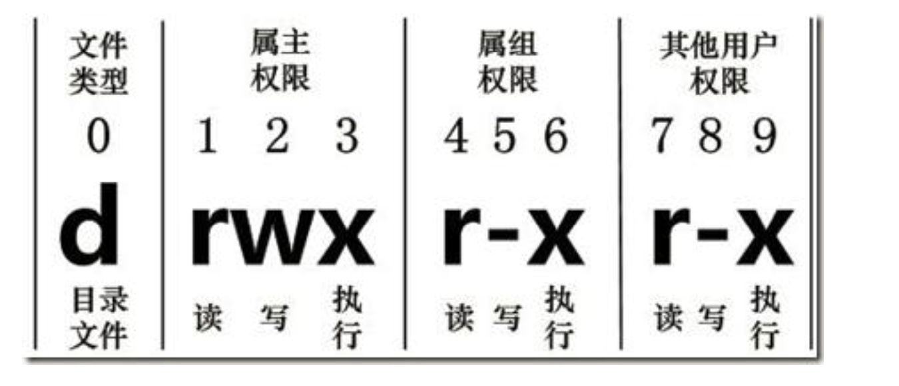
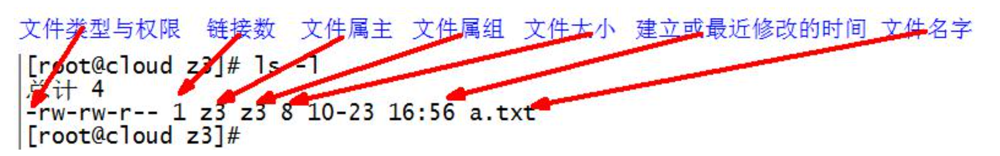
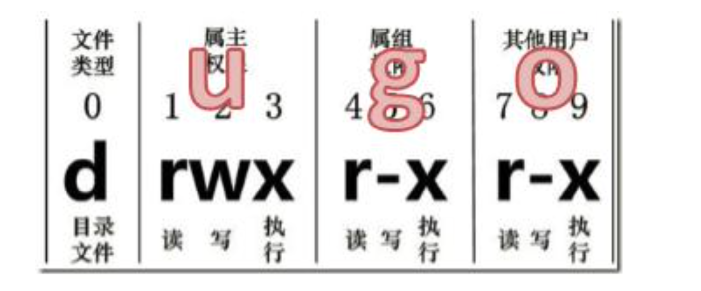

**笔记来源：**[**3天搞定Linux，1天搞定Shell，清华学神带你通关**](https://www.bilibili.com/video/BV1WY4y1H7d3?p=9&vd_source=e8046ccbdc793e09a75eb61fe8e84a30)

# 1 用户管理命令
## 1.1 useradd 
添加新用户。基本语法

```powershell
useradd 用户名  #(功能描述:添加新用户) 
useradd -g 组名 用户名 #(功能描述:添加新用户到某个组) 
```

案例实操：添加一个用户

```powershell
useradd tangseng
ll /home/  #这里是LL的小写
```

## 1.2 passwd 
设置用户密码。基本语法

```powershell
passwd 用户名  # (功能描述:设置用户密码) 
```

案例实操：设置用户的密码

```powershell
passwd tangseng
```

## 1.3 id 
查看用户是否存在。基本语法

```powershell
id 用户名 
```

案例实操：查看用户是否存在 

```powershell
id tangseng
```

## 1.4 查看创建了哪些用户 
cat /etc/passwd

案例实操

```powershell
cat  /etc/passwd 
```

## 1.5 su 
切换用户：su（swith user）切换用户。基本语法

```powershell
su 用户名称 	#(功能描述:切换用户，只能获得用户的执行权限，不能获得环境变量) 
su - 用户名称 	#(功能描述:切换到用户并获得该用户的环境变量及执行权限) 
```

案例实操：切换用户 

```powershell
su tangseng
echo $PATH

su - tangseng
echo $PATH
```

## 1.6 userdel 
删除用户。基本语法 

```powershell
userdel 用户名 	#(功能描述:删除用户但保存用户主目录)
userdel -r 用户名 	# (功能描述:用户和用户主目录，都删除)  
```

选项说明 

+ `-r`：删除用户的同时，删除与用户相关的所有文件。 

案例实操

```powershell
# (1)删除用户但保存用户主目录
userdel tangseng
ll /home/

# (2)删除用户和用户主目录，都删除
useradd zhubajie
ll /home/
userdel -r zhubajie
ll /home/
 
```

## 1.7 who 
查看登录用户信息。基本语法 

```powershell
whoami  	#(功能描述：显示自身用户名称) 
who am i 	#(功能描述：显示登录用户的用户名以及登陆时间) 
```

案例实操 

```powershell
#  (1)显示自身用户名称 
whoami 
 					
#  (2)显示登录用户的用户名 
who am i 
```

## 1.8 sudo 
设置普通用户具有 root 权限 

1. 添加 atguigu 用户，并对其设置密码。 

   ```shell
   useradd atguigu
   passwd atguigu
   ```


2. 修改配置文件

   ```shell
   vi /etc/sudoers
   ```

   修改`/etc/sudoers`  文件，找到下面一行【91 行】，在 root 下面添加一行，如下所示：

   ```shell
   ## Allow root to run any commands anywhere
   root       ALL=(ALL)     ALL
   atguigu   ALL=(ALL)     ALL
   ```

   或者配置成采用 sudo 命令时，不需要输入密码

   ```shell
   ## Allow root to run any commands anywhere
   root       ALL=(ALL)     ALL
   atguigu   ALL=(ALL)     NOPASSWD:ALL
   ```

   修改完毕，现在可以用 atguigu 帐号登录，然后用命令 sudo ，即可获得 root 权限进行操作。

案例实操：用普通用户在 /opt 目录下创建一个文件夹 

```powershell
[atguigu@hadoop101 opt]$ sudo mkdir module
[root@hadoop101 opt]# chown atguigu:atguigu module/
```

## 1.9 usermod 
修改用户。基本语法 

```powershell
usermod -g 用户组 用户名
```

选项说明 

+ `-g`： 修改用户的初始登录组，给定的组必须存在。默认组 id 是 1。 

案例实操：将用户加入到用户组

```powershell
usermod -g root zhubajie 
```

# 2 用户组管理命令 
每个用户都有一个用户组，系统可以对一个用户组中的所有用户进行集中管理。不同 Linux 系统对用户组的规定有所不同， 

如 Linux 下的用户属于与它同名的用户组，这个用户组在创建用户时同时创建。 

用户组的管理涉及用户组的添加、删除和修改。组的增加、删除和修改实际上就是对 /etc/group 文件的更新。 

## 2.1 groupadd 
新增组。基本语法

```powershell
groupadd 组名 
```

案例实操：添加一个 xitianqujing 组 

```powershell
groupadd xitianqujing  
```

## 2.2 groupdel 
删除组。基本语法

```powershell
groupdel 组名 
```

 案例实操：删除 xitianqujing 组 

```powershell
groupdel xitianqujing  
```

## 2.3 groupmod 
修改组。基本语法

```powershell
groupmod -n 新组名 老组名
```

选项说明 

+ `-n <新组名>`：指定工作组的新组名 

案例实操

```powershell
groupadd xitianqujing
groupmod -n xitian xitianqujing
```

## 2.4 查看创建了哪些组
cat /etc/group。基本操作

```powershell
cat  /etc/group
```

# 3 文件权限类
## 3.1 文件属性 
Linux系统是一种典型的多用户系统，不同的用户处于不同的地位，拥有不同的权限。 为了保护系统的安全性，Linux系统对不同的用户访问同一文件(包括目录文件)的权限做 了不同的规定。在Linux中我们可以使用 `ll` 或者`ls -l` 命令来显示一个文件的属性以及文件所属 的用户和组。 

从左到右的 **10 **个字符表示，如图所示 



如果没有权限，就会出现减号 [ - ] 而已。从左至右用 0-9 这些数字来表示: 

+ 0 首位表示类型 
    - 在Linux中第一个字符代表这个文件是目录、文件或链接文件等等。 
        * `-` ：代表文件
        * `d` ：代表目录
        * `l` ：链接文档（link file）
+ 第1-3位确定属主（该文件的所有者）拥有该文件的权限。---User 
+ 第4-6位确定属组（所有者的同组用户）拥有该文件的权限。---Group 
+ 第7-9位确定其他用户拥有该文件的权限。---Other 


**rwx 作用文件和目录的不同解释 ** 

+ 作用到文件
    - `[ r ]` 代表可读（read）：可以读取，查看
    - `[ w ]` 代表可写（write）：可以修改，但是不代表可以删除该文件，删除一个文件的前提条件是对该文件所在的目录有写权限，才能删除该文件.
    - `[ x ]` 代表可执行（execute）：可以被系统执行 
+ 作用到目录
    - `[ r ]` 代表可读（read）：可以读取，ls查看目录内容 
    - `[ w ]` 代表可写（write）：可以修改，目录内创建 + 删除 + 重命名目录 
    - `[ x ]` 代表可执行（execute）可以进入该目录 


案例实操：文件基本属性介绍

```powershell
ll
```



> 如果查看到是文件：链接数指的是硬链接个数。 
>
> 如果查看的是文件夹：链接数指的是子文件夹个数。 


## 3.2 chmod 
改变权限 



基本语法：

第一种方式变更权限

```powershell
chmod [{ugoa}{+-=}{rwx}]文件或目录 
```

第二种方式变更权限 

```powershell
chmod [mode=421] [文件或目录] 
```

经验技巧 

+ u：所有者  
+ g：所有组  
+ o：其他人  
+ a：所有人(u、g、o的总和)

```powershell
r=4 w=2 x=1 
rwx=4+2+1=7 
```

案例实操

```powershell
#(1)修改文件使其所属主用户具有执行权限 
cp xiyou/dssz/houge.txt ./
chmod u+x houge.txt

#(2)修改文件使其所属组用户具有执行权限 
chmod g+x houge.txt 

#(3)修改文件所属主用户执行权限,并使其他用户具有执行权限 
chmod u-x,o+x houge.txt 

#(4)采用数字的方式，设置文件所有者、所属组、其他用户都具有可读可写可执行权限。 
chmod 777 houge.txt

#(5)修改整个文件夹里面的所有文件的所有者、所属组、其他用户都具有可读可写可执行权限。 
chmod -R 777 xiyou/ 
```

## 3.3 chown 
改变所有者。基本语法 

```powershell
chown [选项] [最终用户] [文件或目录] #(功能描述:改变文件或者目录的所有者) 
```

选项说明 

+ `-R`：递归操作 

案例实操：

修改文件所有者 

```powershell
chown atguigu houge.txt
```

递归改变文件所有者和所有组

```powershell
chown -R atguigu:atguigu xiyou/
```

## 3.4 chgrp 
改变所属组。基本语法

```powershell
chgrp [最终用户组] [文件或目录] #(功能描述:改变文件或者目录的所属组)  	
```

案例实操：修改文件的所属组

```powershell
chgrp root houge.txt
# 此处的root是用户组，不是root用户
```

