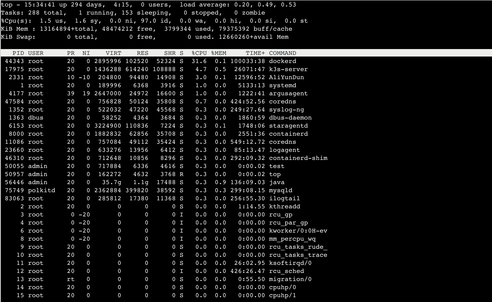

**笔记来源：**[**3天搞定Linux，1天搞定Shell，清华学神带你通关**](https://www.bilibili.com/video/BV1WY4y1H7d3?p=9&vd_source=e8046ccbdc793e09a75eb61fe8e84a30)

进程是正在执行的一个程序或命令，每一个进程都是一个运行的实体，都有自己的地址空间，并占用一定的系统资源。  					

# 1 ps
查看当前系统进程状态：ps（process status）进程状态

基本语法

```powershell
ps aux | grep xxx  #(功能描述：查看系统中所有进程) 
ps -ef | grep xxx  #(功能描述：可以查看子父进程之间的关系)  		
```

选项说明

>- `a` ：列出带有终端的所有用户的进程 
>- `x` ：列出当前用户的所有进程，包括没有终端的进程
>- `u` ：面向用户友好的显示风格
>- `-e` ：列出所有进程
>- `-u ` ：列出某个用户关联的所有进程
>- `-f` ： 显示完整格式的进程列表


功能说明：

ps aux  显示信息说明

- USER：该进程是由哪个用户产生的
- PID：进程的 ID 号
- %CPU：该进程占用 CPU 资源的百分比，占用越高，进程越耗费资源; 
- %MEM：该进程占用物理内存的百分比，占用越高，进程越耗费资源; 
- VSZ：该进程占用虚拟内存的大小，单位 KB; 
- RSS：该进程占用实际物理内存的大小，单位 KB; 
- TTY：该进程是在哪个终端中运行的。对于 CentOS 来说，tty1 是图形化终端，tty2-tty6 是本地的字符界面终端。pts/0-255 代表虚拟终端。 
- STAT：进程状态。常见的状态有：
    * `R`：运行状态、
    * `S`：睡眠状态、
    * `T`：暂停状态、
    * `Z`：僵尸状态、
    * `s`：包含子进程、
    * `l`：多线程、
    * `+`：前台显示 
- START：该进程的启动时间
- TIME：该进程占用 CPU 的运算时间，注意不是系统时间 
- COMMAND：产生此进程的命令名

ps -ef 显示信息说明 

- UID：用户 ID
- PID：进程 ID
- PPID：父进程 ID
- C：CPU 用于计算执行优先级的因子。数值越大，表明进程是 CPU 密集型运算， 执行优先级会降低;数值越小，表明进程是 I/O 密集型运算，执行优先级会提高 
- STIME：进程启动的时间 
- TTY：完整的终端名称 
- TIME：CPU 时间
- CMD：启动进程所用的命令和参数 

经验技巧：如果想查看进程的 CPU 占用率和内存占用率，可以使用 aux; 如果想查看进程的父进程 ID 可以使用 ef; 

案例实操

```powershell
#查看进程的 CPU 占用率和内存占用率
ps aux

#查看进程的父进程 ID
ps -ef 
```

# 2 kill 
终止进程。基本语法 

```powershell
kill [选项] 进程号 	#(功能描述:通过进程号杀死进程) 				
killall 进程名称 	#(功能描述:通过进程名称杀死进程，也支持通配符，这在系统因负载过大而变得很慢时很有用) 
```

选项说明 

+ `-9` 表示强迫进程立即停止 

案例实操 

```powershell
#(1)杀死浏览器进程
kill -9 5102 
 					
#(2)通过进程名称杀死进程
killall firefox 
```

# 3 pstree 
查看进程树基本语法

```powershell
pstree [选项]
```

选项说明 

+ `-p`：显示进程的 PID 
+ `-u`：显示进程的所属用户 

案例实操 

```powershell
#(1)显示进程 pid 
pstree -p 
 					
#(2)显示进程所属用户 
pstree -u 
```

# 4 top 
实时监控系统进程状态基本命令 

```powershell
top [选项]
```

选项说明

+ `-d 秒数`：指定 top 命令每隔几秒更新。默认是 3 秒在 top 命令的交互模式当中可以执行的命令
+ `-i`：使 top 不显示任何闲置或者僵死进程。 
+ `-p` 通过指定监控进程 ID 来仅仅监控某个进程的状态。 

操作说明 

+ `P`：以 CPU 使用率排序，默认就是此项 
+ `M`：以内存的使用率排序
+ `N`：以PID排序
+ `q`：退出top 


查询结果字段解释



第一行信息为任务队列信息 

+ `12:26:4` 系统当前时间
+ `up 1 day, 13:32` 系统的运行时间，本机已经运行 1 天 13小时32分钟
+ `2 users` 当前登录了两个用户
+ `load average: 0.00, 0.00, 0.00` 系统在之前 1 分钟，5 分钟，15 分钟的平均负 载。一般认为小于 1 时，负载较小。如果大于 1，系统已经超出负荷。 

第二行为进程信息 

+ `Tasks: 95 total` 系统中的进程总数 
+ `1 running` 正在运行的进程数
+ `94 sleeping` 睡眠的进程
+ `0 stopped` 正在停止的进程
+ `0 zombie ` 僵尸进程。如果不是 0，需要手工检查僵尸进程 


第三行为 CPU 信息

+ `Cpu(s): 0.1%us` 用户模式占用的CPU百分比 
+ `0.1%sy` 系统模式占用的 CPU 百分比
+ `0.0%ni ` 改变过优先级的用户进程占用的 CPU 百分比
+ `99.7%id` 空闲 CPU 的 CPU 百分比
+ `0.1%wa ` 等待输入/输出的进程的占用 CPU 百分比
+ `0.0%hi` 硬中断请求服务占用的 CPU 百分比
+ `0.1%si`  软中断请求服务占用的 CPU 百分比 
+ `0.0%st` st（Steal time）虚拟时间百分比。就是当有虚拟 机时，虚拟 CPU 等待实际 CPU 的时间百分比。 


第四行为物理内存信息 

+ `Mem: 625344k total` 物理内存的总量，单位 KB 
+ `571504k used` 已经使用的物理内存数量
+ `53840k free` 空闲的物理内存数量，我们使用的是虚拟机，总 共只分配了 628MB 内存，所以只有 53MB 的空闲内存了
+ `65800k buffers` 作为缓冲的内存数量 

第五行为交换分区（swap）信息 

+ `Swap: 524280k total` 交换分区(虚拟内存)的总大小
+ `0k used` 已经使用的交互分区的大小
+ `524280k free` 空闲交换分区的大小
+ `409280k cached` 作为缓存的交互分区的大小 

  ​

案例实操

```powershell
top -d 1 
top -i 
top -p 2575  
```

执行上述命令后，可以按 P、M、N 对查询出的进程结果进行排序。 

# 5 netstat 
显示网络状态和端口占用信息 

基本语法 

```powershell
netstat -anp | grep 进程号  #(功能描述:查看该进程网络信息)
netstat –nlp | grep 端口号  #(功能描述:查看网络端口号占用情况) 
```

选项说明 

+ `-a`：显示所有正在监听（listen）和未监听的套接字（socket） 
+ `-n`：拒绝显示别名，能显示数字的全部转化成数字
+ `-l`：仅列出在监听的服务状态
+ `-p`：表示显示哪个进程在调用 

案例实操

```powershell
#(1)通过进程号查看sshd进程的网络信息
netstat -anp | grep sshd

#(2)查看某端口号是否被占用 
netstat -nltp | grep 22
```

 

