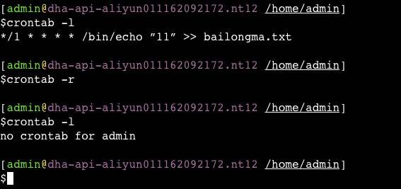
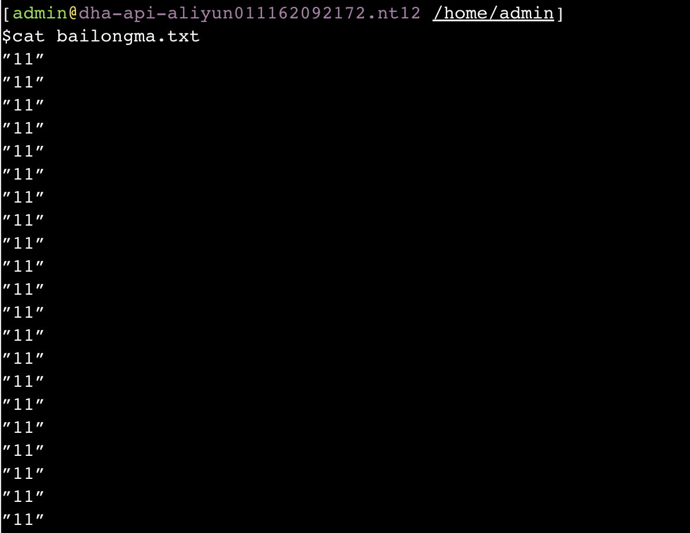

**笔记来源：**[**3天搞定Linux，1天搞定Shell，清华学神带你通关**](https://www.bilibili.com/video/BV1WY4y1H7d3?p=9&vd_source=e8046ccbdc793e09a75eb61fe8e84a30)


# 1 crontab 服务管理 
重新启动 crond 服务

```powershell
systemctl restart crond
```

# 2 crontab 定时任务设置 
基本语法

```powershell
crontab [选项] 
```

选项说明 

+ `-e` 编辑 crontab 定时任务
+ `-l` 查询 crontab 任务
+ `-r` 删除当前用户所有的 crontab 任务



 					

参数说明

```powershell
crontab -e
```

进入 crontab 编辑界面。会打开 vim 编辑你的工作。 

+ `* * * * * 执行的任务`
    - 第一个`*`：一小时当中的第几分钟 0-59
    - 第二个`*`：一天当中的第几小时 0-23
    - 第三个`*`：一个月当中的第几天 1-31
    - 第四个`*`：一个月当中的第几天 1-12
    - 第五个`*`：一周当中的星期几 0-7（0 和 7 都代表星期日）
+ 特殊符号 
    - `*`：代表任何时间。比如第一个`*` 就代表一小时中每分钟 都执行一次的意思。
    - `,`：代表不连续的时间。比如 `0 8,12,16 * * * 命令`，就代表在每天的 8 点 0 分，12 点 0 分，16 点 0分都执行一次命令
    - `-`：代表连续的时间范围。比如 `0 5 * * 1-6 命令`，代表在 周一到周六的凌晨 5 点 0 分执行命令
    - `*/n`：代表每隔多久执行一次。比如 `*/10 * * * * 命令`，代表每隔 10 分钟就执行一遍命令 
+ 特定时间执行命令
    - `45 22 * * * 命令`：每天22点45分执行命令
    - `0 17 * * 1 命令`：每周1的17点0分执行命令
    - `0 5 1,15 * * 命令`：每月1号和15号的凌晨5点0分执行命令
    - `40 4 * * 1-5 命令`：每周一到周五的凌晨4点40分执行命令
    - `*/10 4 * * * 命令`：每天的凌晨 4 点，每隔 10 分钟执行一次命令
    - `0 0 1,15 * 1 命令`：每月1号和15号，每周1的0点0分都会执行命令。注意：星期几和几号最好不要同时出现，因为他们定义的都是天。非常容易让管理员混乱。 


案例实操：每隔 1 分钟，向 bailongma.txt 文件中添加一个 11 的数字 

```powershell
*/1 * * * * /bin/echo "11" >> bailongma.txt
```



