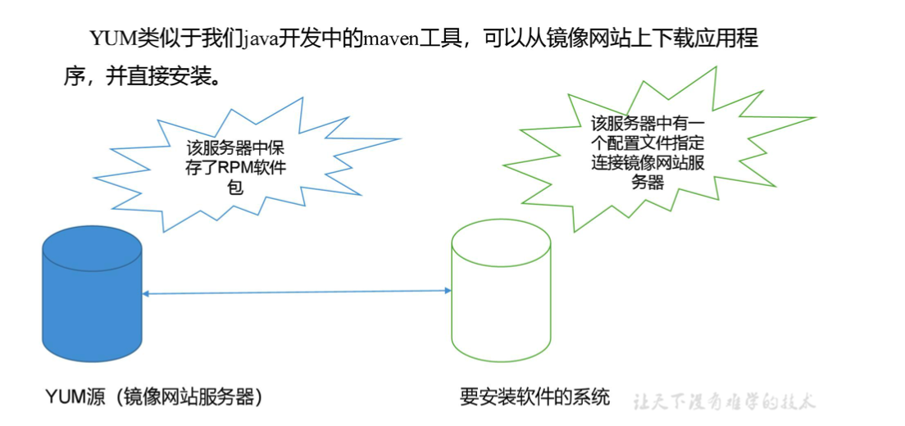

**笔记来源：**[**3天搞定Linux，1天搞定Shell，清华学神带你通关**](https://www.bilibili.com/video/BV1WY4y1H7d3?p=9&vd_source=e8046ccbdc793e09a75eb61fe8e84a30)


# 1 RPM 
## 1.1 RPM 概述 
RPM（RedHat Package Manager），RedHat软件包管理工具，类似 windows 里面的 setup.exe 是 Linux 这系列操作系统里面的打包安装工具，它虽然是RedHat的标志，但理念是通用的。 


RPM包的名称格式 Apache-1.3.23-11.i386.rpm 

+ `apache` 软件名称  						
+ `1.3.23-11` 软件的版本号，主版本和此版本
+ `i386` 是软件所运行的硬件平台，Intel 32位处理器的统称
+ `rpm` 文件扩展名，代表RPM包  						


## 1.2 RPM 查询命令
基本语法

```powershell
rpm -qa  #(功能描述:查询所安装的所有 rpm 软件包)  	
```

经验技巧：由于软件包比较多，一般都会采取过滤。

```powershell
rpm -qa | grep rpm软件包 
```

 案例实操：查询 firefox   软件安装情况

```powershell
rpm -qa |grep firefox
```

## 1.3 RPM 卸载命令
基本语法  						

```powershell
rpm -e RPM软件包
rpm -e --nodeps 软件包
```

选项说明 

+ `-e`：卸载软件包
+ `--nodeps`：卸载软件时，不检查依赖。这样的话，那些使用该软件包的软件在此之后可能就不能正常工作了。

案例实操：卸载firefox软件

```powershell
rpm -e firefox
```

## 1.4 RPM 安装命令
基本语法

```powershell
rpm -ivh RPM 包全名
```

选项说明 

+ `-i`： install，安装
+ `-v`：--verbose，显示详细信息 
+ `-h`： --hash，进度条
+ `--nodeps`：安装前不检查依赖 

案例实操：安装firefox软件 

```powershell
rpm -ivh firefox-45.0.1-1.el6.centos.x86_64.rpm
```

 					

# 2 YUM 仓库配置 
## 2.1 YUM 概述 				
YUM（全称为 Yellow dog Updater, Modified）是一个在 Fedora 和 RedHat 以及 CentOS 中的 Shell 前端软件包管理器。基于 RPM 包管理，能够从指定的服务器自动下载 RPM 包 并且安装，可以自动处理依赖性关系，并且一次安装所有依赖的软件包，无须繁琐地一次次下载、安装，如图所示



## 2.2 YUM 的常用命令 
基本语法

```powershell
yum [选项] [参数]
```

选项说明		

+ `-y`： 对所有提问都回答 yes

参数说明 

+ install：安装 rpm 软件包
+ update：更新 rpm 软件包 
+ check-update：检查是否有可用的更新 rpm 软件包
+ remove： 删除指定的 rpm 软件包
+ list：显示软件包信息
+ clean：清理 yum 过期的缓存
+ deplist：显示 yum 软件包的所有依赖关系


案例实操实操：采用 yum 方式安装 firefox

```powershell
yum -y install firefox 
```

 

## 2.3 修改网络 YUM 源
默认的系统 YUM 源，需要连接国外 apache 网站，网速比较慢，可以修改关联的网络 

YUM 源为国内镜像的网站，比如网易 163,aliyun 等 

操作步骤

1. 安装 wget，wget 用来从指定的 URL 下载文件

   ```shell
   yum install wget
   ```

2.  在 /etc/yum.repos.d/ 目录下，备份默认的 repos 文件

    ```shell
    cp CentOS-Base.repo CentOS-Base
    ```

3. 下载网易 163 或者是 aliyun 的 repos 文件，任选其一

   ```shell
   wget http://mirrors.aliyun.com/repo/Centos-7.repo #阿里云
   wget http://mirrors.163.com/.help/CentOS7-Base-163.repo #网易 163
   ```


4. 使用下载好的 repos 文件替换默认的 repos 文件，例如：用 CentOS7-Base-163.repo 替换 CentOS-Base.repo

   ```shell
   mv CentOS7-Base-163.repo CentOS-Base.repo
   ```


5. 清理旧缓存数据，缓存新数据

   ```shell
   yum clean all
   yum makecache 
   ```

   就是把服务器的包信息下载到本地电脑缓存起来 


6. 测试

   ```shell
   yum list | grep firefox
   yum -y install firefox
   ```

   ​


