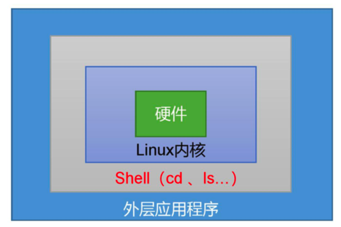
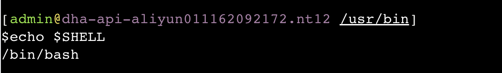
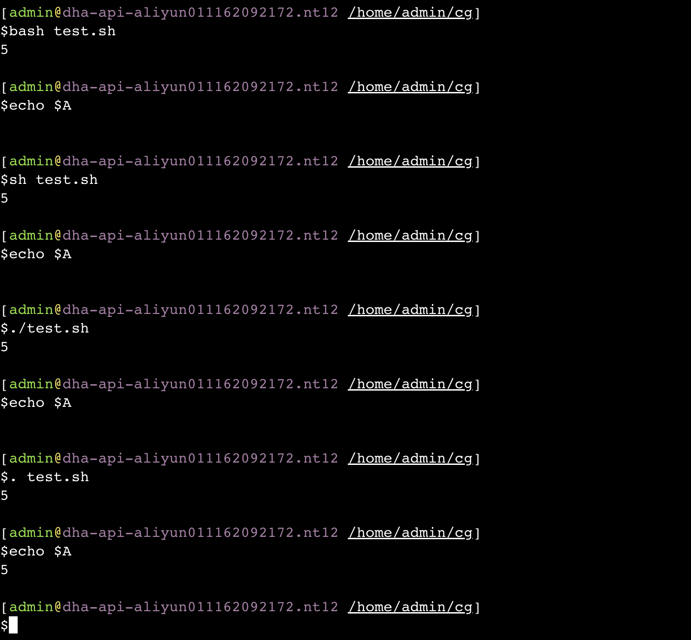

**笔记来源：**[**3天搞定Linux，1天搞定Shell，清华学神带你通关**](https://www.bilibili.com/video/BV1WY4y1H7d3?p=9&vd_source=e8046ccbdc793e09a75eb61fe8e84a30)


# 1 Shell 概述 
Shell 是一个命令行解释器，它接受应用程序/用户命令，然后调用操作系统内核。



Shell还是一个功能相当强大的编程语言，易编写，易调试，灵活性强。


**Linux ** 提供的 **Shell ** 解析器有

```powershell
cat /etc/shells

/bin/sh
/bin/bash
/usr/bin/sh
/usr/bin/bash
/bin/tcsh
/bin/csh
/usr/bin/tmux
/bin/tmux
```


**bash **和 **sh **的关系

```powershell
ll | grep bash

-rwxr-xr-x    1 root root      964536 Apr  1  2020 bash
lrwxrwxrwx    1 root root          10 Apr  1  2020 bashbug -> bashbug-64
-rwxr-xr-x    1 root root        6958 Apr  1  2020 bashbug-64
lrwxrwxrwx    1 root root           4 Apr  1  2020 sh -> bash
```

 					

**Centos **默认的解析器是 **bash**

```powershell
echo $SHELL
/bin/bash
```




# 2 Shell 脚本入门 
脚本格式：脚本以`<font style="color:rgb(100.000000%, 0.000000%, 0.000000%);">#!/bin/bash</font>`开头（指定解析器）


第一个 **Shell **脚本：**helloworld.sh **

1. 需求：创建一个 Shell 脚本，输出 helloworld 

2. 案例实操：

   ```shell
   touch helloworld.sh
   vim helloworld.sh
   ```

   在 helloworld.sh 中输入如下内容

   ```shell
   #!/bin/bash
   echo "helloworld"
   ```

3. 脚本的常用执行方式
    - 第一种：采用 bash 或 sh 和脚本的相对路径或绝对路径（不用赋予脚本+x 权限）

        >sh + 脚本的相对路径
        >
        >```shell
        >sh ./helloworld.sh
        >```
        >
        >sh + 脚本的绝对路径
        >
        >```shell
        >sh /home/atguigu/shells/helloworld.sh
        >```
        >
        >bash + 脚本的相对路径
        >
        >```shell
        >bash ./helloworld.sh
        >```
        >
        >bash + 脚本的绝对路径
        >
        >```shell
        >bash /home/atguigu/shells/helloworld.sh
        >```

    - 第二种：采用输入脚本的绝对路径或相对路径执行脚本（必须具有可执行权限 +x）

        >1. 首先要赋予 helloworld.sh 脚本的 +x 权限
        >
        >   ```shell
        >   chmod +x helloworld.sh
        >   ```
        >
        >2. 执行脚本
        >
        >   ```shell
        >   # 相对路径
        >   ./helloworld.sh
        >
        >   # 绝对路径
        >   /home/atguigu/shells/helloworld.sh
        >   ```

        注意：第一种执行方法，本质是 bash 解析器帮你执行脚本，所以脚本本身不需要执行权限。第二种执行方法，本质是脚本需要自己执行，所以需要执行权限。

    - 第三种：在脚本的路径前加上 `.` 或者 source 【了解】

        >1. 有以下脚本
        >
        >   ```shell
        >   cat test.sh
        >
        >   #!/bin/bash
        >   A=5
        >   echo $A
        >   ```
        >
        >2. 分别使用 `sh` `bash` `./` 和 `.` 的方式来执行，结果如下：
        >
        >   ```shell
        >   bash test.sh
        >   echo $A
        >
        >   sh test.sh
        >   echo $A
        >
        >   ./test.sh
        >   echo $A
        >
        >   . test.sh
        >   echo $A
        >   # 这种方式是可以看到 $A的输出的，上面其他三种都是看不到的。
        >   ```

        

        原因：前三种方式都是在当前 shell 中打开一个子 shell 来执行脚本内容，当脚本内容结束，则子 shell 关闭，回到父 shell 中。 

        第四种，也就是使用在脚本路径前加 `.` 或者 source 的方式，可以使脚本内容在当前 shell 里执行，而无需打开子 shell，这也是为什么我们每次要修改完  /etc/profile  文件以后，需要 source 一下的原因。 

        开子 shell 与不开子 shell 的区别就在于，环境变量的继承关系，如在子 shell 中设置的当前变量，父 shell 是不可见的。 


