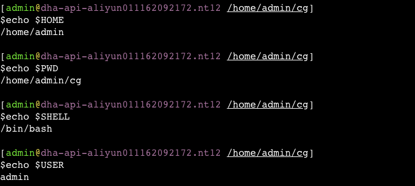
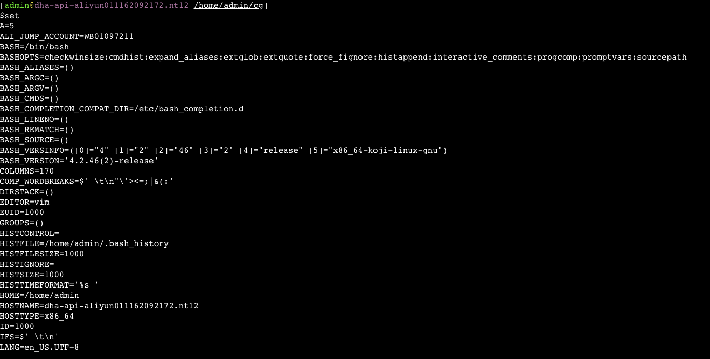
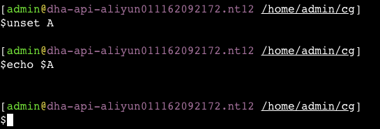
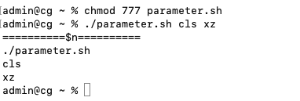
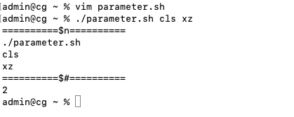
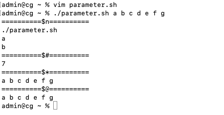
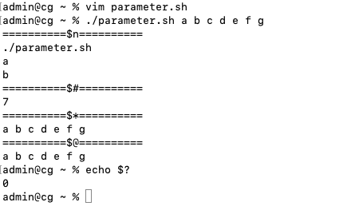

**<font style="color:#DF2A3F;">笔记来源：</font>**[**<font style="color:#DF2A3F;">3天搞定Linux，1天搞定Shell，清华学神带你通关</font>**](https://www.bilibili.com/video/BV1WY4y1H7d3?p=9&vd_source=e8046ccbdc793e09a75eb61fe8e84a30)


# 1 系统预定义变量
常用系统变量 

$$

$$

HOME、

$$
PWD、
$$
SHELL、
$$

$$

USER 等 

案例实操

+ 查看系统变量的值

```powershell
echo $HOME
echo $PWD
echo $SHELL
echo $USER
```



+ 显示当前 Shell 中所有变量

```powershell
set
```

	

# 2 自定义变量 
基本语法

+ 定义变量：变量名=变量值【<font style="color:rgb(100.000000%, 0.000000%, 0.000000%);">注意，=号前后不能有空格】</font>
+ 撤销变量：unset 变量名 
+ 声明静态变量：readonly 变量【注意:不能 unset】 

 					

变量定义规则

1. 变量名称可以由字母、数字和下划线组成，但是不能以数字开头，<font style="color:rgb(100.000000%, 0.000000%, 0.000000%);">环境变量名建议大写</font>。
2. 等号两侧不能有空格
3. 在 bash 中，变量默认类型都是字符串类型，无法直接进行数值运算。 
4. 变量的值如果有空格，需要使用双引号或单引号括起来。 

 

案例实操

1. 定义变量 A 

```powershell
A=5
echo $A
```

```powershell
[admin@dha-api-aliyun011162092172.nt12 /home/admin/cg]
$A=5

[admin@dha-api-aliyun011162092172.nt12 /home/admin/cg]
$$

$$

echo 
$$

$$

A
5
```

2. 给变量 A 重新赋值 

```powershell
A=8
echo $A
```

```powershell
[admin@dha-api-aliyun011162092172.nt12 /home/admin/cg]
$A=8

[admin@dha-api-aliyun011162092172.nt12 /home/admin/cg]
$$

$$

echo 
$$

$$

A
8
```

3. 撤销变量 A

```powershell
unset A
echo $A
```



4. 声明静态的变量 B=2，不能 unset 

```powershell
readonly B=2
echo $B
B=9
```

```powershell
[admin@dha-api-aliyun011162092172.nt12 /home/admin/cg]
$readonly B=2

[admin@dha-api-aliyun011162092172.nt12 /home/admin/cg]
$$

$$

echo 
$$

$$

B
2

[admin@dha-api-aliyun011162092172.nt12 /home/admin/cg]
$B=9
bash: B: readonly variable
```

5. 在 bash 中，变量默认类型都是字符串类型，无法直接进行数值运算

```powershell
C=1+2
echo $C
```

```powershell
[admin@dha-api-aliyun011162092172.nt12 /home/admin/cg]
$C=1+2

[admin@dha-api-aliyun011162092172.nt12 /home/admin/cg]
$$

$$

echo 
$$

$$

C
1+2
```

6. 变量的值如果有空格，需要使用双引号或单引号括起来

```powershell
D=I love banzhang
D="I love banzhang"
echo $D
```

```powershell
[admin@dha-api-aliyun011162092172.nt12 /home/admin/cg]
$D=I love banzhang
bash: love: command not found

[admin@dha-api-aliyun011162092172.nt12 /home/admin/cg]
$D="I love banzhang"

[admin@dha-api-aliyun011162092172.nt12 /home/admin/cg]
$$

$$

echo 
$$

$$

D
I love banzhang
```

7. 可把变量提升为全局环境变量，可供其他 Shell 程序使用

**export 变量名**

```powershell
vim helloworld.sh 
```

在 helloworld.sh 文件中增加 echo $B

```powershell
#!/bin/bash
echo "helloworld"
echo $B
```

```powershell
[admin@dha-api-aliyun011162092172.nt12 /home/admin/cg]
$sh helloworld.sh
helloworld
```

发现并没有打印输出变量 B 的值。 

```powershell
[admin@dha-api-aliyun011162092172.nt12 /home/admin/cg]
$export B

[admin@dha-api-aliyun011162092172.nt12 /home/admin/cg]
$sh helloworld.sh
helloworld
2
```

# 3 特殊变量
## 3.1 `$n` 
基本语法

```powershell
$$

$$

n #(功能描述:n 为数字，

$$
0代表该脚本名称，$1-
$$
9 代表第一到第九个参数，十以上的参数，十以上的参数需要用大括号包含，如
$$

$$

{10}) 
```

案例实操

```powershell
touch parameter.sh
vim parameter.sh
```

```powershell
#!/bin/bash
echo '==========$n=========='
echo $0
echo $1
echo $2
```

```powershell
chmod 777 parameter.sh
./parameter.sh cls xz
```

 			

## 3.2 `$#` 
基本语法

+ `$#`：功能描述，获取所有输入参数个数，常用于循环,判断参数的个数是否正确以及加强脚本的健壮性。

案例实操

```powershell
vim parameter.sh
```

```powershell
#!/bin/bash
echo '==========$n=========='
echo $0
echo $1
echo $2
echo '==========$#=========='
echo $#
```

```powershell
chmod 777 parameter.sh
./parameter.sh cls xz
```

 	

## 3.3 `

$$

$$

*` 和 `
$$

$$

@`
基本语法

```powershell
$$

$$

*  #(功能描述:这个变量代表命令行中所有的参数，
$$

$$

*把所有的参数看成一个整体) 
$$

$$

@  #(功能描述:这个变量也代表命令行中所有的参数，不过
$$

$$

@把每个参数区分对待) 
```

案例实操

```powershell
vim parameter.sh
```

```powershell
#!/bin/bash
echo '==========$n=========='
echo $0
echo $1
echo $2
echo '==========$#=========='
echo $#
echo '==========$*=========='
echo $*
echo '==========$@=========='
echo $@
```

```powershell
./parameter.sh a b c d e f g
```



## 3.4 `$?`
基本语法

```powershell
$? #(功能描述:最后一次执行的命令的返回状态。如果这个变量的值为 0，证明上一个命令正确执行;
	 #如果这个变量的值为非 0(具体是哪个数，由命令自己来决定)，则证明上一个命令执行不正确了。)
```

案例实操：判断 parameter.sh 脚本是否正确执行

```powershell
echo $?
```

				

# 4 定义数组
```powershell
#!/bin/bash
# 517. 要加入路由的ip 数组，以空格分开，请用自己需要访问的目标服务器ip替换
# 518. 定义一个数组
ips=(124.70.129.0 124.70.128.0)
# 519. 获取网关
gw=$(netstat -nr |grep "6/12" |grep "30.[0-9.]\+" -o) 
if [ ! -n "$gw" ]; then
	echo "can't find gateway, finish."
else
	echo "find gateway: $gw"
  #
	for ip in ${ips[*]}
	do
		sudo route add -net 

$$

$$

ip -netmask 255.255.0.0 
$$

$$

gw && \
		echo "add route: ip: 

$$

$$

ip, gateway: 
$$

$$

gw" || \
		echo "add route fialed."
	done
fi
```

:::color1
<font style="color:rgb(51, 51, 51);">在Shell脚本中，</font>`<font style="color:rgb(51, 51, 51);">${ips[*]}</font>`<font style="color:rgb(51, 51, 51);"> 是一个数组扩展语法，它会将数组 ips 中的所有元素合并成一个字符串，每个元素之间用空格分隔。</font>

<font style="color:rgb(51, 51, 51);">例如，如果 ips 数组包含两个元素 124.70.129.0 和 124.70.128.0，那么 </font>`<font style="color:rgb(51, 51, 51);">

$$

$$

{ips[*]}</font>`<font style="color:rgb(51, 51, 51);">扩展后的结果是 "124.70.129.0 124.70.128.0"。这个字符串可以在循环或命令行中使用，如在代码中的第10行，</font>`<font style="color:rgb(51, 51, 51);">for ip in 
$$

$$

{ips[*]}</font>`<font style="color:rgb(51, 51, 51);">，表示循环遍历数组 ips 中的所有元素。</font>

:::

