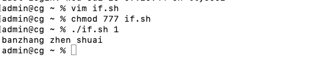
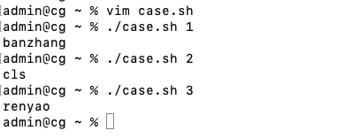
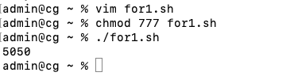
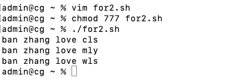
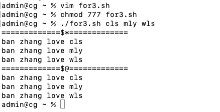
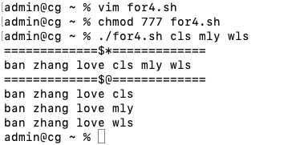
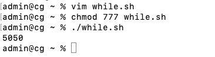
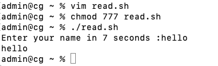

**笔记来源：**[**3天搞定Linux，1天搞定Shell，清华学神带你通关**](https://www.bilibili.com/video/BV1WY4y1H7d3?p=9&vd_source=e8046ccbdc793e09a75eb61fe8e84a30)

 	 	 		

# 1 if 判断 
基本语法

+ 单分支 

  ```powershell
  if [ 条件判断式 ];then
  	程序
  fi
  ```

  或

  ```powershell
  if [ 条件判断式 ]
  then
  	程序
  fi
  ```


+ 多分支 

  ```powershell
  if [ 条件判断式 ]
  then
  	程序
  elif [ 条件判断式 ]
  then
  	程序
  else
  	程序
  fi
  ```

注意事项：

+ [ 条件判断式 ]：中括号和条件判断式之间必须有空格 
+ if 后要有空格 


案例实操：输入一个数字，如果是 1，则输出 banzhang zhen shuai，如果是 2，则输出 cls zhen mei， 如果是其它，什么也不输出。 

```powershell
touch if.sh
vim if.sh  
```

```powershell
#!/bin/bash
if [ $1 -eq 1 ]
then
       echo "banzhang zhen shuai"
elif [ $1 -eq 2 ]
then
       echo "cls zhen mei"
fi
```

```powershell
chmod 777 if.sh
./if.sh 1
```

 

# 2 case 语句 
基本语法 

```powershell
case $变量名 in 
"值 1")
	如果变量的值等于值 1，则执行程序 1
;;
"值 2")
	如果变量的值等于值 2，则执行程序 2
;;
	...省略其他分支...
*)
	如果变量的值都不是以上的值，则执行此程序
;;
esac
```

注意事项：

+ case 行尾必须为单词 `in` ，每一个模式匹配必须以右括号 `)` 结束。 
+ 双分号 `**;;**` 表示命令序列结束，相当于 java 中的 break。
+ 最后的 `*)` 表示默认模式，相当于 java 中的 default。 

案例实操：输入一个数字，如果是 1，则输出 banzhang，如果是 2，则输出 cls，如果是其它，输出 renyao。 

```powershell
touch case.sh
vim case.sh
```

```powershell
#!/bin/bash
case $1 in
"1")
  echo "banzhang"
;;
"2")
	echo "cls" ;;
*)
	echo "renyao"
;;
esac
```

```powershell
chmod 777 case.sh
./case.sh 1
```

 

# 3 for 循环 
基本语法格式一：

```powershell
for (( 初始值;循环控制条件;变量变化 )) 
do
	程序
done
```

案例实操：从1加到100 

```powershell
touch for1.sh
vim for1.sh
```

```powershell
#!/bin/bash
sum=0
for((i=0;i<=100;i++))
do
	sum=$[$sum+$i]
done

echo $sum
```

```powershell
chmod 777 for1.sh
./for1.sh
```

 

 			

基本语法格式二：

```powershell
for 变量 in 值 1 值 2 值 3...
do
	程序
done
```

案例实操：打印所有输入参数 

```powershell
touch for2.sh
vim for2.sh
```

```powershell
：:#!/bin/bash #打印数字
for i in cls mly wls
do   
	echo "ban zhang love $i"
done
```

```powershell
chmod 777 for2.sh
./for2.sh
```

 

比较`$*`  和`$@` 区别

>`$*` 和 `$@` 都表示传递给函数或脚本的所有参数，不被双引号 `""` 包含时，都以 `$1 $2 ...$n` 的形式输出所有参数。
>
>```shell
>touch for3.sh
>vim for3.sh
>```
>
>```shell
>#!/bin/bash
>echo '=============$*============='
>for i in $*
>do 
>	echo "ban zhang love $i" 
>done
>
>echo '=============$@============='
>for j in $@
>do 
>	echo "ban zhang love $j" 
>done
>```
>
>```shell
>chmod 777 for3.sh
>./for3.sh cls mly wls
>```
>
> 
>
>


 	

+ 当它们被双引号`""`包含时，`

$$

$$

*`会将所有的参数作为一个整体，以`

$$
1 $2 ...$n`的形式输出所有参数；`$@`会将各个参数分开，以`$1` `
$$
2``...``
$$

$$

n`的形式输出所有参数。 

```powershell
vim for4.sh
```

```powershell
#!/bin/bash
echo '=============$*============='
for i in "$*"
#$*中的所有参数看成是一个整体，所以这个 for 循环只会循环一次 
do
	echo "ban zhang love $i"
done


echo '=============$@============='
for j in "

$$

$$

@" #$@中的每个参数都看成是独立的，所以“
$$

$$

@”中有几个参数，就会循环几次 
do
	echo "ban zhang love $j"
done
```

```powershell
chmod 777 for4.sh
./for4.sh cls mly wls
```



# 4 while 循环 
基本语法

```powershell
while [ 条件判断式 ] 
do
	程序
done
```

案例实操：从1加到100 

```powershell
touch while.sh
vim while.sh
```

```powershell
#!/bin/bash
sum=0
i=1
while [ $i -le 100 ]
do
	sum=

$$

$$

[$sum+
$$

$$

i]
	i=

$$

$$

[
$$

$$

i+1]
done

echo $sum
```

```powershell
chmod 777 while.sh
./while.sh
```



# 5 read 读取控制台输入 
基本语法

```powershell
read (选项) (参数)
```

选项：

+ `-p`：指定读取值时的提示符； 
+ `-t`：指定读取值时等待的时间(秒)，如果 -t 不加表示一直等待 

参数 

+ 变量：指定读取值的变量名  					

案例实操：提示 7 秒内，读取控制台输入的名称

```powershell
touch read.sh
vim read.sh
```

```powershell
#!/bin/bash
read -t 7 -p "Enter your name in 7 seconds :" NN
echo $NN
```

```powershell
chmod 777 read.sh 
./read.sh
```



