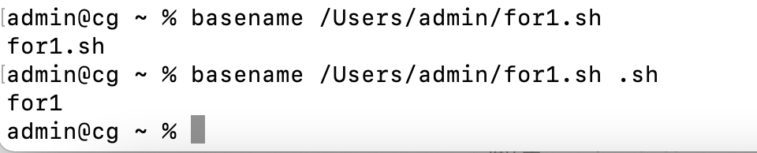
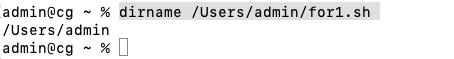
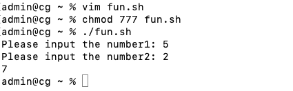

**<font style="color:#DF2A3F;">笔记来源：</font>**[**<font style="color:#DF2A3F;">3天搞定Linux，1天搞定Shell，清华学神带你通关</font>**](https://www.bilibili.com/video/BV1WY4y1H7d3?p=9&vd_source=e8046ccbdc793e09a75eb61fe8e84a30)

 	 	 		

# 1 系统函数 
## 1.1 basename 
基本语法

```powershell
basename [string / pathname] [suffix] 
#(功能描述:basename 命令会删掉所有的前缀包括最后一个(‘/’)字符，然后将字符串显示出来。
```

basename 可以理解为取路径里的文件名称  
选项：suffix 为后缀，如果 suffix 被指定了，basename 会将 pathname 或 string 中的 suffix 去掉。 

 					

案例实操：截取该 /Users/admin/for1.sh 路径的文件名称。

```powershell
basename /Users/admin/for1.sh
basename /Users/admin/for1.sh .sh
```

 				

## 1.2 dirname 
基本语法

```powershell
dirname 文件绝对路径 
#(功能描述:从给定的包含绝对路径的文件名中去除文件名 (非目录的部分)，然后返回剩下的路径(目录的部分)) 
```

dirname 可以理解为取文件路径的绝对路径名称 

案例实操：获取 /Users/admin/for1.sh 文件的路径。 

```powershell
dirname /Users/admin/for1.sh 
```

 

# 2 自定义函数 
基本语法

```powershell
[ function ] funname[()] 
{
	Action;
	[return int;] 
}
```

经验技巧

+ 必须在调用函数地方之前，先声明函数，shell 脚本是逐行运行。不会像其它语言一样先编译。
+ 函数返回值，只能通过`$?`系统变量获得，可以显示加 `return 返回值`，如果不加，将以最后一条命令运行结果，作为返回值。return 后跟数值 n(0-255) 

案例实操：计算两个输入参数的和。 

```powershell
touch fun.sh
vim fun.sh
```

```powershell
#!/bin/bash
function sum()
{
	s=0
	s=

$$

$$

[$1+
$$

$$

2]
	echo "$s" 
}
read -p "Please input the number1: " n1;
read -p "Please input the number2: " n2;
sum 

$$

$$

n1 
$$

$$

n2;
```

```powershell
chmod 777 fun.sh
./fun.sh
```



 		

 	 

