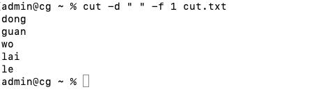
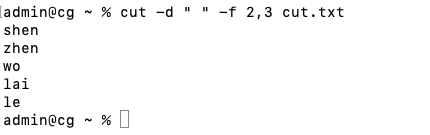
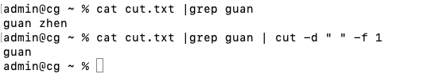
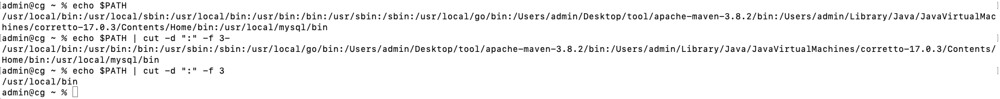
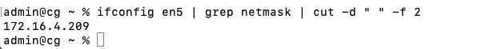
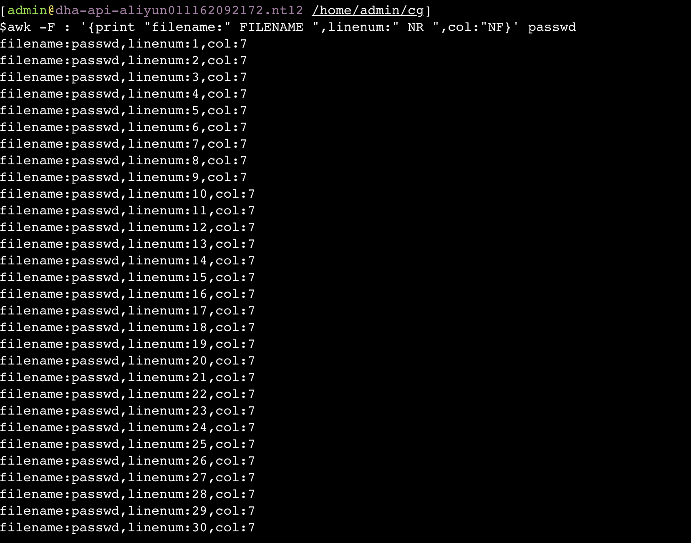
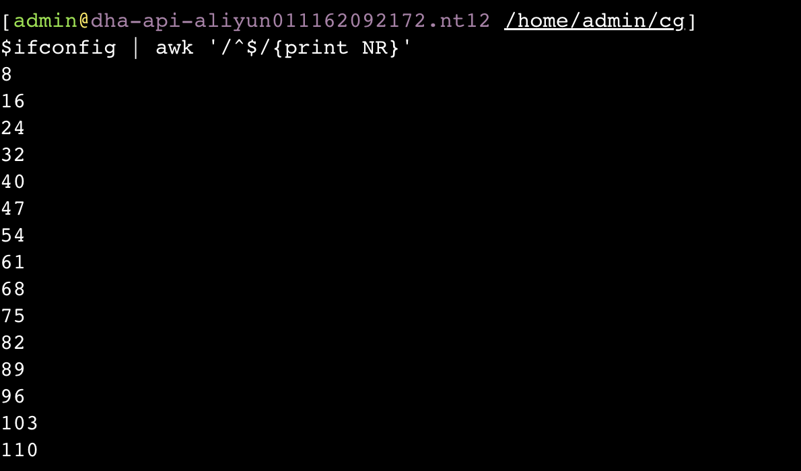
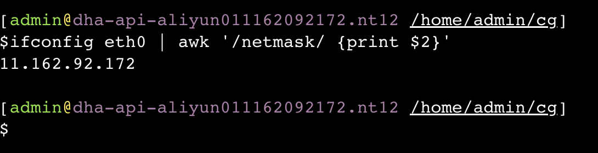

**<font style="color:#DF2A3F;">笔记来源：</font>**[**<font style="color:#DF2A3F;">3天搞定Linux，1天搞定Shell，清华学神带你通关</font>**](https://www.bilibili.com/video/BV1WY4y1H7d3?p=9&vd_source=e8046ccbdc793e09a75eb61fe8e84a30)

 	 	 		

# 1 cut 
cut 的工作就是剪，具体的说就是在文件中负责剪切数据用的。cut 命令从文件的每一行剪切字节、字符和字段并将这些字节、字符和字段输出。

基本用法 

```powershell
cut [选项参数] filename  #说明:默认分隔符是制表符  	
```

选项参数说明

+ -f ：列号，提取第几列 
+ -d：分隔符，按照指定分隔符分割列，默认是制表符`\t`
+ -c：按字符进行切割 后加加 n 表示取第几列，比如`-c 1`

案例实操

1. 数据准备

```powershell
touch cut.txt
vim cut.txt
```

```powershell
dong shen
guan zhen
wo wo
lai lai
le le
```

2. 切割 cut.txt 第一列

```powershell
cut -d " " -f 1 cut.txt
```



3. 切割 cut.txt 第二、三列

```powershell
cut -d " " -f 2,3 cut.txt
```



4. 在 cut.txt 文件中切割出 guan

```powershell
cat cut.txt |grep guan | cut -d " " -f 1
```



5. 选取系统 PATH 变量值，第 2 个`:`开始后的所有路径

```powershell
echo $PATH
echo $PATH | cut -d ":" -f 3-
```



6. 切割 ifconfig 后打印的 IP 地址

```powershell
ifconfig en5 | grep netmask | cut -d " " -f 2
```

 	 	 		

# 2 awk 
一个强大的文本分析工具，把文件逐行的读入，以空格为默认分隔符将每行切片，切开 的部分再进行分析处理。

基本用法 

```powershell
awk [选项参数] '/pattern1/{action1} /pattern2/{action2}...' filename

# 521. pattern:表示 awk 在数据中查找的内容，就是匹配模式 
# 522. action:在找到匹配内容时所执行的一系列命令 
```

选项参数说明

+ -F：指定输入文件分隔符 
+ -v：赋值一个用户定义变量 

案例实操

1. 数据准备

```powershell
sudo cp /etc/passwd ./
```

```powershell
passwd 数据的含义
用户名:密码(加密过后的):用户 id:组 id:注释:用户家目录:shell 解析器
```

2. 搜索 passwd 文件以 root 关键字开头的所有行，并输出该行的第 7 列。

```powershell
awk -F : '/^root/{print $7}' passwd /bin/bash
```

```powershell
[admin@dha-api-aliyun011162092172.nt12 /home/admin/cg]
$$
awk -F : '/^root/{print 
$$
7}' passwd
/bin/bash
```

3. 搜索 passwd 文件以 root 关键字开头的所有行，并输出该行的第 1 列和第 7 列，中间以`,`号分割。 

```powershell
awk -F : '/^root/{print 

$$
1","
$$
7}' passwd
```

```powershell
[admin@dha-api-aliyun011162092172.nt12 /home/admin/cg]
$$
awk -F : '/^root/{print $1","
$$
7}' passwd
root,/bin/bash
```

注意：只有匹配了 pattern 的行才会执行 action。 

4. 只显示/etc/passwd 的第一列和第七列，以逗号分割，且在所有行前面添加列名 user， shell 在最后一行添加`dahaige，/bin/zuishuai`。 

```powershell
awk -F : 'BEGIN{print "user, shell"} {print 

$$
1","
$$
7} END{print "dahaige,/bin/zuishuai"}' passwd
```

```powershell
[admin@dha-api-aliyun011162092172.nt12 /home/admin/cg]
$$
awk -F : 'BEGIN{print "user, shell"} {print $1","
$$
7} END{print "dahaige,/bin/zuishuai"}' passwd
user, shell
root,/bin/bash
bin,/sbin/nologin
daemon,/sbin/nologin
adm,/sbin/nologin
lp,/sbin/nologin
sync,/bin/sync
shutdown,/sbin/shutdown
halt,/sbin/halt
mail,/sbin/nologin
operator,/sbin/nologin
games,/sbin/nologin
ftp,/sbin/nologin
nobody,/sbin/nologin
systemd-network,/sbin/nologin
dbus,/sbin/nologin
polkitd,/sbin/nologin
libstoragemgmt,/sbin/nologin
ntp,/sbin/nologin
tss,/sbin/nologin
sshd,/sbin/nologin
tcpdump,/sbin/nologin
postfix,/sbin/nologin
hwnoc,/sbin/nologin
long.qul,/bin/bash
zhuxun.lx,/bin/bash
karl.lj,/bin/bash
zhaogang.lzg,/bin/bash
guanhu.wgh,/bin/bash
admin,/bin/bash
agent,/bin/bash
dahaige,/bin/zuishuai
```

       注意：BEGIN 在所有数据读取行之前执行；END 在所有数据执行之后执行。 

5. 将 passwd 文件中的用户 id 增加数值 1 并输出

```powershell
awk -v i=1 -F : '{print $3+i}' passwd
```

```powershell
[admin@dha-api-aliyun011162092172.nt12 /home/admin/cg]
$$
awk -v i=1 -F : '{print 
$$
3+i}' passwd
1
2
3
4
5
6
7
8
9
12
13
15
100
193
82
1000
999
39
60
75
73
90
120064
62900
61585
1321231
1322356
1349714
1001
1002
```

 					

**awk **的内置变量

| 变量  | 说明 |
| --- | --- |
| FILENAME | 文件名 |
| NR | 已读的记录数(行号)  |
| NF | 浏览记录的域的个数(切割后，列的个数)   |


案例实操

1. 统计 passwd 文件名，每行的行号，每行的列数 

```powershell
awk -F : '{print "filename:" FILENAME ",linenum:" NR ",col:"NF}' passwd
```



2. 查询 ifconfig 命令输出结果中的空行所在的行号

```powershell
ifconfig | awk '/^$/{print NR}'
```



3. 切割 IP

```powershell
ifconfig eth0 | awk '/netmask/ {print $2}'
```



 				

 			

 		

 	 	 	 		

