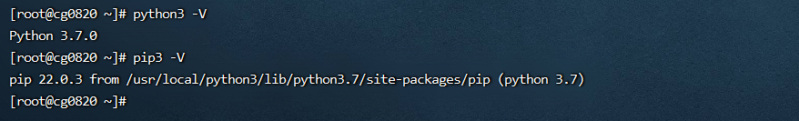
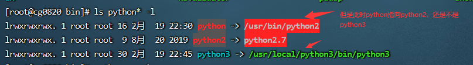
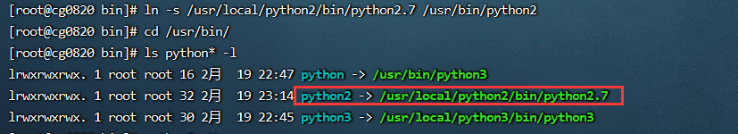
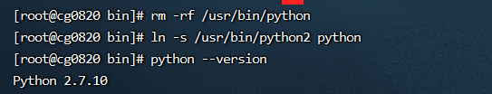

# 1 python的版本安装并设置默认版本
基于 centos7 安装，yum命令是基于 python2.7 的  
全部操作都在 root 用户下执行。步骤如下：

1. 安装编译相关工具

   ```shell
   yum -y groupinstall "Development tools"
   yum -y install zlib-devel bzip2-devel openssl-devel ncurses-devel sqlite-devel readline-devel tk-devel gdbm-devel db4-devel libpcap-devel xz-devel
   yum install libffi-devel -y
   ```


2. 下载安装包解压

   ```shell
   wget https://www.python.org/ftp/python/3.7.0/Python-3.7.0.tar.xz
   tar -xvJf  Python-3.7.0.tar.xz
   ```


3. 编译安装

   ```shell
   #创建编译安装目录
   mkdir /usr/local/python3 
   cd Python-3.7.0

   #将python3安装再/usr/local/目录下
   ./configure --prefix=/usr/local/python3

   make && make install
   ```

4. 创建软连接

   ```shell
   # 将安装的python3连接到/usr/bin/python3
   ln -s /usr/local/python3/bin/python3 /usr/bin/python3
   ln -s /usr/local/python3/bin/pip3 /usr/bin/pip3
   ```


5. 这里可以验证python是否验证成功，但是还不是验证设置默认的python

   ```shel
   python3 -V
   pip3 -V
   ```

   

   执行完上面命令后，如果想将python3设置为默认的 python 版本，则继续如下图  
   在 /usr/bin/ 目录下，执行`ls python* -l`  命令：  
     
   注意：linux里默认的是指向python文件，python文件连接的是python2，如果要设置默认的为python3，则需要执行下面的命令：

   ```shell
   #删除原来的连接
   rm -rf python

   #将python文件夹执行python3
   ln -s /usr/bin/python3 python
   ```


6. 验证是否成功

   ```shell
   python --version
   ```

   


# 2 将python版本切回python2.7
```bash
#1.下载源码包,后面的下载链接直接在python官网找的，如果想安装更高的版本自行更换
wget https://www.python.org/ftp/python/2.7.10/Python-2.7.10.tgz

#2.解压压缩包
tar xvf Python-2.7.10.tgz

#3.指定安装路径
cd Python-2.7.10
./configure --prefix=/usr/local/python2

#4.编译并安装
make
make install

#5.设置连接
ln -s /usr/local/python2/bin/python2.7 /usr/bin/python2 
cd /usr/bin/
ls python* -l
```

如下：  
  


接下来将设置默认版本为python2.7

```bash
rm -rf /usr/bin/python 
ln -s /usr/bin/python2 python
python --version
```

如图：  


