# 1 docker简介
## 1.1 组件概念
Docker使用C/S架构，Client通过接口与Server进程通信实现容器的构建

**<font style="color:#E8323C;">Host(Docker 宿主机)：</font>**安装了Docker程序，并运行了Docker daemon的主机。

**<font style="color:#E8323C;">Docker daemon(Docker 守护进程)：</font>**运行在宿主机上，Docker守护进程，用户通过Docker client(Docker命令)与Docker daemon交互。

**<font style="color:#E8323C;">Images(镜像)：</font>**将软件环境打包好的模板，用来创建容器的，一个镜像可以创建多个容器。  
<font style="color:#000000;">镜像分层结构：</font>

位于下层的镜像称为父镜像(Parent Image)，最底层的称为基础镜像(Base Image)。  
最上层为“可读写”层，其下的均为“只读”层。  
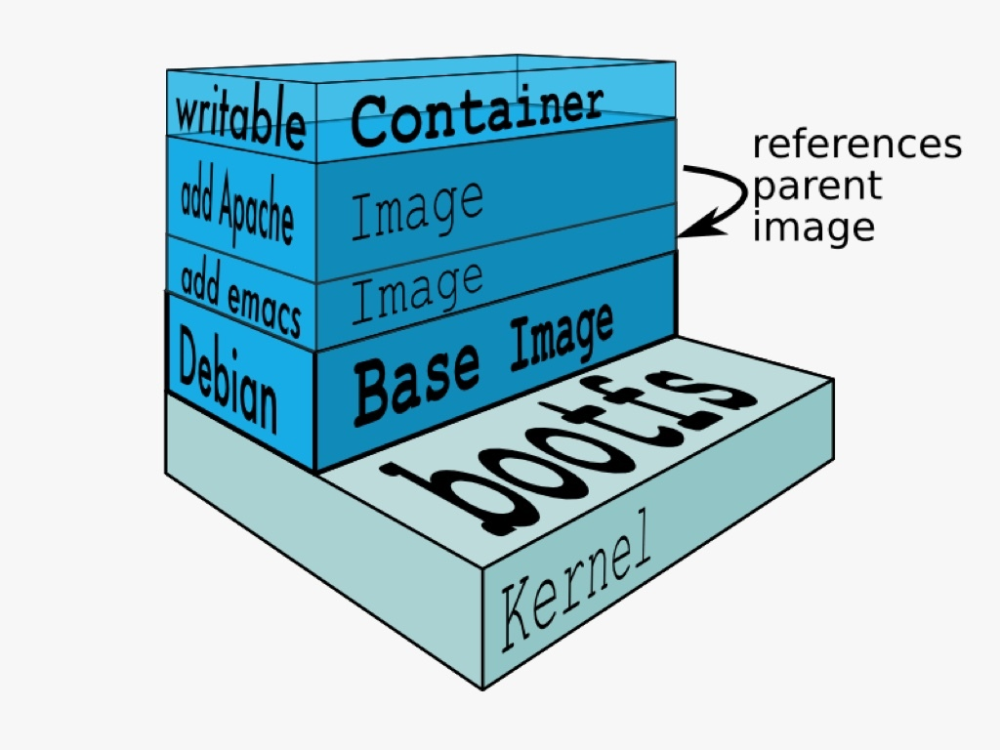

**<font style="color:#F5222D;">Containers(容器)：</font>**Docker的运行组件，启动一个镜像就是一个容器，容器与容器之间相互隔离，并且互不影响。

**<font style="color:#F5222D;">Docker Client(Docker 客户端)</font>**：Docker命令行工具，用户是用Docker Client与Docker daemon进行通信并返回结果给用户。也可以使用其他工具通过Docker Api 与Docker daemon通信。

**<font style="color:#F5222D;">Registry(仓库服务注册)</font>**<font style="color:#F5222D;">：</font>经常会和仓库(Repository)混为一谈，实际上Registry上可以有多个仓库，每个仓库可以看成是一个用户，一个用户的仓库放了多个镜像。仓库分为了公开仓库(Public Repository)和私有仓库(Private Repository)，最大的公开仓库是官方的Docker Hub，国内也有如阿里云、时速云等，可以给国内用户提供稳定快速的服务。用户也可以在本地网络内创建一个私有仓库。当用户创建了自己的镜像之后就可以使用 push 命令将它上传到公有或者私有仓库，这样下次在另外一台机器上使用这个镜像时候，只需要从仓库上 pull 下来就可以了。


# 2 docker安装
Docker 提供了两个版本：社区版 (CE) 和企业版 (EE)。  
以Centos7为例，且Docker 要求操作系统必须为64位，且centos内核版本为3.1及以上。  
查看系统内核版本信息：

```plain
uname -r
```

如下图：  
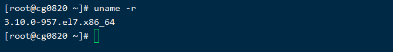

## 2.1 准备
卸载旧版本：

```shell
# 1. 查看安装过的docker相关软件
[root@cg0820 ~]# yum list installed | grep docker

#卸载
[root@cg0820 ~]# yum remove docker-ce.x86_64 docker-ce-cli.x86_64 docker-ce-rootless-extras.x86_64  -y

[root@cg0820 ~]# rm -rf /var/lib/docker
```

如下图所示：  
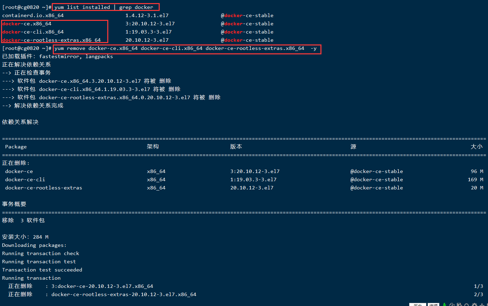

## 2.2 安装
1. yi安装依赖软件包

```shell
yum install -y yum-utils device-mapper-persistent-data lvm2

#安装前可查看device-mapper-persistent-data和lvm2是否已经安装
rpm -qa|grep device-mapper-persistent-data
rpm -qa|grep lvm2
```


2. 设置yum源

```plain
yum-config-manager --add-repo https://download.docker.com/linux/centos/docker-ce.repo
```


3. 更新yum软件包索引

```plain
yum makecache fast
```


4. 安装最新版本docker-ce

```powershell
yum install docker-ce -y

#安装指定版本docker-ce可使用以下命令查看
yum list docker-ce.x86_64 --showduplicates | sort -r

#重启docker服务
systemctl restart docker

#安装完成之后可以使用命令查看
docker version
```

如下图：  
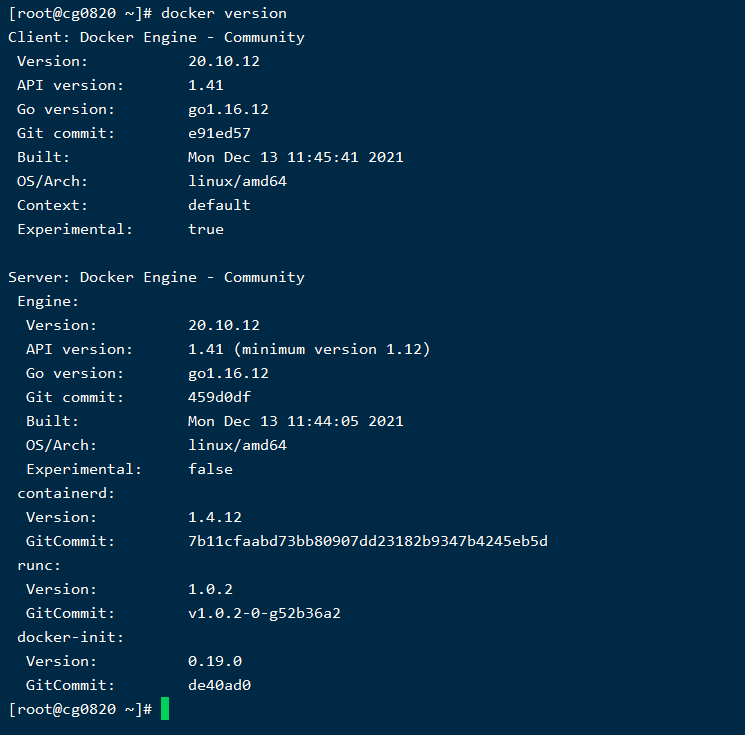


# 3 docker常用操作
输入 docker 可以查看Docker的命令用法，输入 **<font style="color:#F5222D;">docker COMMAND --help</font>** 查看指定命令详细用法。


## 3.1 镜像常用操作
**<font style="color:#F5222D;">查找镜像</font>**

```java
docker search 关键词     //搜索docker hub网站镜像的详细信息
```

例如：  
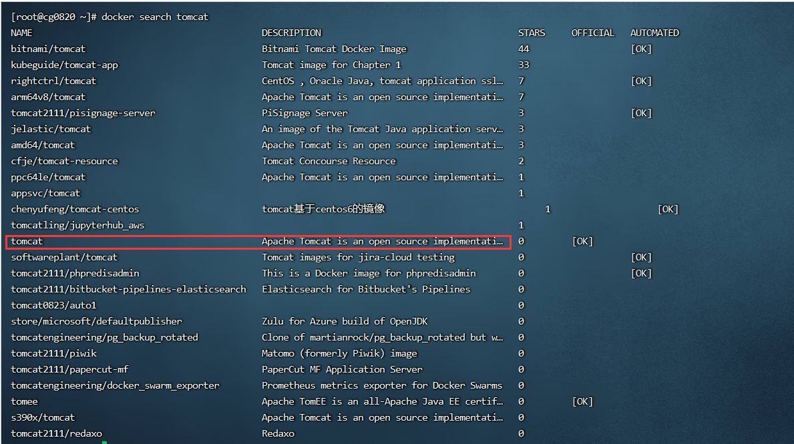


**<font style="color:#F5222D;">下载镜像</font>**

```java
docker pull 镜像名:TAG     //TAG表示版本，有些镜像的版本显示为latest，为最新版本
```


**<font style="color:#F5222D;">查看镜像</font>**

```java
docker image list
docker images  // 查看本地所有镜像
```


**<font style="color:#F5222D;">删除镜像</font>**

```java
docker rmi -f $(docker images -aq)     //删除全部镜像
    
docker rmi -f 镜像ID或者镜像名:TAG     
//删除指定本地镜像
//-f 表示强制删除
```


**<font style="color:#F5222D;">获取元信息</font>**

```java
docker inspect 镜像ID或者镜像名:TAG
// 获取镜像的元信息，详细信息
```

例如：  
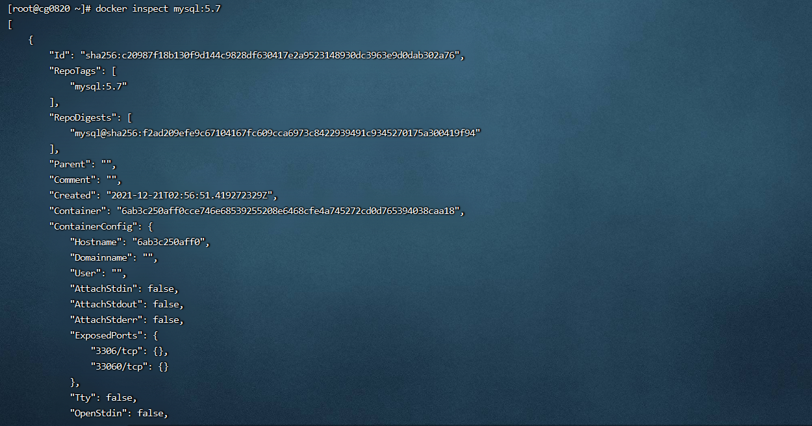


## 3.2 容器常用操作
**<font style="color:#F5222D;">运行容器</font>**

```java
docker run --name 容器名 -i -t -p 主机端口:容器端口 -d -v 主机目录:容器目录:ro 镜像ID或镜像名:TAG
// --name 指定容器名，可自定义，不指定自动命名
// -i 以交互模式运行容器
// -t 分配一个伪终端，即命令行，通常-it组合来使用
// -p 指定映射端口，讲主机端口映射到容器内的端口
// -d 后台运行容器
// -v 指定挂载主机目录到容器目录，默认为rw读写模式，ro表示只读
```


**<font style="color:#F5222D;">容器列表</font>**

```java
docker ps -a -q
// docker ps查看正在运行的容器
// -a 查看所有容器（运行中、未运行）
// -q 只查看容器的ID
```


**<font style="color:#F5222D;">启动容器</font>**

```plain
docker start 容器ID或容器名
```


**<font style="color:#F5222D;">停止容器</font>**

```plain
docker stop 容器ID或容器名
```


**<font style="color:#F5222D;">删除容器</font>**

```bash
docker rm -f 容器ID或容器名
# 2. -f 表示强制删除
```


**<font style="color:#F5222D;">查看日志</font>**

```plain
docker logs 容器ID或容器名
```


**<font style="color:#F5222D;">进入正在运行容器</font>**

```bash
docker exec -it 容器ID或者容器名 /bin/bash
# 3. 进入正在运行的容器并且开启交互模式终端
# 4. /bin/bash是固有写法，作用是因为docker后台必须运行一个进程，否则容器就会退出，在这里表示启动容器后启动bash。
# 5. 也可以用docker exec在运行中的容器执行命令
```


**<font style="color:#F5222D;">拷贝文件</font>**

```bash
docker cp 主机文件路径 容器ID或容器名:容器路径 #主机中文件拷贝到容器中
docker cp 容器ID或容器名:容器路径 主机文件路径 #容器中文件拷贝到主机中
```


**<font style="color:#F5222D;">获取容器元信息</font>**

```plain
docker inspect 容器ID或容器名
```


**<font style="color:#F5222D;">docker运行图</font>**  
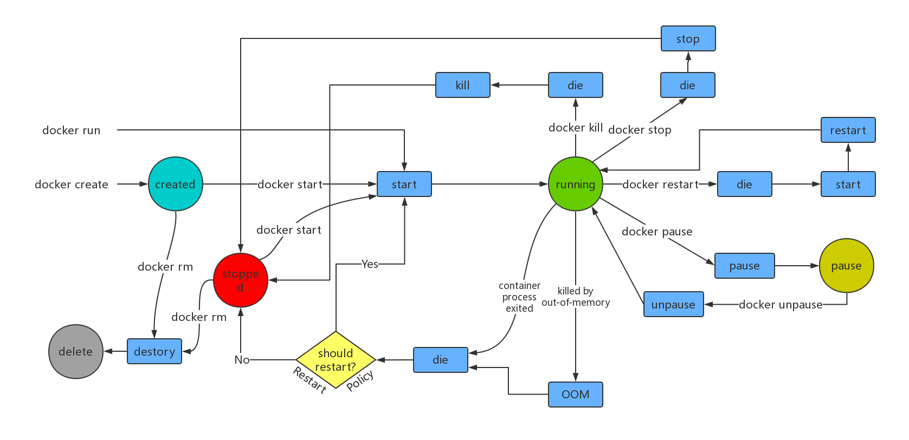

## 3.3 实例：运行mysql
```bash
# 1.拉取镜像
docker pull mysql:5.7

# 2.创建三个要挂载的目录
mkdir -p /my/mysql/conf
mkdir -p /my/mysql/data
mkdir -p /my/mysql/logs

# 3.复制文件 并修改字符
docker cp mysql:/etc/mysql/mysql.conf.d/mysqld.cnf /my/mysql/conf/
vi /my/mysql/conf/mysqld.conf
character-set-server=utf8

# 4.最终启动命令
docker run \
--name mysql \
-p 3306:3306 \
-v /my/mysql/conf:/etc/mysql/mysql.conf.d/ \
-v /my/mysql/data:/var/lib/mysql \
-v /my/mysql/logs:/logs \
-e MYSQL_ROOT_PASSWORD=root \
-d mysql:5.7
```

# 4 制作docker镜像
有时候从Docker镜像仓库中下载的镜像不能满足要求，我们可以基于一个基础镜像构建一个自己的镜像

两种方式：

+ 更新镜像：使用 **<font style="color:#E8323C;">docker commit </font>**命令
+ 构建镜像：使用 **<font style="color:#E8323C;">docker build </font>**命令，需要创建Dockerfile文件


## 4.1 更新镜像
先使用基础镜像创建一个容器，然后对容器内容进行更改，然后使用 docker commit 命令提交为一个新的镜像（以tomcat为例）。

  
1. 根据基础镜像，创建容器

```plain
docker run --name mytomcat -p 80:8080 -d tomcat:7
```

如下图：  
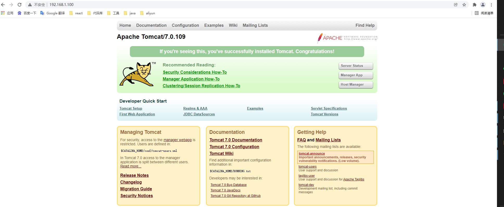


2. 修改容器内容

```plain
docker exec -it mytomcat /bin/bash
cd webapps/ROOT
rm -f index.jsp
echo hello world > index.html
exit
```

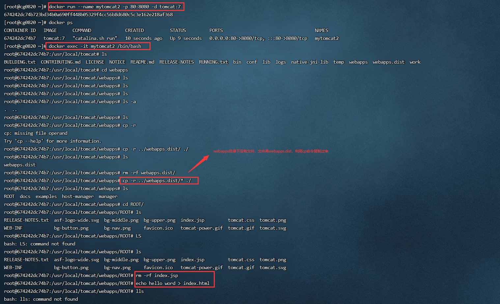


3. 提交为新镜像

```bash
docker commit -m="描述消息" -a="作者" 容器ID或容器名 镜像名:TAG
# 6. 例:
# 7. docker commit -m="修改了首页" -a="cg" mytomcat huaan/tomcat:v1.0
```

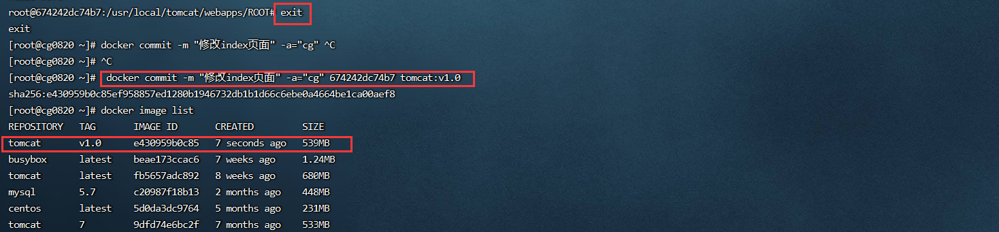


4. 使用新镜像运行容器

```bash
docker run --name tom -p 8080:8080 -d tomcat:v1.0
```

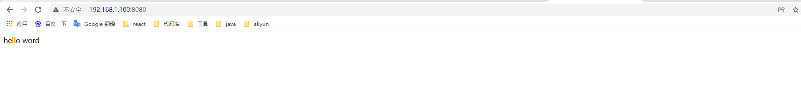

## 4.2 使用DockerFile创建镜像
### 4.2.1 Dockerfile格式
+ Format： 
    - Comment
    - INSTRUCTION arguments
+ The instruction is not case-sensitive 
    - However,convention is for them to be UPPERCASE to distinguish them from arguments more easily
+ Docker runs instructions in a Dockerfile in order
+ The first instruction must be 'FROM' in order to specify the Base Image from which you are building


### 4.2.2 使用Dockerfile构建SpringBoot应用镜像
1. 准备：把你的 springboot 项目打包成可执行 jar 包，把 jar 包上传到 Linux 服务器
2. 构建：在jar包路径下创建Dockerfile文件 vi Dockerfile

```dockerfile
# 8. 指定基础镜像，本地没有会从dockerHub pull下来
FROM java:8
#作者
MAINTAINER huaan
# 9. 把可执行jar包复制到基础镜像的根目录下
ADD luban.jar /luban.jar
# 10. 镜像要暴露的端口，如要使用端口，在执行docker run命令时使用-p生效
EXPOSE 80
# 11. 在镜像运行为容器后执行的命令
ENTRYPOINT ["java","-jar","/luban.jar"]
```

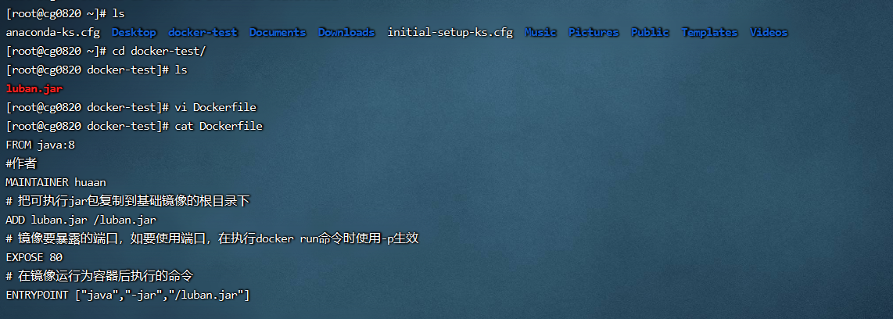

3. 使用 docker build 命令构建镜像，基本语法

```bash
docker build -t mypro:v1 .
# 12. -f指定Dockerfile文件的路径
# 13. -t指定镜像名字和TAG
# 14. .指当前目录，这里实际上需要一个上下文路径
```

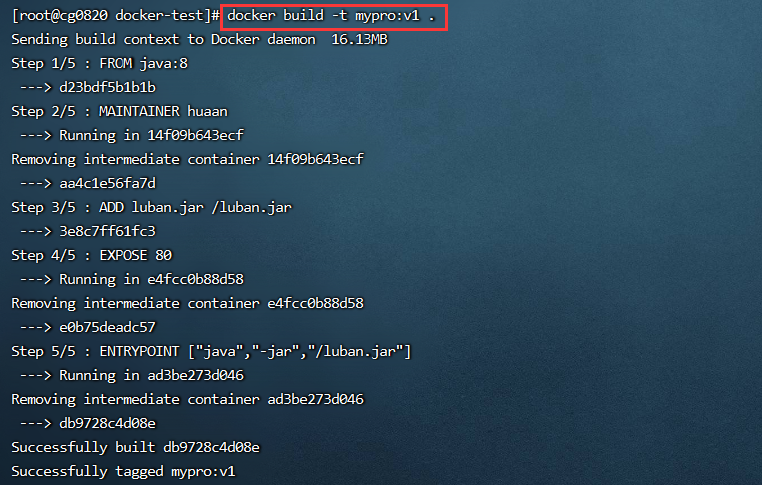

4. 运行：运行自己的SpringBoot镜像

```bash
docker run --name pro -p 80:80 -d 镜像名:TAG
```

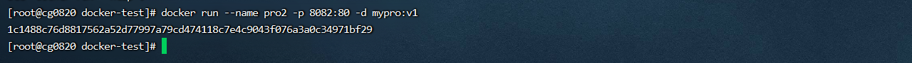

运行结果如下图：  
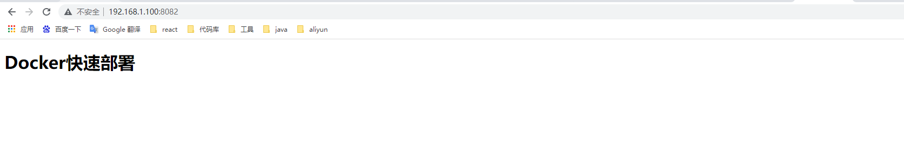

### 4.3.3 DockerFile常用指令
**<font style="color:#E8323C;">FROM</font>**：FROM指令是最重要的一个并且必须为Dockerfile文件开篇的第一个非注释行，用于为镜像文件构建过程指定基础镜像，后续的指令运行于此基础镜像提供的运行环境。

这个基础镜像可以是任何可用镜像，默认情况下docker build会从本地仓库找指定的镜像文件，如果不存在就会从Docker Hub上拉取

语法：

```dockerfile
FROM <image>
FROM <image>:<tag>
FROM <image>@<digest>
```


**<font style="color:#E8323C;">MAINTAINER(depreacted)</font>**：Dockerfile的制作者提供的本人详细信息，Dockerfile不限制MAINTAINER出现的位置，但是推荐放到FROM指令之后。

语法：

```dockerfile
MAINTAINER <name>
```

name可以是任何文本信息，一般用作者名称或者邮箱


**<font style="color:#E8323C;">LABEL</font>**：给镜像指定各种元数据

语法：

```dockerfile
LABEL <key>=<value> <key>=<value> <key>=<value>...
```

一个 Dockerfile 可以写多个LABEL，但是不推荐这么做，Dockerfile每一条指令都会生成一层镜像，如果LABEL太长可以使用\符号换行。构建的镜像会继承基础镜像的LABEL，并且会去掉重复的，但如果值不同，则后面的值会覆盖前面的值。


**<font style="color:#E8323C;">COPY</font>**：用于从宿主机复制文件到创建的新镜像文件

语法：

```dockerfile
COPY <src> <dest>
COPY ["<src>","<dest>"]
# 15. <src>：要复制的源文件或者目录，可以使用通配符
# 16. <dest>：目标路径，即正在创建的image的文件系统路径；建议<dest>使用绝对路径，否则COPY指令则以WORKDIR为其起始路径
```

注意：如果你的路径中有空白字符，通常会使用第二种格式。

规则：

+ 必须是build上下文中的路径，不能是其父目录中的文件
+ 如果是目录，则其内部文件或子目录会被递归复制，但目录自身不会被复制
+ 如果指定了多个  ，或在  中使用了通配符，则  必须是一个目录，则必须以/符号结尾
+ 如果  不存在，将会被自动创建，包括其父目录路径


**<font style="color:#E8323C;">ADD</font>**  
基本用法和COPY指令一样，ADD支持使用TAR文件和URL路径  
语法：

```dockerfile
ADD <src> <dest>
ADD ["<src>","<dest>"]
```

规则：

+ 和COPY规则相同
+ 如果  为URL并且  没有以/结尾，则  指定的文件将被下载到 
+ 如果  是一个本地系统上压缩格式的tar文件，它会展开成一个目录；但是通过URL获取的tar文件不会自动展开
+ 如果  有多个，直接或间接使用了通配符指定多个资源，则  必须是目录并且以/结尾


**<font style="color:#E8323C;">WORKDIR</font>**  
用于为Dockerfile中所有的RUN、CMD、ENTRYPOINT、COPY和ADD指定设定工作目录，只会影响当前WORKDIR之后的指令。  
语法：

```dockerfile
WORKDIR <dirpath>
```

在Dockerfile文件中，WORKDIR可以出现多次，路径可以是相对路径，但是它是相对于前一个WORKDIR指令指定的路径，另外，WORKDIR可以是ENV指定定义的变量


**<font style="color:#E8323C;">VOLUME</font>**  
用来创建挂载点，可以挂载宿主机上的卷或者其他容器上的卷  
语法：

```dockerfile
VOLUME <mountpoint>
VOLUME ["<mountpoint>"]
```

不能指定宿主机当中的目录，宿主机挂载的目录是自动生成的


**<font style="color:#E8323C;">EXPOSE</font>**  
用于给容器打开指定要监听的端口以实现和外部通信  
语法：

```dockerfile
EXPOSE <port>[/<protocol>] [<port>[/<protocol>]...]
```

用于指定传输层协议，可以是TCP或者UDP，默认是TCP协议  
EXPOSE可以一次性指定多个端口，例如： EXPOSE 80/tcp 80/udp


**<font style="color:#E8323C;">ENV</font>**  
用来给镜像定义所需要的环境变量，并且可以被Dockerfile文件中位于其后的其他指令(如ENV、ADD、COPY等)所调用，调用格式：

$$
 variable_name或者 
$$
{variable_name}  
语法：

```dockerfile
ENV <key> <value>
ENV <key>=<value>...
```

第一种格式中， 之后的所有内容都会被视为  的组成部分，所以一次只能设置一个变量  
第二种格式可以一次设置多个变量，如果  当中有空格可以使用\进行转义或者对  加引号进行标识；另外\也可以用来续行


**<font style="color:#E8323C;">ARG</font>**  
用法同ENV  
语法：

```dockerfile
ARG <name>[=<default value>]
```

指定一个变量，可以在docker build创建镜像的时候，使用 --build-arg = 来指定参数


**<font style="color:#E8323C;">RUN</font>**  
用来指定docker build过程中运行指定的命令  
语法：

```dockerfile
RUN <command>
RUN ["<executable>","<param1>","<param2>"]
```

第一种格式里面的参数一般是一个shell命令，以 /bin/sh -c 来运行它  
第二种格式中的参数是一个JSON格式的数组，当中  是要运行的命令，后面是传递给命令的选项或者参数；但是这种格式不会用 /bin/sh -c 来发起，所以常见的shell操作像变量替换和通配符替换不会进行；如果你运行的命令依赖shell特性，可以替换成类型以下的格式

```dockerfile
RUN ["/bin/bash","-c","<executable>","<param1>"]
```


**<font style="color:#E8323C;">CMD</font>**  
容器启动时运行的命令  
语法：

```dockerfile
CMD <command>
CMD ["<executable>","<param1>","<param2>"]
CMD ["<param1>","<param2>"]
```

前两种语法和RUN相同  
第三种语法用于为ENTRYPOINT指令提供默认参数  
RUN和CMD区别：

+ RUN指令运行于镜像文件构建过程中，CMD则运行于基于Dockerfile构建出的新镜像文件启动为一个容器的时候
+ CMD指令的主要目的在于给启动的容器指定默认要运行的程序，且在运行结束后，容器也将终止；不过，CMD命令可以被docker run的命令行选项给覆盖
+ Dockerfile中可以存在多个CMD指令，但是只有最后一个会生效


**<font style="color:#E8323C;">ENTRYPOINT</font>**  
类似于CMD指令功能，用于给容器指定默认运行程序  
语法：

```dockerfile
ENTRYPOINT<command>
ENTRYPOINT["<executable>","<param1>","<param2>"]
```

和CMD不同的是ENTRYPOINT启动的程序不会被docker run命令指定的参数所覆盖，而且，这些命令行参数会被当做参数传递给ENTRYPOINT指定的程序(但是，docker run命令的--entrypoint参数可以覆盖ENTRYPOINT)

docker run命令传入的参数会覆盖CMD指令的内容并且附加到ENTRYPOINT命令最后作为其参数使用同样，Dockerfile中可以存在多个ENTRYPOINT指令，但是只有最后一个会生效  
Dockerfile中如果既有CMD又有ENTRYPOINT，并且CMD是一个完整可执行命令，那么谁在最后谁生效


**<font style="color:#E8323C;">ONBUILD</font>**  
用来在Dockerfile中定义一个触发器  
语法：

```dockerfile
ONBUILD <instruction>
```

Dockerfile用来构建镜像文件，镜像文件也可以当成是基础镜像被另外一个Dockerfile用作FROM指令的参数在后面这个Dockerfile中的FROM指令在构建过程中被执行的时候，会触发基础镜像里面的ONBUILD指令  
ONBUILD不能自我嵌套，ONBUILD不会触发FROM和MAINTAINER指令  
在ONBUILD指令中使用ADD和COPY要小心，因为新构建过程中的上下文在缺少指定的源文件的时候会失败

****

### 4.3.4 实例
第一步：  
vim Dockerfile

```dockerfile
FROM centos:7
ARG myname
LABEL author=$myname
ADD apache-tomcat-7.0.92.tar.gz /usr/local
ADD jdk-8u60-linux-x64.tar.gz /usr/local

ENV JAVA_HOME=/usr/local/jdk1.8.0_60
ENV CLASSPATH .:$JAVA_HOME/lib
ENV CATALINA_HOME=/usr/local/apache-tomcat-7.0.92
ENV PATH 

$$
PATH:$JAVA_HOME/bin:
$$
CATALINA_HOME/bin

WORKDIR $CATALINA_HOME

RUN yun install -y vim
EXPOSE 8080
CMD ls
ENTRYPOINT ["catalina.sh","run"]
```

第二步：

```bash
docker build -t mypro:v10 --build-arg myname=cg .
```

  
  
第三步：

```bash
docker run --name tom3 -p 8085:8080 -d mypro:v10
```

  
第四步：截图如下  
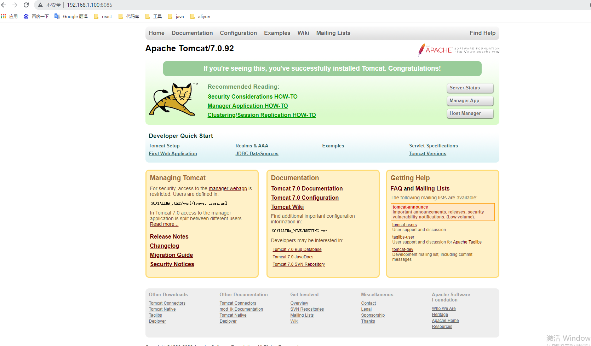


# 5 将本地镜像发布到阿里云
有时候需要共享镜像或者习惯使用自己定义的镜像，可以注册私有仓库，国内推荐使用阿里云  
步骤：  
1. 登录阿里云容器镜像服务：[https://cr.console.aliyun.com/cn-hangzhou/repositories](https://cr.console.aliyun.com/cn-hangzhou/repositories)  
2. 将镜像推送到阿里云

```bash

# 17. 登录
docker login --username=guangc201 registry.cn-hangzhou.aliyuncs.com

# 18. 打tag
docker tag  tomcat:7 registry.cn-hangzhou.aliyuncs.com/guangchen/springboot-test:tomcat7

# 19. 推送
docker push  registry.cn-hangzhou.aliyuncs.com/guangchen/springboot-test:tomcat7

# 20. 拉取
docker pull registry.cn-hangzhou.aliyuncs.com/guangchen/springboot-test:tomcat7
```

如图：  
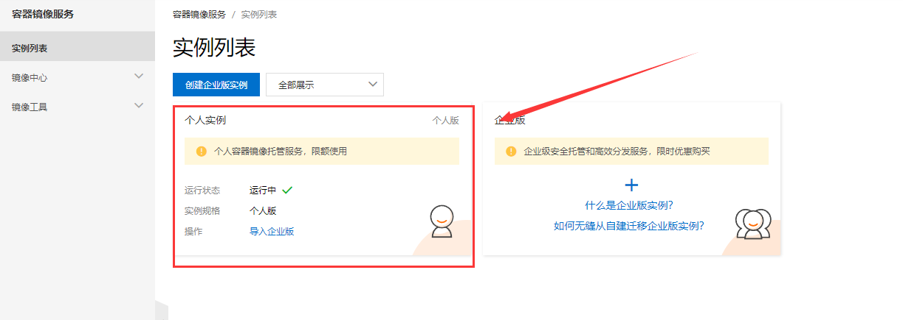  
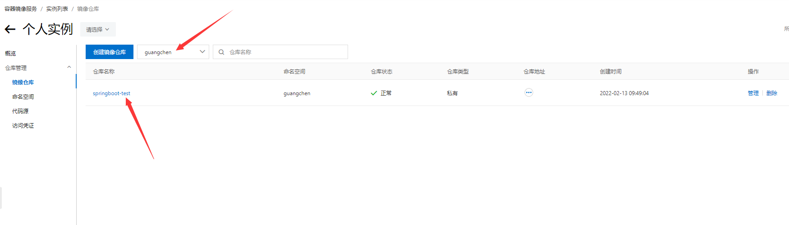  
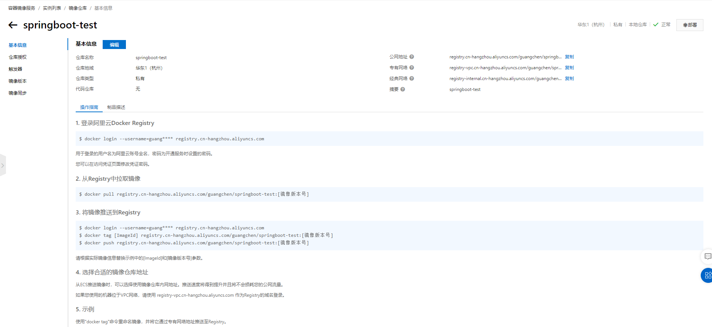  
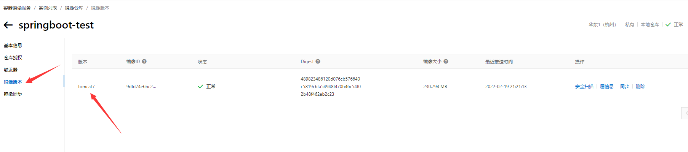


# 6 Docker网络
Docker允许通过外部访问容器或容器互联的方式来提供网络服务。  
安装Docker时，会自动安装一块Docker网卡称为docker0，用于Docker各容器及宿主机的网络通信，网段为172.0.0.1。如图：  
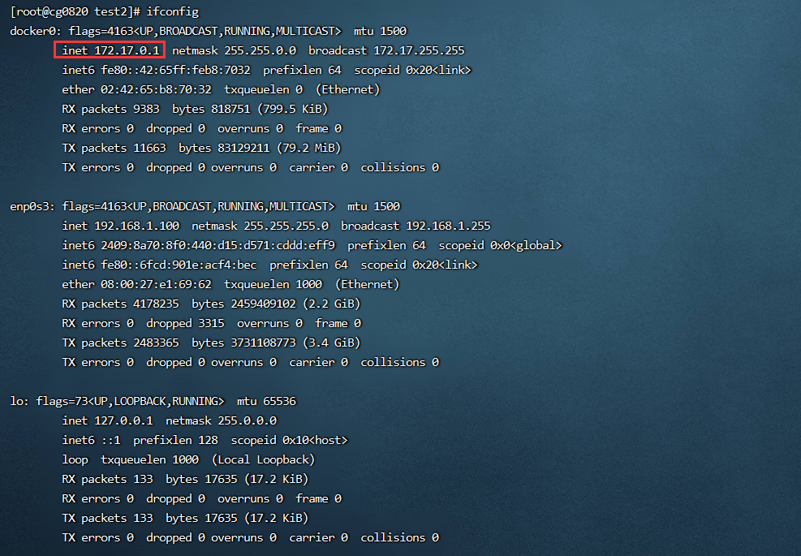

Docker网络中有三个核心概念：沙盒（Sandbox）、网络（Network）、端点（Endpoint）。

+ 沙盒：提供了容器的虚拟网络栈，也即端口套接字、IP路由表、防火墙等内容。隔离容器网络与宿主机网络，形成了完全独立的容器网络环境。
+ 网络：可以理解为Docker内部的虚拟子网，网络内的参与者相互可见并能够进行通讯。Docker的虚拟网络和宿主机网络是存在隔离关系的，其目的主要是形成容器间的安全通讯环境。
+ 端点：位于容器或网络隔离墙之上的洞，主要目的是形成一个可以控制的突破封闭的网络环境的出入口。当容器的端点与网络的端点形成配对后，就如同在这两者之间搭建了桥梁，便能够进行数据传输了。

**<font style="color:#E8323C;">Bridge：</font>**桥接模式，主要用来对外通信的，docker容器默认的网络使用的就是bridge。  
使用bridge模式配置容器自定的网络配置

```bash
# 21. 配置容器的主机名 
docker run --name t1 --network bridge -h [自定义主机名] -it --rm busybox 

# 22. 自定义DNS 
docker run --name t1 --network bridge --dns 114.114 -it --rm busybox 

# 23. 给host文件添加一条 
docker run --name t1 --network bridge --add-host [hostname]:[ip] -it --rm busybox
```

**<font style="color:#E8323C;">Host</font>**：host类型的网络就是主机网络的意思，绑定到这种网络上面的容器，内部使用的端口直接绑定在主机上对应的端口，而如果容器服务没有使用端口，则无影响。

**<font style="color:#E8323C;">None</font>**：从某种意义上来说，none应该算不上网络了，因为它不使用任何网络，会形成一个封闭网络的容器

**<font style="color:#E8323C;">container</font>**：共享另外一个容器的network namespace，和host模式差不多，只是这里不是使用宿主机网络，而是使用的容器网络

# 7 Docker Compose
我们了解到可以使用一个Dockerfile模板文件来快速构建一个自己的镜像并运行为应用容器。但是在平时工作的时候，我们会碰到多个容器要互相配合来使用的情况，比如数据库加上咱们Web应用等等。这种情况下，每次都要一个一个启动容器设置命令变得麻烦起来，所以Docker Compose诞生了。


## 7.1 简介
Compose的作用是“定义和运行多个Docker容器的应用”。使用Compose，你可以在一个配置文件（yaml格式）中配置你应用的服务，然后使用一个命令，即可创建并启动配置中引用的所有服务。  
Compose中两个重要概念：

+ 服务 (service)：一个应用的容器，实际上可以包括若干运行相同镜像的容器实例。
+ 项目 (project)：由一组关联的应用容器组成的一个完整业务单元，在 docker-compose.yml文件中定义。

## 7.2 安装
Compose支持三平台Windows、Mac、Linux，安装方式各有不同。我这里使用的是Linux系统，其他系统安装方法可以参考官方文档和开源GitHub链接：  
Docker Compose官方文档链接：[https://docs.docker.com/compose](https://docs.docker.com/compose)  
Docker Compose GitHub链接：[https://github.com/docker/compose](https://github.com/docker/compose)

Linux上有两种安装方法，Compose项目是用Python写的，可以使用Python-pip安装，也可以通过GitHub下载二进制文件进行安装。

### 7.2.1出通过Python-pip安装
```bash
#1.安装Python-pip
yum install -y epel-release
yum install -y python-pip
#2.安装docker-compose
pip install docker-compose
#3.验证是否安装
docker-compose version
#4.卸载
pip uninstall docker-compose
```

### 7.2.2 通过GitHub链接下载安装
非ROOT用户记得加sudo

```bash
#1.通过GitHub获取下载链接，以往版本地址：https://github.com/docker/compose/releases
curl -L "https://github.com/docker/compose/releases/download/1.23.2/docker-compose-

$$
(uname -s)-
$$
(uname -m)" -o /usr/local/bin/docker-compose

#2.给二进制下载文件可执行的权限
chmod +x /usr/local/bin/docker-compose

#3.可能没有启动程序，设置软连接，比如:
ln -s /usr/local/bin/docker-compose /usr/bin/docker-compose

#4.验证是否安装
docker-compose version

#5.卸载,如果是二进制包方式安装的，删除二进制文件即可。
rm /usr/local/bin/docker-compose
```

## 7.3 案例
**使用Docker Compose编排SpringCloud微服务**  
使用docker-compose一次性来编排三个微服务:eureka服务(eureka-server-2.0.2.RELEASE.jar)、user服务(user-2.0.2.RELEASE.jar)、power服务(power-2.0.2.RELEASE.jar)  
1. 创建一个工作目录和docker-compose模板文件  
2. 工作目录下创建三个文件夹eureka、user、power，并分别构建好三个服务的镜像文件

  
以eureka的Dockerfile为例:

```dockerfile
# 24. 基础镜像 
FROM java:8 
# 25. 作者
MAINTAINER huaan 
# 26. 把可执行jar包复制到基础镜像的根目录下 
ADD eureka-server-2.0.2.RELEASE.jar /eureka-server-2.0.2.RELEASE.jar 
# 27. 镜像要暴露的端口，如要使用端口，在执行docker run命令时使用-p生效 
EXPOSE 3000 
# 28. 在镜像运行为容器后执行的命令 
ENTRYPOINT ["java","-jar","/eureka-server-2.0.2.RELEASE.jar"]
```


目录文件结构：

```plain
compose 
    docker-compose.yml 
    eureka 
        Dockerfile 
        eureka-server-2.0.2.RELEASE.jar 
    user 
        Dockerfile 
        user-2.0.2.RELEASE.jar 
    power 
        Dockerfile 
        power-2.0.2.RELEASE.jar
```


3. 编写docker-compose模板文件：

```plain
version: '1' 
services: 
  eureka: 
    image: eureka:v1 
    ports: 
      - 8080:8080 
  user: 
    image: user:v1 
    ports: 
      - 8081:8081 
  power: 
    image: power:v1 
    ports: 
      - 8082:8082
```


4.启动微服务，可以加上参数-d后台启动

```plain
docker-compose up -d
```

