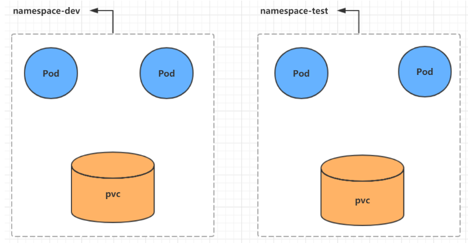
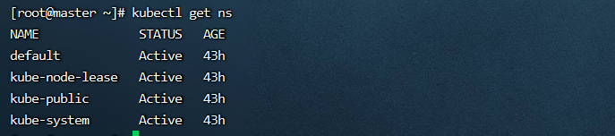
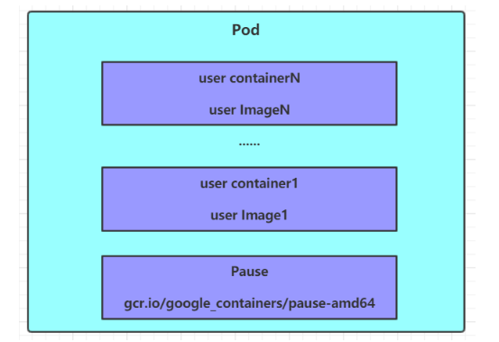
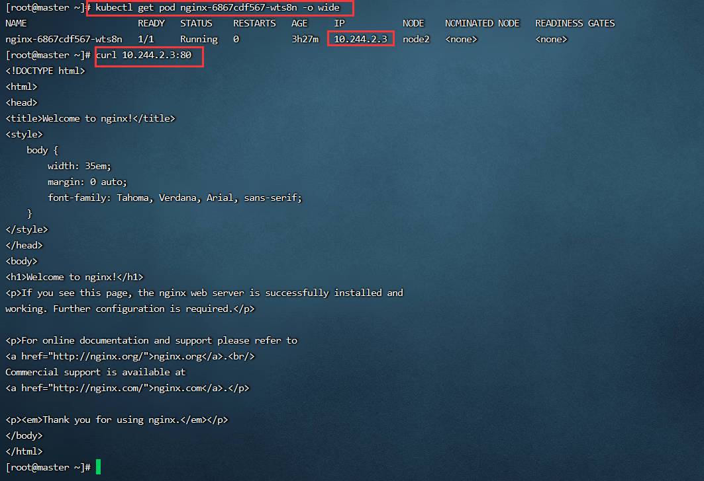
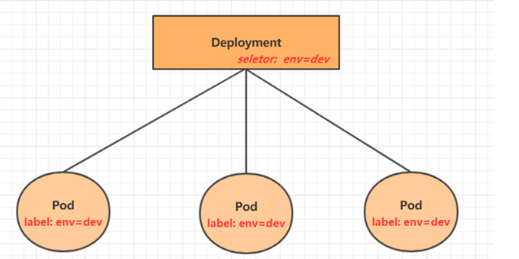
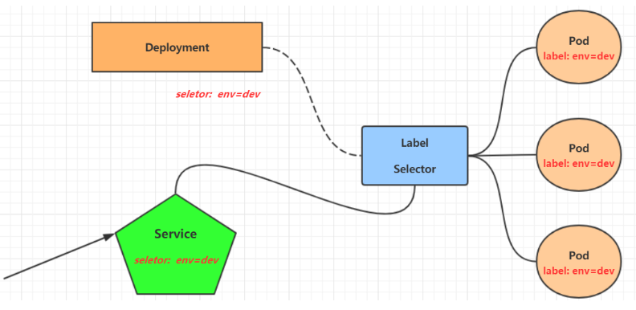
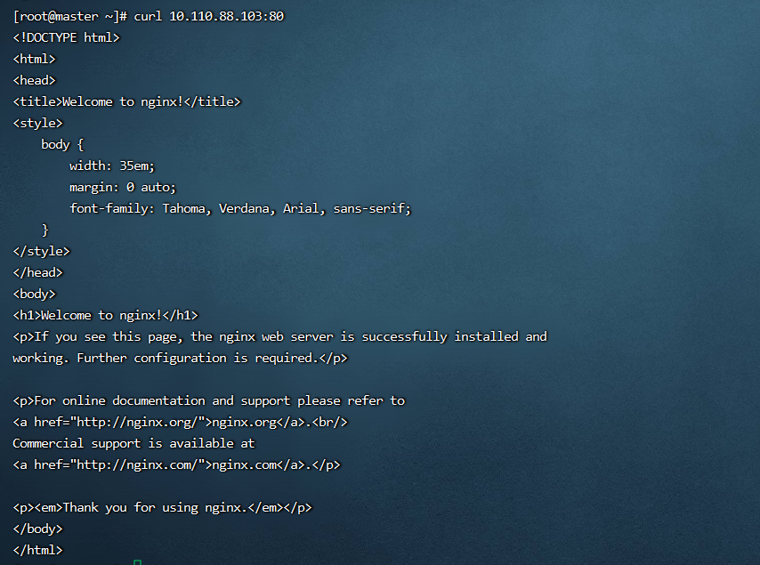

**<font style="color:#DF2A3F;">笔记来源：</font>**[**<font style="color:#DF2A3F;">Kubernetes(K8S) 入门进阶实战完整教程，黑马程序员K8S全套教程（基础+高级）</font>**](https://www.bilibili.com/video/BV1Qv41167ck/?spm_id_from=333.337.search-card.all.click&vd_source=e8046ccbdc793e09a75eb61fe8e84a30)

# 1 Namespace
**Namespace**是kubernetes系统中的一种非常重要资源，它的主要作用是用来实现**多套环境的资源隔离**或者**多租户的资源隔离**。

默认情况下，kubernetes集群中的所有的Pod都是可以相互访问的。但是在实际中，可能不想让两个Pod之间进行互相的访问，那此时就可以将两个Pod划分到不同的namespace下。kubernetes通过将集群内部的资源分配到不同的Namespace中，可以形成逻辑上的"组"，以方便不同的组的资源进行隔离使用和管理。

可以通过kubernetes的授权机制，将不同的namespace交给不同租户进行管理，这样就实现了多租户的资源隔离。此时还能结合kubernetes的资源配额机制，限定不同租户能占用的资源，例如CPU使用量、内存使用量等等，来实现租户可用资源的管理。  
  
kubernetes在集群启动之后，会默认创建几个namespace

```bash
[root@master ~]# kubectl  get namespace
NAME              STATUS   AGE
default           Active   45h     #  所有未指定Namespace的对象都会被分配在default命名空间
kube-node-lease   Active   45h     #  集群节点之间的心跳维护，v1.13开始引入
kube-public       Active   45h     #  此命名空间下的资源可以被所有人访问（包括未认证用户）
kube-system       Active   45h     #  所有由Kubernetes系统创建的资源都处于这个命名空间
```



下面来看namespace资源的具体操作：

## 1.1 查看
```bash
# 1 查看所有的ns  命令：kubectl get ns
[root@master ~]# kubectl get ns
NAME              STATUS   AGE
default           Active   45h
kube-node-lease   Active   45h
kube-public       Active   45h     
kube-system       Active   45h     

# 2 查看指定的ns   命令：kubectl get ns ns名称
[root@master ~]# kubectl get ns default
NAME      STATUS   AGE
default   Active   45h

# 3 指定输出格式  命令：kubectl get ns ns名称  -o 格式参数
# 192. kubernetes支持的格式有很多，比较常见的是wide、json、yaml
[root@master ~]# kubectl get ns default -o yaml
apiVersion: v1
kind: Namespace
metadata:
creationTimestamp: "2020-04-05T04:44:16Z"
name: default
resourceVersion: "151"
selfLink: /api/v1/namespaces/default
uid: 7405f73a-e486-43d4-9db6-145f1409f090
spec:
finalizers:
- kubernetes
status:
phase: Active

# 4 查看ns详情  命令：kubectl describe ns ns名称
[root@master ~]# kubectl describe ns default
Name:         default
Labels:       <none>
Annotations:  <none>
Status:       Active  # Active 命名空间正在使用中  Terminating 正在删除命名空间

# 193. ResourceQuota 针对namespace做的资源限制
# 194. LimitRange针对namespace中的每个组件做的资源限制
No resource quota.
No LimitRange resource.
```


## 1.2 创建
```bash
# 195. 创建namespace
[root@master ~]# kubectl create ns dev
namespace/dev created
```


## 1.3 删除
```powershell
# 196. 删除namespace
[root@master ~]# kubectl delete ns dev
namespace "dev" deleted
```


## 1.4 配置方式
首先准备一个yaml文件：ns-dev.yaml

```yaml
apiVersion: v1
kind: Namespace
metadata:
  name: dev
```

然后就可以执行对应的创建和删除命令了：  
创建：`<font style="color:#E8323C;">kubectl create -f ns-dev.yaml</font>`  
删除：`<font style="color:#E8323C;">kubectl delete -f ns-dev.yaml</font>`

# 2 Pod
Pod是kubernetes集群进行管理的最小单元，程序要运行必须部署在容器中，而容器必须存在于Pod中。Pod可以认为是容器的封装，一个Pod中可以存在一个或者多个容器。  


kubernetes在集群启动之后，集群中的各个组件也都是以Pod方式运行的。可以通过下面命令查看：

```bash
[root@master ~]# kubectl get pod -n kube-system
NAMESPACE     NAME                             READY   STATUS    RESTARTS   AGE
kube-system   coredns-6955765f44-68g6v         1/1     Running   0          2d1h
kube-system   coredns-6955765f44-cs5r8         1/1     Running   0          2d1h
kube-system   etcd-master                      1/1     Running   0          2d1h
kube-system   kube-apiserver-master            1/1     Running   0          2d1h
kube-system   kube-controller-manager-master   1/1     Running   0          2d1h
kube-system   kube-flannel-ds-amd64-47r25      1/1     Running   0          2d1h
kube-system   kube-flannel-ds-amd64-ls5lh      1/1     Running   0          2d1h
kube-system   kube-proxy-685tk                 1/1     Running   0          2d1h
kube-system   kube-proxy-87spt                 1/1     Running   0          2d1h
kube-system   kube-scheduler-master            1/1     Running   0          2d1h
```


## 2.1 创建并运行
kubernetes没有提供单独运行Pod的命令，都是通过Pod控制器来实现的

```bash
# 197. 命令格式： kubectl run (pod控制器名称) [参数] 
# 198. --image  指定Pod的镜像
# 199. --port   指定端口
# 200. --namespace  指定namespace
[root@master ~]# kubectl run nginx --image=nginx:1.17.1 --port=80 --namespace dev 
deployment.apps/nginx created
```

## 2.2 查看pod信息
```bash
# 201. 查看Pod基本信息
[root@master ~]# kubectl get pods -n dev
NAME                     READY   STATUS    RESTARTS   AGE
nginx-5ff7956ff6-fg2db   1/1     Running   0          43s

# 202. 查看Pod的详细信息
[root@master ~]# kubectl describe pod nginx-5ff7956ff6-fg2db -n dev
```


## 2.3 访问Pod
```bash
# 203. 获取podIP
[root@master ~]# kubectl get pods -n dev -o wide
NAME                     READY   STATUS    RESTARTS   AGE    IP             NODE    ... 
nginx-5ff7956ff6-fg2db   1/1     Running   0          190s   10.244.1.23   node1   ...

# 204. 访问POD 
[root@master ~]# curl 10.244.2.3:80
```




## 2.4 删除指定Pod
```bash
# 205. 删除指定Pod
[root@master ~]# kubectl delete pod nginx-5ff7956ff6-fg2db -n dev
pod "nginx-5ff7956ff6-fg2db" deleted

# 206. 此时，显示删除Pod成功，但是再查询，发现又新产生了一个 
[root@master ~]# kubectl get pods -n dev
NAME                     READY   STATUS    RESTARTS   AGE
nginx-5ff7956ff6-jj4ng   1/1     Running   0          21s

# 207. 这是因为当前Pod是由Pod控制器创建的，控制器会监控Pod状况，一旦发现Pod死亡，会立即重建
# 208. 此时要想删除Pod，必须删除Pod控制器

# 209. 先来查询一下当前namespace下的Pod控制器
[root@master ~]# kubectl get deploy -n  dev
NAME    READY   UP-TO-DATE   AVAILABLE   AGE
nginx   1/1     1            1           9m7s

# 210. 接下来，删除此Pod控制器
[root@master ~]# kubectl delete deploy nginx -n dev
deployment.apps "nginx" deleted

# 211. 稍等片刻，再查询Pod，发现Pod被删除了
[root@master ~]# kubectl get pods -n dev
No resources found in dev namespace.
```


## 2.5 配置操作
创建一个pod-nginx.yaml，内容如下：

```yaml
apiVersion: v1
kind: Pod
metadata:
  name: nginx
  namespace: dev
spec:
  containers:
  - image: nginx:1.17.1
    name: pod
    ports:
    - name: nginx-port
      containerPort: 80
      protocol: TCP
```

然后就可以执行对应的创建和删除命令了：  
创建：`<font style="color:#E8323C;">kubectl create -f pod-nginx.yaml</font>`  
删除：`<font style="color:#E8323C;">kubectl delete -f pod-nginx.yaml</font>`


# 3 Label
Label是kubernetes系统中的一个重要概念。它的作用就是在资源上添加标识，用来对它们进行区分和选择。

  
Label的特点：

+ 一个Label会以key/value键值对的形式附加到各种对象上，如Node、Pod、Service等等
+ 一个资源对象可以定义任意数量的Label ，同一个Label也可以被添加到任意数量的资源对象上去
+ Label通常在资源对象定义时确定，当然也可以在对象创建后动态添加或者删除


可以通过Label实现资源的多维度分组，以便灵活、方便地进行资源分配、调度、配置、部署等管理工作。


> 一些常用的Label 示例如下：
>
> + 版本标签："version":"release", "version":"stable"......
> + 环境标签："environment":"dev"，"environment":"test"，"environment":"pro"
> + 架构标签："tier":"frontend"，"tier":"backend"
>


标签定义完毕之后，还要考虑到标签的选择，这就要使用到Label Selector，即：

+ Label用于给某个资源对象定义标识
+ Label Selector用于查询和筛选拥有某些标签的资源对象


当前有两种Label Selector：

+  基于等式的Label Selector 
    - `name = slave`: 选择所有包含Label中key="name"且value="slave"的对象
    - `env != production`: 选择所有包括Label中的key="env"且value不等于"production"的对象
+  基于集合的Label Selector 
    - `name in (master, slave)`: 选择所有包含Label中的key="name"且value="master"或"slave"的对象
    - `name not in (frontend)`: 选择所有包含Label中的key="name"且value不等于"frontend"的对象


标签的选择条件可以使用多个，此时将多个Label Selector进行组合，使用逗号","进行分隔即可。例如：  
`name=slave，env!=production`  
`name not in (frontend)，env!=production`


## 3.1 命令方式
```bash
# 212. 为pod资源打标签
[root@master ~]# kubectl label pod nginx-pod version=1.0 -n dev
pod/nginx-pod labeled

# 213. 为pod资源更新标签
[root@master ~]# kubectl label pod nginx-pod version=2.0 -n dev --overwrite
pod/nginx-pod labeled

# 214. 查看标签
[root@master ~]# kubectl get pod nginx-pod  -n dev --show-labels
NAME        READY   STATUS    RESTARTS   AGE   LABELS
nginx-pod   1/1     Running   0          10m   version=2.0

# 215. 筛选标签
[root@master ~]# kubectl get pod -n dev -l version=2.0  --show-labels
NAME        READY   STATUS    RESTARTS   AGE   LABELS
nginx-pod   1/1     Running   0          17m   version=2.0
[root@master ~]# kubectl get pod -n dev -l version!=2.0 --show-labels
No resources found in dev namespace.

#删除标签
[root@master ~]# kubectl label pod nginx-pod version- -n dev
pod/nginx-pod labeled
```


## 3.2 配置方式
```yaml
apiVersion: v1
kind: Pod
metadata:
  name: nginx
  namespace: dev
  labels:
    version: "3.0" 
    env: "test"
spec:
  containers:
  - image: nginx:1.17.1
    name: pod
    ports:
    - name: nginx-port
      containerPort: 80
      protocol: TCP
```

然后就可以执行对应的更新命令了：`<font style="color:#E8323C;">kubectl apply -f pod-nginx.yaml</font>`

# 4 Deployment
在kubernetes中，Pod是最小的控制单元，但是kubernetes很少直接控制Pod，一般都是通过Pod控制器来完成的。Pod控制器用于pod的管理，确保pod资源符合预期的状态，当pod的资源出现故障时，会尝试进行重启或重建pod。  
在kubernetes中Pod控制器的种类有很多，在此只介绍一种：Deployment。  



## 4.1 命令操作
```bash
# 216. 命令格式: kubectl run deployment名称  [参数] 
# 217. --image  指定pod的镜像
# 218. --port   指定端口
# 219. --replicas  指定创建pod数量
# 220. --namespace  指定namespace
[root@master ~]# kubectl run nginx --image=nginx:1.17.1 --port=80 --replicas=3 -n dev
deployment.apps/nginx created

# 221. 查看创建的Pod
[root@master ~]# kubectl get pods -n dev
NAME                     READY   STATUS    RESTARTS   AGE
nginx-5ff7956ff6-6k8cb   1/1     Running   0          19s
nginx-5ff7956ff6-jxfjt   1/1     Running   0          19s
nginx-5ff7956ff6-v6jqw   1/1     Running   0          19s

# 222. 查看deployment的信息
[root@master ~]# kubectl get deploy -n dev
NAME    READY   UP-TO-DATE   AVAILABLE   AGE
nginx   3/3     3            3           2m42s

# 223. UP-TO-DATE：成功升级的副本数量
# 224. AVAILABLE：可用副本的数量
[root@master ~]# kubectl get deploy -n dev -o wide
NAME    READY UP-TO-DATE  AVAILABLE   AGE     CONTAINERS   IMAGES              SELECTOR
nginx   3/3     3         3           2m51s   nginx        nginx:1.17.1        run=nginx

# 225. 查看deployment的详细信息
[root@master ~]# kubectl describe deploy nginx -n dev

# 226. 删除 
[root@master ~]# kubectl delete deploy nginx -n dev
deployment.apps "nginx" deleted
```


## 4.2 配置操作
创建一个deploy-nginx.yaml，内容如下：

```yaml
apiVersion: apps/v1
kind: Deployment
metadata:
  name: nginx
  namespace: dev
spec:
  replicas: 3
  selector:
    matchLabels:
      run: nginx
  template:
    metadata:
      labels:
        run: nginx
    spec:
      containers:
      - image: nginx:1.17.1
        name: nginx
        ports:
        - containerPort: 80
          protocol: TCP
```

然后就可以执行对应的创建和删除命令了：  
创建：`<font style="color:#E8323C;">kubectl create -f deploy-nginx.yaml</font>`  
删除：`<font style="color:#E8323C;">kubectl delete -f deploy-nginx.yaml</font>`


# 5 Service
虽然每个Pod都会分配一个单独的Pod IP，然而却存在如下两问题：

+ Pod IP 会随着Pod的重建产生变化
+ Pod IP 仅仅是集群内可见的虚拟IP，外部无法访问


这样对于访问这个服务带来了难度。因此，kubernetes设计了Service来解决这个问题。  
Service可以看作是一组同类Pod**对外的访问接口**。借助Service，应用可以方便地实现服务发现和负载均衡。  


## 5.1 创建
**操作一：创建集群内部可访问的Service**

```bash
# 227. 暴露Service
[root@master ~]# kubectl expose deploy nginx --name=svc-nginx1 --type=ClusterIP --port=80 --target-port=80 -n dev
service/svc-nginx1 exposed

# 228. 查看service
[root@master ~]# kubectl get svc svc-nginx -n dev -o wide
NAME         TYPE        CLUSTER-IP       EXTERNAL-IP   PORT(S)   AGE     SELECTOR
svc-nginx1   ClusterIP   10.109.179.231   <none>        80/TCP    3m51s   run=nginx

# 229. 这里产生了一个CLUSTER-IP，这就是service的IP，在Service的生命周期中，这个地址是不会变动的
# 230. 可以通过这个IP访问当前service对应的POD
[root@master ~]# curl 10.109.179.231:80
```





**操作二：创建集群外部也可访问的Service**

```bash
# 231. 上面创建的Service的type类型为ClusterIP，这个ip地址只用集群内部可访问
# 232. 如果需要创建外部也可以访问的Service，需要修改type为NodePort
[root@master ~]# kubectl expose deploy nginx --name=svc-nginx2 --type=NodePort --port=80 --target-port=80 -n dev service/svc-nginx2 exposed

# 233. 此时查看，会发现出现了NodePort类型的Service，而且有一对Port（80:31928/TC）
[root@master ~]# kubectl get svc  svc-nginx-1  -n dev -o wide
NAME          TYPE        CLUSTER-IP       EXTERNAL-IP   PORT(S)        AGE    SELECTOR
svc-nginx2    NodePort    10.100.94.0      <none>        80:31928/TCP   9s     run=nginx

# 234. 接下来就可以通过集群外的主机访问 节点IP:31928访问服务了
# 235. 例如在的电脑主机上通过浏览器访问下面的地址，http://192.168.109.100:31928/
```


## 5.2 删除Service
```bash
[root@master ~]# kubectl delete svc svc-nginx-1 -n dev                                  
service "svc-nginx-1" deleted
```


## 5.3 配置方式
创建一个svc-nginx.yaml，内容如下：

```yaml
apiVersion: v1
kind: Service
metadata:
  name: svc-nginx
  namespace: dev
spec:
  clusterIP: 10.109.179.231
  ports:
  - port: 80
    protocol: TCP
    targetPort: 80
  selector:
    run: nginx
  type: ClusterIP
```

然后就可以执行对应的创建和删除命令了：  
创建：`<font style="color:#E8323C;">kubectl create -f svc-nginx.yaml</font>`  
删除：`<font style="color:#E8323C;">kubectl delete -f svc-nginx.yaml</font>`

**小结**  
至此，已经掌握了Namespace、Pod、Deployment、Service资源的基本操作，有了这些操作，就可以在kubernetes集群中实现一个服务的简单部署和访问了，但是如果想要更好的使用kubernetes，就需要深入学习这几种资源的细节和原理。


