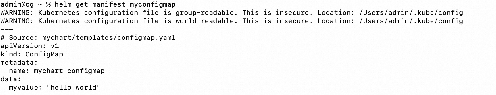
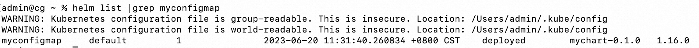
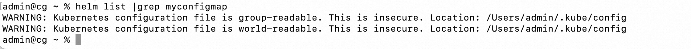
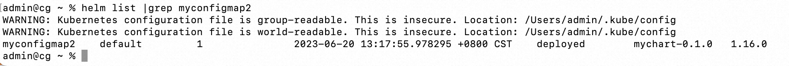
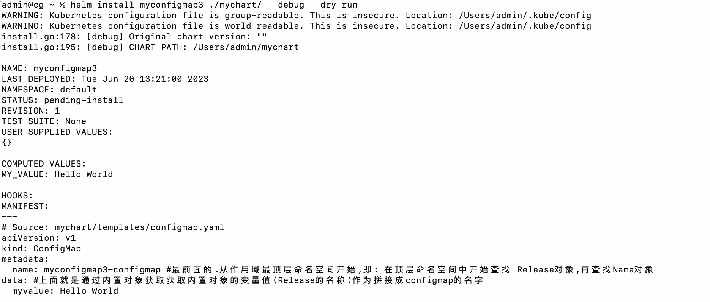

**<font style="color:#DF2A3F;background-color:#FFFFFF;">笔记来源：</font>**[**<font style="color:#DF2A3F;background-color:#FFFFFF;">k8s（Kubernetes）集群编排工具helm3实战教程</font>**](https://www.bilibili.com/video/BV12D4y1Y7Z7/?spm_id_from=333.337.search-card.all.click&vd_source=e8046ccbdc793e09a75eb61fe8e84a30)<font style="color:#ff7800;"> 		</font>

# 1 helm3创建编写一个chart <font style="color:#ff7800;">	</font>
## 1.1 案例一
<font style="color:#ff7800;">创建一个chart</font>

使用helm create 命令即可创建一个chart，其中包含完整的目录结构

```yaml
helm create mychart
tree mychart/
```

```yaml
mychart
├── Chart.yaml
├── charts
├── templates
│   ├── NOTES.txt
│   ├── _helpers.tpl
│   ├── deployment.yaml
│   ├── hpa.yaml
│   ├── ingress.yaml
│   ├── service.yaml
│   ├── serviceaccount.yaml
│   └── tests
│       └── test-connection.yaml
└── values.yaml
```

  
<font style="color:#ff7800;">编写一个chart，不引用内置对象的变量值（用helm3发布创建一个configmap，创建的k8s集群中,发布其他应用也一样，我们由浅入深进行学习）</font>

1. 查看node节点

```yaml
kubectl get node
```

2. <font style="color:#ff7800;">创建一个chart包：</font>

```yaml
helm create mychart  #创建一个chart包，chart包名为：mychart   关于helm使用相关的命令，后续我们单独介绍
```

3. 进入<font style="color:#ff7800;">mychart目录</font>

```yaml
cd mychart/
```

4. 进入<font style="color:#ff7800;">templates目录</font>

```yaml
cd templates/
```

5. 删除<font style="color:#ff7800;">templates目录下的文件</font>

```yaml
rm -rf *  #全部删除
```

6. 编写一个自己需要的模板文件

```yaml
vim configmap.yaml  #编写一个自己需要的模板文件
```

```yaml
apiVersion: v1
kind: ConfigMap
metadata:
	name: mychart-configmap 
data:
	myvalue: "hello world"
```

7. <font style="color:#ff7800;">创建一个release实例</font>

```yaml
helm install myconfigmap ./mychart/  #使用helm安装一个release的实例,指定release实例名: myconfigmap，指定chart目录./mychart
```

8. <font style="color:#ff7800;">查看创建后的相关信息和验证是否已经在k8s集群中创建了configmap</font>

```yaml
helm get manifest myconfigmap  #安装成功后,用helm get manifest release名 命令可以查看已经发布到k8s中的release信息
```



9. 列出创建的release实例名

```yaml
helm list |grep myconfigmap  #list列出创建的release实例名
```



10. 查看使用helm发布后创建的configmap

```yaml
kubectl get configmap |grep mychart-configmap #查看使用helm发布后创建的configmap
```


11. <font style="color:#ff7800;">删除release实例</font>

```yaml
helm uninstall release实例名 
# 49. 删除这个release，删除的时候直接指定release名称即可
```

12. 再次查看

```yaml
helm list |grep myconfigmap
```



结果为空，说明删除成功了

## 1.2 案例二
<font style="color:#ff7800;">编写一个chart，引用内置对象的变量值（用helm3发布创建一个configmap，创建的k8s集群中）</font>

1. 查看k8s node

```yaml
kubectl get node
```

2. <font style="color:#ff7800;">创建一个chart包</font>

```yaml
 helm create mychart #创建一个chart包，chart包名为： mychart
```

3. 进入mychart

```yaml
cd mychart/
```

4. 进入templates

```yaml
cd templates/
```

5. 删除templates的所有文件

```yaml
rm -rf *  #全部删除
```

6. 编写configmap.yaml

```yaml
vim configmap.yaml  #编写一个自己需要的模板文件
```

```yaml
apiVersion: v1
kind: ConfigMap
metadata:
	name: {{ .Release.Name }}-configmap #最前面的.从作用域最顶层命名空间开始,即: 在顶层命名空间中开始查找 Release对象,再查找Name对象
data: #上面就是通过内置对象获取获取内置对象的变量值(Release的名称)作为拼接成configmap的名字
	myvalue: {{ .Values.MY_VALUE }}
```

7. 编写mychart/values.yaml

```yaml
MY_VALUE: "Hello World"
```

:::color1
 引用内置对象变量或其他变量（如values.yaml）的好处：如果metadata.name 中设置的值是一个固定值，这样的模板是无法在k8s中多次部署的，所以我们可以试着在每次安装chart时，都自动metadata.name的值设置为release的名称，因为每次部署时候release实例名是不一样的，这样部署时候，里面的资源名也就可以作为一个区分，而可以进行重复部署。

:::

8. <font style="color:#ff7800;">创建一个release实例</font>

```yaml
helm install myconfigmap2 ./mychart/  #使用helm安装一个release的实例,指定release实例名: myconfigmap，指定chart目录./mychart
```

9. <font style="color:#ff7800;">查看创建后的相关信息和验证是否已经在k8s集群中创建了configmap</font>

```yaml
helm list |grep myconfigmap2 #list列出创建的release实例名
```



10. 查看使用helm发布后创建的configmap

```yaml
kubectl get configmap |grep myconfigmap2 #查看使用helm发布后创建的configmap
```


11. <font style="color:#ff7800;">删除release实例</font>

```yaml
helm uninstall release实例名 
# 50. 删除这个release，删除的时候直接指定release 名称即可
```

12. 再次查看

```yaml
kubectl get configmap |grep myconfigmap2
```


13. <font style="color:#ff7800;">helm的测试渲染命令</font>，不真正执行，只是试运行看是否能运行

helm提供了一个用来渲染模板的命令，该命令可以将模板内容渲染出来，但是不会进行任何安装的操作。可以用该命令来测试模板渲染的内容是否正确。

```yaml
helm install release实例名 chart目录 --debug --dry-run 
```

```yaml
helm install myconfigmap3 ./mychart/ --debug --dry-run
```



## 1.3 chart来源
<font style="color:#ff7800;">helm通过各种类型chart包安装一个release实例名来部署k8s相关的资源（如：pod,deployment,svc,ingress等,根据模板文件定义）</font>

1. 从加入到本地的chart官方仓库(从官方仓库安装)安装release实例

```yaml
helm install db stable/mysql #从加入到本地的chart官方仓库(从官方仓库安装)安装release实例，db为release实例名
helm install my-tomcat test-repo/tomcat #从加入到本地的chart社区仓库(从官方仓库安装)安装release实例，my-tomcat 为release实例名
```

2. 将从chart仓库拉下来的压缩包进行安装release实例（下载好的压缩包本地离线安装release）

```yaml
helm install db mysql-1.6.9.tgz #从chart仓库拉下来的压缩包进行安装release实例(从本地存档文件离线安装),db为release实例名
```

3. 将从chart仓库拉下来的压缩包解压后，从解压目录安装release实例（解压下载好的压缩包，从解压目录离线安装release实例）

```yaml
helm install db mysql #从chart仓库拉下来的压缩包解压后，从解压目录安装release实例(从解压目录离线安装), db为release实例名
```

4. 从一个网络地址仓库压缩包直接安装release实例

```yaml
helm install db http://url.../mysql-1.6.9.tgz #从一个网络地址仓库压缩包直接安装release实例(从下载服务器安装), db为release实例名
```

5. 卸载release实例:

```yaml
helm uninstall release实例名  #后面详细介绍命令
```

  
  


<font style="color:#ff7800;">1.helm3常用的内置对象</font>  
Release 对象  
Values 对象  
Chart 对象  
Capabilities 对象  
Template 对象  
  
<font style="color:#ff7800;">2.各内置对象详解</font>  
<font style="color:#ff7800;">1).Release对象</font> 描述了版本发布自身的一些信息。它包含了以下对象：  
对象名称	 描述  
.Release.Name	 release 的名称  
.Release.Namespace	 release 的命名空间  
.Release.IsUpgrade	 如果当前操作是升级或回滚的话，该值为 true  
.Release.IsInstall	 如果当前操作是安装的话，该值为 true  
.Release.Revision	 获取此次修订的版本号。初次安装时为 1，每次升级或回滚都会递增  
.Release.Service	 获取渲染当前模板的服务名称。一般都是 Helm  
  
<font style="color:#ff7800;">2).Values 对象</font> 描述的是value.yaml 文件（定义变量的文件）中的内容，默认为空。使用Value 对象可以获取到value.yaml文件中已定义的任何变量数值  
Value 键值对	 获取方式  
name1: test1	 .Values.name1  
info:  
name2: test2	 .Values.info.name2  
  
<font style="color:#ff7800;">3).Chart 对象</font> 用于获取Chart.yaml 文件中的内容：  
对象名称	 描述  
.Chart.Name	 获取Chart 的名称  
.Chart.Version	 获取Chart 的版本  
  
<font style="color:#ff7800;">4).Capabilities对象</font> 提供了关于kubernetes 集群相关的信息。该对象有如下方法：  
对象名称	 描述  
.Capabilities.APIVersions	 返回kubernetes集群 API 版本信息集合  
.Capabilities.APIVersions.Has $version	 用于检测指定的版本或资源在k8s集群中是否可用，例如：apps/v1/Deployment  
.Capabilities.KubeVersion和.Capabilities.KubeVersion.Version	都用于获取kubernetes 的版本号  
.Capabilities.KubeVersion.Major	 获取kubernetes 的主版本号  
.Capabilities.KubeVersion.Minor	 获取kubernetes 的小版本号  
  
<font style="color:#ff7800;">5).Template对象</font> 用于获取当前模板的信息，它包含如下两个对象  
对象名称	 描述  
.Template.Name	 用于获取当前模板的名称和路径（例如：mychart/templates/mytemplate.yaml）  
.Template.BasePath	用于获取当前模板的路径（例如：mychart/templates）  
  
  
<font style="color:#ff7800;">3.各内置对象调用的演示</font>  
<font style="color:#ff7800;">1).环境准备 k8s集群</font>  
# 51. kubectl get node  
NAME STATUS ROLES AGE VERSION  
m1 Ready control-plane,master 252d v1.20.4  
m2 Ready control-plane,master 252d v1.20.4  
m3 Ready control-plane,master 252d v1.20.4  
n1 Ready <none> 251d v1.20.4  
<font style="color:#ff7800;">2).创建一个chart包 (用helm3发布创建一个configmap,创建的k8s集群中,发布其他应用也一样)</font>  
# 52. <font style="color:#ff7800;">helm create mychart</font> #创建一个chart包，chart包名为： mychart   
# 53. <font style="color:#ff7800;">cd mychart/</font>  
# 54. ls  
charts Chart.yaml templates values.yaml  
# 55. <font style="color:#ff7800;">cd templates/</font>  
# 56. ls  
deployment.yaml _helpers.tpl hpa.yaml ingress.yaml NOTES.txt serviceaccount.yaml service.yaml tests  
# 57. <font style="color:#ff7800;">rm -rf * </font> #全部删除  
  
<font style="color:#ff7800;">3).编写自己需要的yaml文件，调用上面各自内置对象获取相关变量的值</font>  
<font style="color:#ff7800;">(1).调用Release对象</font> 描述了版本发布自身的一些信息。  
# 58. <font style="color:#ff7800;">vim /root/mychart/templates/configmap.yaml </font> #编写一个自己需要的模板文件  
apiVersion: v1  
kind: ConfigMap  
metadata:  
name: {{ .Release.Name }}-configmap  
namespace: {{ .Release.Namespace }}  
data:   
value1: "{{ .Release.IsUpgrade }}" #如果当前操作是升级或回滚的话,该值为true  
value2: "{{ .Release.IsInstall }}" #如果当前操作是安装的话,该值为true  
value3: "{{ .Release.Revision }}" #获取此次修订的版本号  
value4: "{{ .Release.Service }}" #获取当前模板的服务名  
# 59. cd ~  
# 60. <font style="color:#ff7800;">helm install myconfigmap1 ./mychart/ --debug --dry-run</font> #不真正执行，只是试运行看是否能运行  
NAME: myconfigmap1  
LAST DEPLOYED: Sat Nov 26 09:53:13 2022  
NAMESPACE: default  
STATUS: pending-install  
REVISION: 1  
...  
# 61. Source: mychart/templates/configmap.yaml  
apiVersion: v1  
kind: ConfigMap  
metadata:  
<font style="color:#ff7800;"> name: myconfigmap1-configmap  
</font><font style="color:#ff7800;">namespace: default</font>  
data:   
<font style="color:#ff7800;"> value1: "false" #如果当前操作是升级或回滚的话,该值为true  
</font><font style="color:#ff7800;">value2: "true" #如果当前操作是安装的话,该值为true  
</font><font style="color:#ff7800;">value3: "1" #获取此次修订的版本号  
</font><font style="color:#ff7800;">value4: "Helm" #获取当前模板的服务名</font>  
  
<font style="color:#ff7800;">(2).调用Values对象</font> 描述的是value.yaml 文件（定义变量的文件）中的内容  
# 62. <font style="color:#ff7800;">vim /root/mychart/values.yaml </font> #清空里面的初始化信息，设置成我们需要的（变量名和赋值）（里面默认的信息都是初始化信息，仅供参考）  
name1: test1  
info:  
name2: test2  
# 63. <font style="color:#ff7800;">vim /root/mychart/templates/configmap.yaml </font> #编写一个自己需要的模板文件  
apiVersion: v1  
kind: ConfigMap  
metadata:  
name: {{ .Release.Name }}-configmap  
namespace: {{ .Release.Namespace }}  
data:   
<font style="color:#ff7800;"> value1: "{{ .Values.name1 }}" #获取values.yaml文件中定义的变量的值  
</font><font style="color:#ff7800;">value2: "{{ .Values.info.name2 }}" #获取values.yaml文件中定义的层级变量的值</font>  
# 64. cd ~  
# 65. <font style="color:#ff7800;">helm install myconfigmap2 ./mychart/ --debug --dry-run</font> #不真正执行，只是试运行看是否能运行  
NAME: myconfigmap2  
LAST DEPLOYED: Sat Nov 26 10:17:53 2022  
NAMESPACE: default  
STATUS: pending-install  
REVISION: 1  
...  
# 66. Source: mychart/templates/configmap.yaml  
apiVersion: v1  
kind: ConfigMap  
metadata:  
<font style="color:#ff7800;"> name: myconfigmap2-configmap  
</font><font style="color:#ff7800;">namespace: default</font>  
data:   
<font style="color:#ff7800;"> value1: "test1" #获取values.yaml文件中定义的变量的值  
</font><font style="color:#ff7800;">value2: "test2" #获取values.yaml文件中定义的层级变量的值</font>  
  
<font style="color:#ff7800;">(3).调用Chart 对象</font> 用于获取Chart.yaml 文件中的内容  
# 67. <font style="color:#ff7800;">cat /root/mychart/Chart.yaml |grep -vE "#|^$"</font> #先查看下Chart.yaml文件中内容中定义的变量  
apiVersion: v2  
name: mychart  
description: A Helm chart for Kubernetes  
type: application  
version: 0.1.0  
appVersion: "1.16.0"  
# 68. <font style="color:#ff7800;">vim /root/mychart/templates/configmap.yaml </font> #编写一个自己需要的模板文件  
apiVersion: v1  
kind: ConfigMap  
metadata:  
name: {{ .Release.Name }}-configmap  
namespace: {{ .Release.Namespace }}  
data:   
<font style="color:#ff7800;"> value1: "{{ .Chart.Name }}" #获取Chart的名称,获取Chart.yaml文件中定义的变量的值  
</font><font style="color:#ff7800;">value2: "{{ .Chart.Version }}" #获取Chart的版本,获取Chart.yaml文件中定义的变量的值</font>  
# 69. cd ~  
# 70. <font style="color:#ff7800;">helm install myconfigmap3 ./mychart/ --debug --dry-run</font> #不真正执行，只是试运行看是否能运行  
NAME: myconfigmap3  
LAST DEPLOYED: Sat Nov 26 10:26:02 2022  
NAMESPACE: default  
STATUS: pending-install  
REVISION: 1  
...  
# 71. Source: mychart/templates/configmap.yaml  
apiVersion: v1  
kind: ConfigMap  
metadata:  
name: myconfigmap3-configmap  
namespace: default  
data:   
<font style="color:#ff7800;"> value1: "mychart" #获取Chart的名称,获取Chart.yaml文件中定义的变量的值  
</font><font style="color:#ff7800;">value2: "0.1.0" #获取Chart的版本,获取Chart.yaml文件中定义的变量的值</font>  
  
<font style="color:#ff7800;">(4).调用Capabilities对象</font> 提供了关于kubernetes 集群相关的信息。该对象有如下方法  
# 72. <font style="color:#ff7800;">vim /root/mychart/templates/configmap.yaml </font> #编写一个自己需要的模板文件  
apiVersion: v1  
kind: ConfigMap  
metadata:  
name: {{ .Release.Name }}-configmap  
namespace: {{ .Release.Namespace }}  
data:  
value1: "{{ .Capabilities.APIVersions }}" #返回kubernetes集群 API 版本信息集合  
value2: '{{ .Capabilities.APIVersions.Has "apps/v1/Deployment" }}' #用于检测指定的版本或资源在k8s集群中是否可用  
value3: "{{ .Capabilities.KubeVersion.Version }}" #用于获取kubernetes的版本号  
value4: "{{ .Capabilities.KubeVersion.Major }}" #获取kubernetes 的主版本号  
value5: "{{ .Capabilities.KubeVersion.Minor }}" #获取kubernetes 的小版本号  
# 73. cd ~  
# 74. <font style="color:#ff7800;">helm install myconfigmap4 ./mychart/ --debug --dry-run</font> #不真正执行，只是试运行看是否能运行  
NAME: myconfigmap4  
LAST DEPLOYED: Sat Nov 26 10:38:52 2022  
NAMESPACE: default  
STATUS: pending-install  
REVISION: 1  
...  
# 75. Source: mychart/templates/configmap.yaml  
apiVersion: v1  
kind: ConfigMap  
metadata:  
name: myconfigmap4-configmap  
namespace: default  
data:   
value1: "[authentication.k8s.io/v1 discovery.k8s.io/v1beta1 batch/v1/Job admissionregistration.k8s.io/v1 scheduling.k8s.io/v1 authorization.k8s.io/v1beta1/SelfSubjectAccessReview autoscaling/v2beta2/HorizontalPodAutoscaler batch/v1beta1 rbac.authorization.k8s.io/v1beta1 v1/Binding authentication.k8s.io/v1beta1/TokenReview autoscaling/v1/HorizontalPodAutoscaler rbac.authorization.k8s.io/v1beta1/ClusterRole autoscaling/v1 apiextensions.k8s.io/v1beta1 v1/ServiceAccount apiextensions.k8s.io/v1 authorization.k8s.io/v1beta1/SelfSubjectRulesReview rbac.authorization.k8s.io/v1beta1/Role admissionregistration.k8s.io/v1beta1/MutatingWebhookConfiguration v1/Endpoints apps/v1/DaemonSet extensions/v1beta1/Ingress apiregistration.k8s.io/v1 authentication.k8s.io/v1beta1 coordination.k8s.io/v1 v1/ReplicationController v1/Scale storage.k8s.io/v1beta1/CSINode batch/v1 events.k8s.io/v1/Event apiregistration.k8s.io/v1beta1 v1/PersistentVolume v1/PodProxyOptions storage.k8s.io/v1/CSINode certificates.k8s.io/v1 v1/PersistentVolumeClaim authorization.k8s.io/v1/LocalSubjectAccessReview authorization.k8s.io/v1beta1/LocalSubjectAccessReview rbac.authorization.k8s.io/v1/Role storage.k8s.io/v1/CSIDriver flowcontrol.apiserver.k8s.io/v1beta1 networking.k8s.io/v1/Ingress policy/v1beta1/PodDisruptionBudget apps/v1 v1/PodPortForwardOptions v1/Secret networking.k8s.io/v1/IngressClass authorization.k8s.io/v1 networking.k8s.io/v1beta1 node.k8s.io/v1/RuntimeClass extensions/v1beta1 node.k8s.io/v1beta1 v1/Service apiregistration.k8s.io/v1/APIService v1/PodTemplate certificates.k8s.io/v1/CertificateSigningRequest storage.k8s.io/v1 v1/Eviction apps/v1/StatefulSet storage.k8s.io/v1/StorageClass coordination.k8s.io/v1beta1/Lease v1 networking.k8s.io/v1 v1/ComponentStatus node.k8s.io/v1beta1/RuntimeClass certificates.k8s.io/v1beta1 v1/Pod v1/TokenRequest autoscaling/v2beta1/HorizontalPodAutoscaler discovery.k8s.io/v1beta1/EndpointSlice v1/PodExecOptions networking.k8s.io/v1/NetworkPolicy admissionregistration.k8s.io/v1/MutatingWebhookConfiguration coordination.k8s.io/v1/Lease v1/LimitRange v1/Node apiregistration.k8s.io/v1beta1/APIService authorization.k8s.io/v1/SelfSubjectRulesReview apiextensions.k8s.io/v1beta1/CustomResourceDefinition admissionregistration.k8s.io/v1beta1 v1/ConfigMap rbac.authorization.k8s.io/v1/RoleBinding apiextensions.k8s.io/v1/CustomResourceDefinition node.k8s.io/v1 v1/NodeProxyOptions policy/v1beta1/PodSecurityPolicy storage.k8s.io/v1beta1 networking.k8s.io/v1beta1/Ingress rbac.authorization.k8s.io/v1/ClusterRoleBinding rbac.authorization.k8s.io/v1beta1/RoleBinding scheduling.k8s.io/v1/PriorityClass v1/Event apps/v1/ReplicaSet storage.k8s.io/v1beta1/CSIDriver coordination.k8s.io/v1beta1 autoscaling/v2beta2 policy/v1beta1 authorization.k8s.io/v1beta1/SubjectAccessReview storage.k8s.io/v1beta1/VolumeAttachment flowcontrol.apiserver.k8s.io/v1beta1/FlowSchema flowcontrol.apiserver.k8s.io/v1beta1/PriorityLevelConfiguration events.k8s.io/v1 events.k8s.io/v1beta1 rbac.authorization.k8s.io/v1 authorization.k8s.io/v1/SubjectAccessReview networking.k8s.io/v1beta1/IngressClass rbac.authorization.k8s.io/v1/ClusterRole admissionregistration.k8s.io/v1beta1/ValidatingWebhookConfiguration authorization.k8s.io/v1beta1 scheduling.k8s.io/v1beta1 v1/PodAttachOptions v1/ResourceQuota authentication.k8s.io/v1/TokenReview storage.k8s.io/v1/VolumeAttachment apps/v1/Scale batch/v1beta1/CronJob rbac.authorization.k8s.io/v1beta1/ClusterRoleBinding admissionregistration.k8s.io/v1/ValidatingWebhookConfiguration scheduling.k8s.io/v1beta1/PriorityClass autoscaling/v2beta1 v1/Namespace authorization.k8s.io/v1/SelfSubjectAccessReview storage.k8s.io/v1beta1/StorageClass v1/ServiceProxyOptions apps/v1/ControllerRevision apps/v1/Deployment events.k8s.io/v1beta1/Event certificates.k8s.io/v1beta1/CertificateSigningRequest]"   
<font style="color:#ff7800;">#value1返回kubernetes集群 API 版本信息集合</font>  
<font style="color:#ff7800;"> value2: 'true' #用于检测指定的版本或资源在k8s集群中是否可用  
</font><font style="color:#ff7800;">value3: "v1.20.4" #用于获取kubernetes的版本号  
</font><font style="color:#ff7800;">value4: "1" #获取kubernetes 的主版本号  
</font><font style="color:#ff7800;">value5: "20" #获取kubernetes 的小版本号</font>  
  
  
<font style="color:#ff7800;">(5).调用Template对象</font> 用于获取当前模板的信息，它包含如下两个对象  
# 76. <font style="color:#ff7800;">vim /root/mychart/templates/configmap.yaml </font> #编写一个自己需要的模板文件  
apiVersion: v1  
kind: ConfigMap  
metadata:  
name: {{ .Release.Name }}-configmap  
namespace: {{ .Release.Namespace }}  
data:   
<font style="color:#ff7800;"> value1: "{{ .Template.Name }}" #用于获取当前模板的名称和路径（例如：mychart/templates/configmap.yaml）  
</font><font style="color:#ff7800;">value2: "{{ .Template.BasePath }}" #用于获取当前模板的路径（例如：mychart/templates</font>）  
# 77. cd ~  
# 78. <font style="color:#ff7800;">helm install myconfigmap5 ./mychart/ --debug --dry-run</font> #不真正执行，只是试运行看是否能运行  
NAME: myconfigmap5  
LAST DEPLOYED: Sat Nov 26 10:44:58 2022  
NAMESPACE: default  
STATUS: pending-install  
REVISION: 1  
...  
# 79. Source: mychart/templates/configmap.yaml  
<font style="color:#000000;">apiVersion: v1  
</font><font style="color:#000000;">kind: ConfigMap  
</font><font style="color:#000000;">metadata:  
</font><font style="color:#000000;">name: myconfigmap5-configmap  
</font><font style="color:#000000;">namespace: default  
</font><font style="color:#000000;">data: </font><font style="color:#ff7800;">   
</font><font style="color:#ff7800;">value1: "mychart/templates/configmap.yaml" #用于获取当前模板的名称和路径（例如：mychart/templates/configmap.yaml）  
</font><font style="color:#ff7800;">value2: "mychart/templates" #用于获取当前模板的路径（例如：mychart/templates）</font>  
  
  
  
  
  
  


