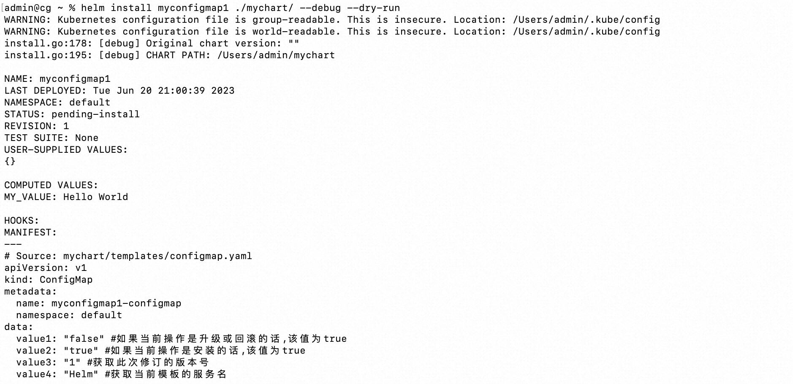
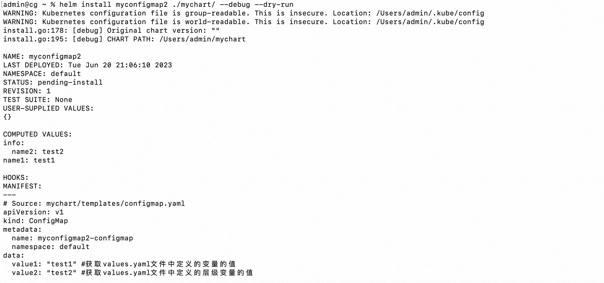
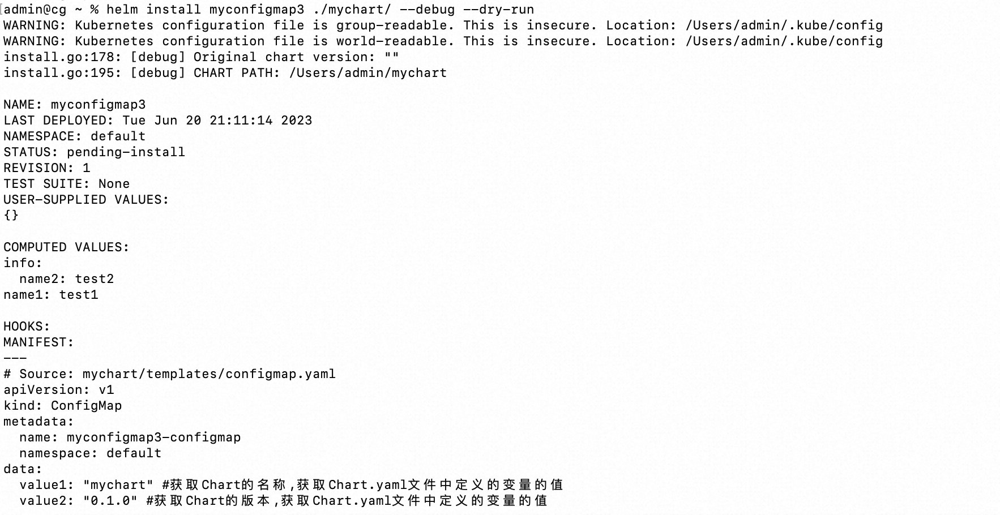
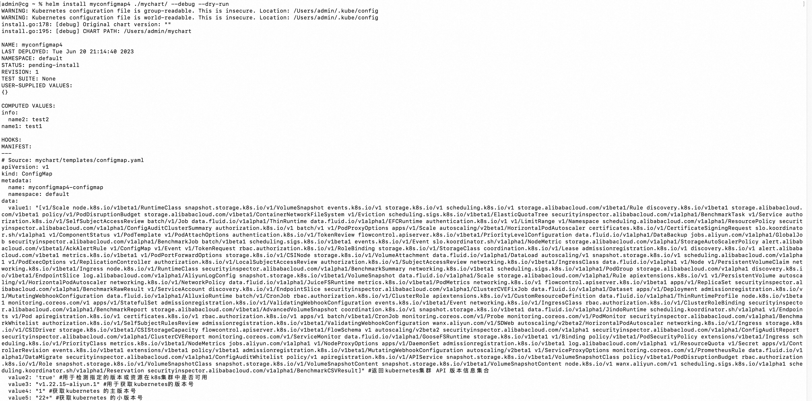
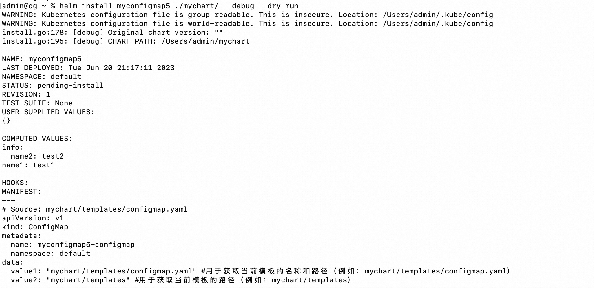

**<font style="color:#DF2A3F;background-color:#FFFFFF;">笔记来源：</font>**[**<font style="color:#DF2A3F;background-color:#FFFFFF;">k8s（Kubernetes）集群编排工具helm3实战教程</font>**](https://www.bilibili.com/video/BV12D4y1Y7Z7/?spm_id_from=333.337.search-card.all.click&vd_source=e8046ccbdc793e09a75eb61fe8e84a30)

# 80. <font style="color:#000000;">1 helm3常用的内置对象</font>
+ <font style="color:#000000;">Release 对象</font>
+ <font style="color:#000000;">Values 对象</font>
+ <font style="color:#000000;">Chart 对象</font>
+ <font style="color:#000000;">Capabilities 对象</font>
+ <font style="color:#000000;">Template 对象</font>

# 81. <font style="color:#000000;">2 Release对象</font><font style="color:#000000;"> </font>
<font style="color:#000000;">描述了版本发布自身的一些信息。它包含了以下对象：</font>

| <font style="color:#000000;">对象名称</font> | <font style="color:#000000;"> 描述</font> |
| --- | --- |
| <font style="color:#000000;">.Release.Name</font> | <font style="color:#000000;"> release 的名称</font> |
| <font style="color:#000000;">.Release.Namespace</font> | <font style="color:#000000;">release 的命名空间</font> |
| <font style="color:#000000;">.Release.IsUpgrade</font> | <font style="color:#000000;">如果当前操作是升级或回滚的话，该值为 true</font> |
| <font style="color:#000000;">.Release.IsInstall</font> | <font style="color:#000000;">如果当前操作是安装的话，该值为 true</font> |
| <font style="color:#000000;">.Release.Revision</font> | <font style="color:#000000;">获取此次修订的版本号。初次安装时为 1，每次升级或回滚都会递增</font> |
| <font style="color:#000000;">.Release.Service</font> | <font style="color:#000000;">获取渲染当前模板的服务名称。一般都是 Helm</font> |


<font style="color:#000000;">案例：</font>

1. <font style="color:#000000;">环境准备 k8s集群</font>

```yaml
kubectl get node
```

2. <font style="color:#000000;">创建一个chart包（用helm3发布创建一个configmap，创建的k8s集群中，发布其他应用也一样）</font>

```yaml
helm create mychart #创建一个chart包，chart包名为： mychart 
```

3. <font style="color:#000000;">进入mychart目录</font>

```yaml
cd mychart/
```

4. <font style="color:#000000;">进入templates目录</font>

```yaml
cd templates/
```

5. <font style="color:#000000;">删除templates目录的所有文件</font>

```yaml
rm -rf *  #全部删除
```

6. <font style="color:#000000;">调用Release对象</font><font style="color:#000000;"> 描述了版本发布自身的一些信息。</font>

```yaml
vim configmap.yaml  #编写一个自己需要的模板文件
```

```yaml
apiVersion: v1
kind: ConfigMap
metadata:
  name: {{ .Release.Name }}-configmap
  namespace: {{ .Release.Namespace }}
data: 
  value1: "{{ .Release.IsUpgrade }}" #如果当前操作是升级或回滚的话,该值为true
  value2: "{{ .Release.IsInstall }}" #如果当前操作是安装的话,该值为true
  value3: "{{ .Release.Revision }}" #获取此次修订的版本号
  value4: "{{ .Release.Service }}" #获取当前模板的服务名
```

7. <font style="color:#000000;">查看</font>

```yaml
helm install myconfigmap1 ./mychart/ --debug --dry-run #不真正执行，只是试运行看是否能运行
```



# 82. <font style="color:#000000;">2 </font><font style="color:#000000;">Values 对象</font><font style="color:#000000;"> </font>
<font style="color:#000000;">描述的是value.yaml 文件（定义变量的文件）中的内容，默认为空。使用Value 对象可以获取到value.yaml文件中已定义的任何变量数值</font>

| <font style="color:#000000;">Value 键值对</font> | <font style="color:#000000;">获取方式</font> |
| --- | --- |
| ```yaml name1: test1 ```  | <font style="color:#000000;">  </font>`<font style="color:#000000;">.Values.name1</font>` |
| ```yaml info: 	name2: test2 ```  | <font style="color:#000000;"> </font>`<font style="color:#000000;">.Values.info.name2</font>` |


<font style="color:#000000;">案例：</font><font style="color:#000000;">调用Values对象</font><font style="color:#000000;"> 描述的是value.yaml 文件（定义变量的文件）中的内容</font>

1. <font style="color:#000000;">编写</font><font style="color:#000000;">values.yaml</font>

```yaml
vim mychart/values.yaml  #清空里面的初始化信息，设置成我们需要的（变量名和赋值）（里面默认的信息都是初始化信息，仅供参考）
```

```yaml
name1: test1
info:
  name2: test2
```

2. <font style="color:#000000;">编写一个自己需要的模板文件</font>

```yaml
vim mychart/templates/configmap.yaml  #编写一个自己需要的模板文件
```

```yaml
apiVersion: v1
kind: ConfigMap
metadata:
  name: {{ .Release.Name }}-configmap
  namespace: {{ .Release.Namespace }}
data: 
  value1: "{{ .Values.name1 }}" #获取values.yaml文件中定义的变量的值
  value2: "{{ .Values.info.name2 }}" #获取values.yaml文件中定义的层级变量的值
```

3. <font style="color:#000000;">运行</font>

```yaml
helm install myconfigmap2 ./mychart/ --debug --dry-run #不真正执行，只是试运行看是否能运行
```



# 83. <font style="color:#000000;">3 Chart 对象</font><font style="color:#000000;"> </font>
<font style="color:#000000;">用于获取Chart.yaml 文件中的内容：</font>

| <font style="color:#000000;">对象名称	</font> | <font style="color:#000000;">描述</font> |
| --- | --- |
| <font style="color:#000000;">.Chart.Name</font> | <font style="color:#000000;"> 获取Chart 的名称</font> |
| <font style="color:#000000;">.Chart.Version</font> | <font style="color:#000000;"> 获取Chart 的版本</font> |


<font style="color:#000000;">案例：</font><font style="color:#000000;">调用Chart 对象</font><font style="color:#000000;"> 用于获取Chart.yaml 文件中的内容</font>

1. <font style="color:#000000;">先查看下Chart.yaml文件中内容中定义的变量</font>

```yaml
 cat mychart/Chart.yaml 
```

```yaml
apiVersion: v2
name: mychart
description: A Helm chart for Kubernetes

# 84. A chart can be either an 'application' or a 'library' chart.
#
# 85. Application charts are a collection of templates that can be packaged into versioned archives
# 86. to be deployed.
#
# 87. Library charts provide useful utilities or functions for the chart developer. They're included as
# 88. a dependency of application charts to inject those utilities and functions into the rendering
# 89. pipeline. Library charts do not define any templates and therefore cannot be deployed.
type: application

# 90. This is the chart version. This version number should be incremented each time you make changes
# 91. to the chart and its templates, including the app version.
# 92. Versions are expected to follow Semantic Versioning (https://semver.org/)
version: 0.1.0

# 93. This is the version number of the application being deployed. This version number should be
# 94. incremented each time you make changes to the application. Versions are not expected to
# 95. follow Semantic Versioning. They should reflect the version the application is using.
# 96. It is recommended to use it with quotes.
appVersion: "1.16.0"
```

2. <font style="color:#000000;">编写一个自己需要的模板文件</font>

```yaml
vim mychart/templates/configmap.yaml
```

```yaml
apiVersion: v1
kind: ConfigMap
metadata:
  name: {{ .Release.Name }}-configmap
  namespace: {{ .Release.Namespace }}
data: 
  value1: "{{ .Chart.Name }}" #获取Chart的名称,获取Chart.yaml文件中定义的变量的值
  value2: "{{ .Chart.Version }}" #获取Chart的版本,获取Chart.yaml文件中定义的变量的值
```

3. <font style="color:#000000;">执行</font>

```yaml
helm install myconfigmap3 ./mychart/ --debug --dry-run #不真正执行，只是试运行看是否能运行
```



# 97. <font style="color:#000000;">4 </font><font style="color:#000000;">Capabilities对象</font><font style="color:#000000;"> </font>
<font style="color:#000000;">提供了关于kubernetes 集群相关的信息。该对象有如下方法：</font>

| <font style="color:#000000;">对象名称</font> | <font style="color:#000000;">描述</font> |
| --- | --- |
| <font style="color:#000000;">.Capabilities.APIVersions</font> | <font style="color:#000000;">返回kubernetes集群 API 版本信息集合</font> |
| <font style="color:#000000;">.Capabilities.APIVersions.Has $version</font> | <font style="color:#000000;">用于检测指定的版本或资源在k8s集群中是否可用，例如：apps/v1/Deployment</font> |
| <font style="color:#000000;">.Capabilities.KubeVersion和.Capabilities.KubeVersion.Version</font> | <font style="color:#000000;">都用于获取kubernetes 的版本号</font> |
| <font style="color:#000000;">.Capabilities.KubeVersion.Major</font> | <font style="color:#000000;">获取kubernetes 的主版本号</font> |
| <font style="color:#000000;">.Capabilities.KubeVersion.Minor</font> | <font style="color:#000000;">获取kubernetes 的小版本号</font> |


<font style="color:#000000;">案例：</font><font style="color:#000000;">调用Capabilities对象</font>

1. <font style="color:#000000;">编写一个自己需要的模板文件</font>

```yaml
vim /root/mychart/templates/configmap.yaml  #编写一个自己需要的模板文件
```

```yaml
apiVersion: v1
kind: ConfigMap
metadata:
  name: {{ .Release.Name }}-configmap
  namespace: {{ .Release.Namespace }}
data:
  value1: "{{ .Capabilities.APIVersions }}" #返回kubernetes集群 API 版本信息集合
  value2: '{{ .Capabilities.APIVersions.Has "apps/v1/Deployment" }}' #用于检测指定的版本或资源在k8s集群中是否可用
  value3: "{{ .Capabilities.KubeVersion.Version }}" #用于获取kubernetes的版本号
  value4: "{{ .Capabilities.KubeVersion.Major }}" #获取kubernetes 的主版本号
  value5: "{{ .Capabilities.KubeVersion.Minor }}" #获取kubernetes 的小版本号
```

2. <font style="color:#000000;">执行</font>

```yaml
helm install myconfigmap4 ./mychart/ --debug --dry-run #不真正执行，只是试运行看是否能运行
```



# 98. <font style="color:#000000;">5 </font><font style="color:#000000;">Template对象</font><font style="color:#000000;"> </font>
<font style="color:#000000;">用于获取当前模板的信息，它包含如下两个对象</font>

| <font style="color:#000000;">对象名称</font> | <font style="color:#000000;"> 描述</font> |
| --- | --- |
| <font style="color:#000000;">.Template.Name</font> | <font style="color:#000000;">用于获取当前模板的名称和路径（例如：mychart/templates/mytemplate.yaml）</font> |
| <font style="color:#000000;">.Template.BasePath</font> | <font style="color:#000000;">用于获取当前模板的路径（例如：mychart/templates）</font> |


<font style="color:#000000;">案例：调用Template对象</font>

1. <font style="color:#000000;">编写一个自己需要的模板文件</font>

```yaml
vim /root/mychart/templates/configmap.yaml  #编写一个自己需要的模板文件
```

```yaml
apiVersion: v1
kind: ConfigMap
metadata:
  name: {{ .Release.Name }}-configmap
  namespace: {{ .Release.Namespace }}
data: 
  value1: "{{ .Template.Name }}" #用于获取当前模板的名称和路径（例如：mychart/templates/configmap.yaml）
  value2: "{{ .Template.BasePath }}" #用于获取当前模板的路径（例如：mychart/templates）
```

2. <font style="color:#000000;">执行</font>

```yaml
helm install myconfigmap5 ./mychart/ --debug --dry-run #不真正执行，只是试运行看是否能运行
```

<font style="color:#000000;">  
  
  
  
  
  
</font>

