**<font style="color:#DF2A3F;background-color:#FFFFFF;">笔记来源：</font>**[**<font style="color:#DF2A3F;background-color:#FFFFFF;">k8s（Kubernetes）集群编排工具helm3实战教程</font>**](https://www.bilibili.com/video/BV12D4y1Y7Z7/?spm_id_from=333.337.search-card.all.click&vd_source=e8046ccbdc793e09a75eb61fe8e84a30)

# 99. <font style="color:#ff7800;">1 helm的常用命令使用</font>
| 命令 | 描述 |
| --- | --- |
| version | 查看helm客户端版本 |
| repo | 添加、列出、移除、更新和索引chart仓库，可用子命令`add``index``list``remove``update` |
| search | 根据关键字搜索chart包 |
| show | 查看chart包的基本信息和详细信息，可用子命令`all``chart``readme``values` |
| pull | 从远程仓库中下载拉取chart包并解压到本地 |
| create | 创建一个chart包并指定chart包名字 |
| install | 通过chart包安装一个release实例 |
| list | 列出release实例名 |
| upgrade | 更新一个release实例 |
| rollback | 从之前版本回滚release实例，也可指定要回滚的版本号 |
| uninstall | 卸载一个release实例 |
| history | 获取release历史，用法： helm history release实例名 |
| package | 将chart目录打包成chart存档文件中 |
| get | 下载一个release，可用子命令：`all``hooks``manifest``notes``values` |
| status | 显示release实例名的状态，显示已命名版本的状态 |


# 2 命令演示
## 2.1 repo
**<font style="color:#ff7800;">添加仓库</font>**  
可以添加多个仓库，添加仓库时候，记得起个仓库名，如：stable，aliyun，或其他，一般起个稳定版的stable会优先使用。

```yaml
helm repo add stable http://mirror.azure.cn/kubernetes/charts                  #添加微软的,强烈推荐
helm repo add aliyun https://kubernetes.oss-cn-hangzhou.aliyuncs.com/charts    #添加阿里云的
helm repo add test-repo http://mirror.kaiyuanshe.cn/kubernetes/charts/         #添加开源社区的
```

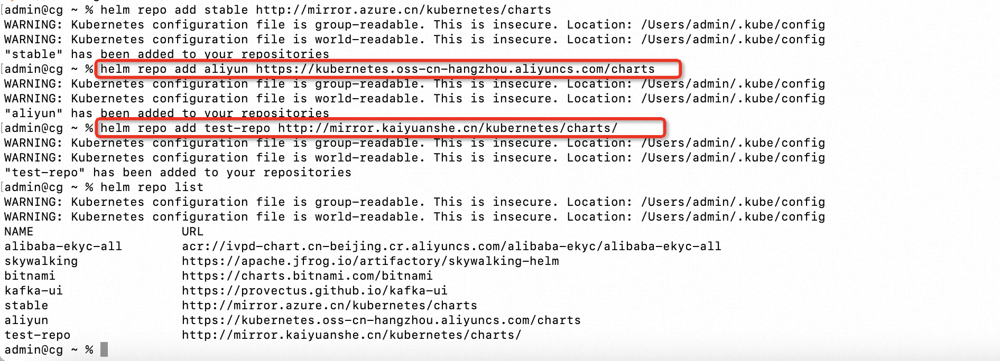  


**列出仓库**

```yaml
helm repo list
```

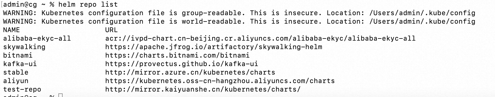  


**<font style="color:#ff7800;">更新仓库</font>**

```yaml
helm repo update  #更新仓库,能更新添加的所有仓库
```

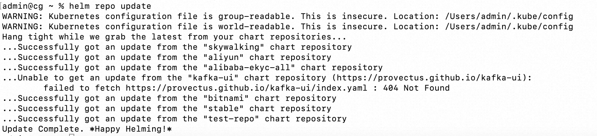  
  
<font style="color:#ff7800;">删除仓库</font>

```yaml
helm repo remove 仓库名
```

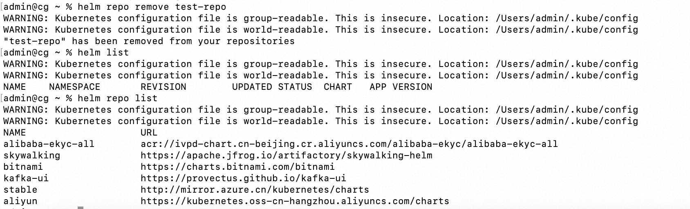

## 2.2 chart 包相关
<font style="color:#ff7800;">创建chart包</font>

```yaml
helm create mychart    # 创建一个chart包，chart包名为： mychart 
```


操作远程chart包

+ <font style="color:#ff7800;">搜索远程仓库的chart包</font>
+ <font style="color:#ff7800;">查看chart包信息</font>
+ <font style="color:#ff7800;">拉取远程仓库chart包到本地</font>

类似docker search 搜索harbor仓库的镜像


<font style="color:#ff7800;">搜索远程仓库的chart包</font>

```yaml
helm search repo chart包名
```

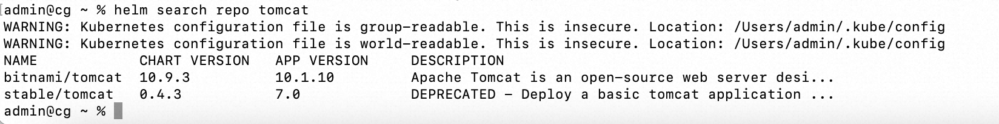  
  
查看chart包格式

```yaml
helm show chart chart包名 
helm show values chart包名  #查看详细信息
```

```yaml
admin@cg ~ % helm show chart stable/tomcat
WARNING: Kubernetes configuration file is group-readable. This is insecure. Location: /Users/admin/.kube/config
WARNING: Kubernetes configuration file is world-readable. This is insecure. Location: /Users/admin/.kube/config
apiVersion: v1
appVersion: "7.0"
deprecated: true
description: DEPRECATED - Deploy a basic tomcat application server with sidecar as
  web archive container
home: https://github.com/yahavb
icon: images/20.png
name: tomcat
version: 0.4.3

admin@cg ~ % helm show values stable/tomcat
WARNING: Kubernetes configuration file is group-readable. This is insecure. Location: /Users/admin/.kube/config
WARNING: Kubernetes configuration file is world-readable. This is insecure. Location: /Users/admin/.kube/config
# 100. Default values for the chart.
# 101. This is a YAML-formatted file.
# 102. Declare variables to be passed into your templates.
replicaCount: 1

image:
  webarchive:
    repository: ananwaresystems/webarchive
    tag: "1.0"
  tomcat:
    repository: tomcat
    tag: "7.0"
  pullPolicy: IfNotPresent
  pullSecrets: []

deploy:
  directory: /usr/local/tomcat/webapps

service:
  name: http
  type: LoadBalancer
  externalPort: 80
  internalPort: 8080

hostPort: 8009

ingress:
  enabled: false
  annotations: {}
    # kubernetes.io/ingress.class: nginx
    # kubernetes.io/tls-acme: "true"
  path: /
  hosts:
    - chart-example.local
  tls: []
  #  - secretName: chart-example-tls
  #    hosts:
  #      - chart-example.local

env: []
  # - name: env
  #   value: test

extraVolumes: []
  # - name: extra
  #   emptyDir: {}

extraVolumeMounts: []
  # - name: extra
  #   mountPath: /usr/local/tomcat/webapps/app
  #   readOnly: true

extraInitContainers: []
  # - name: do-something
  #   image: busybox
  #   command: ['do', 'something']

readinessProbe:
  path: "/sample"
  initialDelaySeconds: 60
  periodSeconds: 30
  failureThreshold: 6
  timeoutSeconds: 5
livenessProbe:
  path: "/sample"
  initialDelaySeconds: 60
  periodSeconds: 30
  failureThreshold: 6
  timeoutSeconds: 5

resources: {}
# 103.  limits:
# 104.    cpu: 100m
# 105.    memory: 256Mi
# 106.  requests:
# 107.    cpu: 100m
# 108.    memory: 256Mi

nodeSelector: {}

tolerations: []

affinity: {}
```

  
<font style="color:#000000;">拉取chart包格式</font>

```yaml
helm pull 远程仓库chart包名 --version 0.4.3 --untar #从远程仓库拉取 指定版本 的chart包到本地并解压,--untar是解压,不加就是压缩包
helm pull 远程仓库chart包名 --untar                 #从远程仓库拉取 最新版本 的chart包到本地并解压,--untar是解压,不加就是压缩包
```

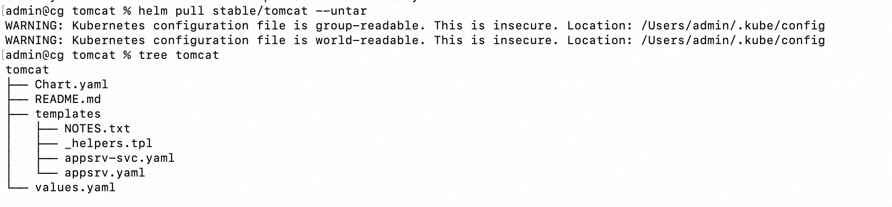

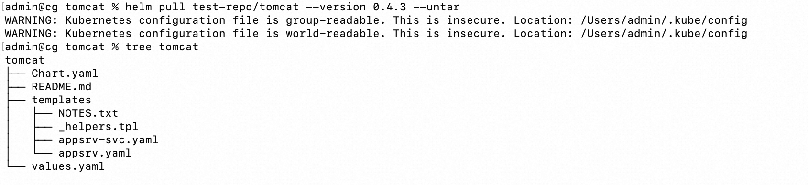

## 2.3 <font style="color:#ff7800;">release实例相关命令</font>


安装实例

<font style="color:#ff7800;">helm通过各种类型chart包安装一个release实例名来部署k8s相关的资源，如：</font>`<font style="color:#ff7800;">pod</font>``<font style="color:#ff7800;">deployment</font>``<font style="color:#ff7800;">svc</font>``<font style="color:#ff7800;">ingress</font>`<font style="color:#ff7800;">等，根据模板文件定义</font>

+ 从加入到本地的chart官方仓库(<font style="color:#ff7800;">从官方仓库在线安装</font>)安装release实例
+ 从chart仓库拉下来的压缩包进行安装release实例（<font style="color:#ff7800;">下载好的压缩包本地离线安装release</font>）
+ 将从chart仓库拉下来的压缩包解压后，从解压目录安装release实例（<font style="color:#ff7800;">解压下载好的压缩包，从解压目录离线安装release实例</font>）
+ 从一个<font style="color:#ff7800;">网络地址（如http服务器）仓库压缩包直接安装</font>release实例
+ 在本地<font style="color:#ff7800;">创建一个chart包</font>，通过自定义编辑自己的yaml文件后，通过本地chart包进行安装release实例

```yaml
helm search repo tomcat
helm install tomcat1 stable/tomcat #从加入到本地的chart社区仓库(从官方仓库在线安装)安装release实例，tomcat1为release实例名

helm install tomcat2 tomcat-0.4.3.tgz #从chart仓库拉下来的压缩包进行安装release实例(从本地存档文件离线安装)

helm install tomcat3 tomcat #从chart仓库拉下来的压缩包解压后，从解压目录安装release实例(从解压目录离线安装)

helm install db http://url.../mysql-1.6.9.tgz #从一个网络地址仓库压缩包直接安装release实例(从下载服务器安装), db为release实例名

helm install test-release ./mychart    #指定release实例名和chart包目录路径进行安装release实例
```

  
<font style="color:#ff7800;">升级release实例</font>

```yaml
helm upgrade release实例名 chart名 --set imageTag=1.19 #指定release名和chart名进行相关set设置的升级
helm upgrade release实例名 chart名 -f /.../mychart/values.yaml #指定release示例名和chart名和values.yaml文件升级

示例:
helm upgrade test-release-nginx mychart --set imageTag=1.19 #指定release实例名和chart名set升级
helm upgrade test-release-nginx mychart -f /root/heml/mychart/values.yaml #指定release示例名和chart名和values.yaml文件升级
```

  
<font style="color:#ff7800;">回滚release实例</font>

```yaml
helm rollback release实例名     #指定release实例名,回滚到上一个版本
helm rollback release实例名 版本号 #指定release实例名,回滚到指定版本，注意版本号是release的版本号，不是镜像版本号

示例:
# 109. helm rollback web-nginx   
# 110. helm rollback web-nginx 1.17.10
```

  
<font style="color:#ff7800;">获取release实例历史</font>

```yaml
helm history release实例名

示例:
helm history test #test为release实例名
```

  
<font style="color:#ff7800;">卸载release实例</font>

```yaml
helm uninstall release实例名 

示例:
helm uninstall test-release-nginx  #uninstall 直接跟release名,卸载release实例 
```

## 2.4 部署nginx服务
<font style="color:#ff7800;">helm3部署自定义的应用实战案例（发布、升级、回滚、卸载）</font> 以部署nginx服务为例，其他应用都类似

1. <font style="color:#ff7800;">准备环境 k8s集群</font>

```yaml
kubectl get node
```

2. <font style="color:#ff7800;">创建一个模板的chart包，删除原来的内容，自定义成我们自己需要的内容，后面我们自定义部署的yaml文件</font>

```yaml
helm create nginx-chart
```

3. 进入

```yaml
cd nginx-chart/
```

4. 删除templates目录下的文件

```yaml
rm -rf templates/* #删除原来所有默认的部署yaml文件，后面我们根据需要自定义
```

5. 清空values.yaml

```yaml
> values.yaml #清空所有默认定义的变量，后面我们根据需要自定义
```

6. <font style="color:#ff7800;">自定义部署的模板yaml文件</font>

```yaml
vim templates/nginx-deploy-service.yaml  #自定义需要的yaml模板文件，deployment和svc，通过nodeport暴露
```

```yaml
apiVersion: apps/v1 
kind: Deployment 
metadata:
  name: {{ .Values.deployment_name }}
spec:
  replicas: {{ .Values.replicas }} 
  selector:
    matchLabels:
      app: {{ .Values.pod_label }}
  template: 
    metadata:
      labels:
        app: {{ .Values.pod_label }}
    spec:
      containers:
      - image: {{ .Values.image }}:{{ .Values.imageTag }}
        name: {{ .Values.container_name }}
        ports:
        - containerPort: {{ .Values.containerport }}
---

apiVersion: v1 
kind: Service 
metadata:
  name: {{ .Values.service_name }}
  namespace: {{ .Values.namespace }} 
spec:
  type: NodePort 
  ports:
  - port: {{ .Values.port }}
    targetPort: {{ .Values.targetport }} 
    nodePort: {{ .Values.nodeport }} 
    protocol: TCP
  selector:
    app: {{ .Values.pod_label }}

```

```yaml
vim values.yaml 
```

```yaml
deployment_name: nginx-deployment 
replicas: 2
pod_label: nginx-pod-label
image: nginx
imageTag: 1.17
container_name: nginx-container 
service_name: nginx-service 
namespace: default
port: 80
targetport: 80
containerport: 80
nodeport: 30001
```

7. 安装

```powershell
helm install nginx-release ./nginx-chart/ #安装一个release实例,实例名: nginx-release
```

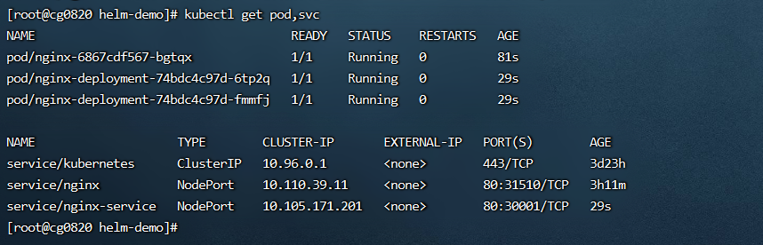

8. 查看 

```powershell
helm list  #列出release实例
```

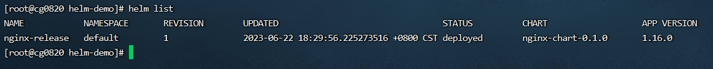

9. 查看部署pod的镜像版本

```powershell
kubectl get pod nginx-deployment-5c8469b67f-5pq8m -o yaml |grep image: #查看部署pod的镜像版本
```

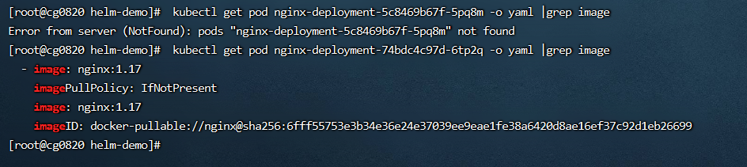

10. 可以通过nodeport方式访问： 在浏览器输入： [http://192.168.1.200:30001/](http://192.168.1.200:30001/)也可访问到  
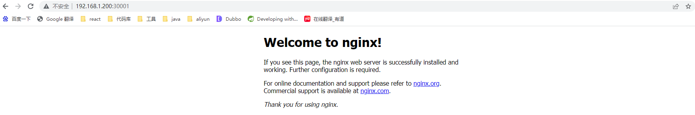
11. <font style="color:#ff7800;">升级release实例版本（将nginx版本1.17升级为1.20.0）</font>

```powershell
vim nginx-chart/values.yaml#修改变量文件，指定相应版本
```

```yaml
deployment_name: nginx-deployment 
replicas: 2
pod_label: nginx-pod-label
image: nginx
imageTag: 1.20.0 # 只修改这一个
container_name: nginx-container 
service_name: nginx-service 
namespace: default
port: 80
targetport: 80
containerport: 80
nodeport: 30001
```

12. 升级

```yaml
helm upgrade nginx-release nginx-chart -f nginx-chart/values.yaml  #指定release实例名和chart名和values.yaml文件升级
```

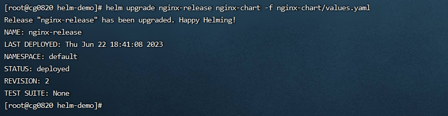

或使用: 

```yaml
helm upgrade nginx-release nginx-chart --set imageTag=1.20  #指定release实例名和chart名set升级
```

13. 查看

```yaml
helm list  #升级后查看
```

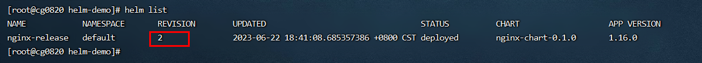

14. 升级后查看

```yaml
kubectl get pod,svc,ep #升级后查看
```

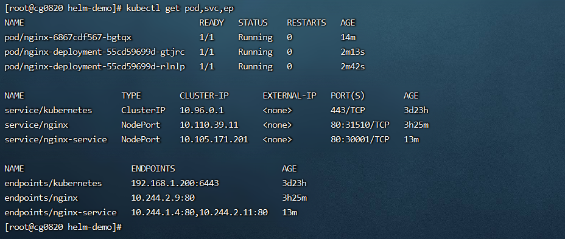

15. 查看升级后部署的版本

```yaml
kubectl get pod nginx-deployment-7dd78bf775-lh558 -o yaml |grep image  #查看升级后部署的版本
```

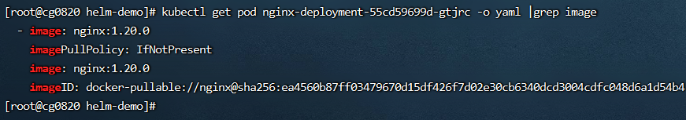

16. <font style="color:#ff7800;">回滚release实例版本（将nginx版本1.20.0回滚为1.17）</font>

语法：

```yaml
helm rollback release实例名            #指定release实例名,回滚到上一个版本
helm rollback release实例名 版本号     #指定release实例名,回滚到指定版本，注意版本号是release的版本号，不是镜像版本号
```

操作

```yaml
# 111. 回滚到上一个版本
helm rollback nginx-release  #回滚到上一个版本,指的是release的版本，不是镜像版本
```


17. 回滚后查看

```yaml
 helm list  #回滚后查看
```

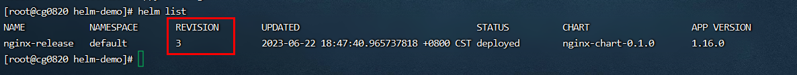

我们发现REVISION变成3了，是从2变成3了，也是说，这个字段一直是递增的。在创建的时候是1，我们upgrade的时候变成了2，我们rollback的时候变成了3

18. <font style="color:#ff7800;">回滚后查看</font>

```yaml
kubectl get pod,svc,ep #回滚后查看
```

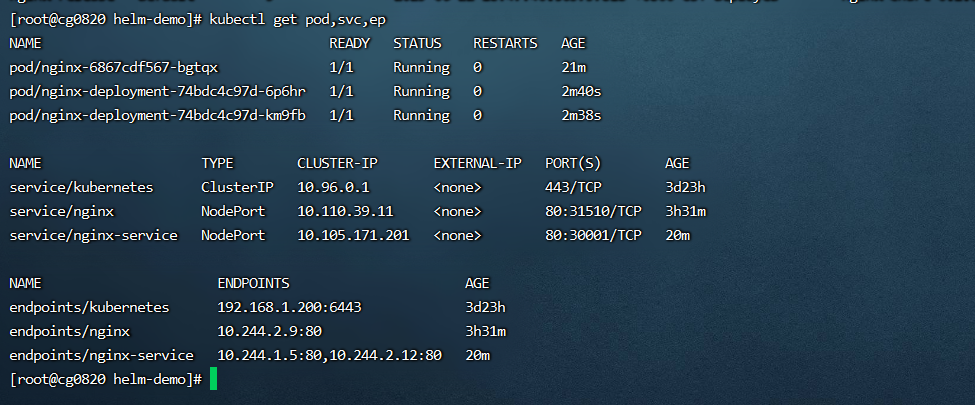

19. <font style="color:#ff7800;"> 查看回滚后部署的版本</font>

```yaml
kubectl get pod nginx-deployment-5c8469b67f-7tw8c -o yaml |grep image  #查看回滚后部署的版本
```

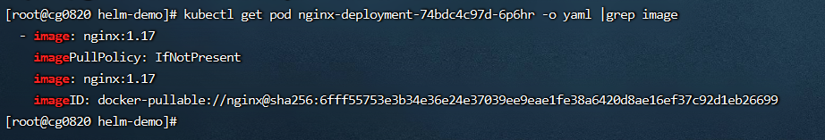

也就是说：

    - release版本1，镜像: 1.17
    - release版本2，镜像:1.20.0
    - release版本3，镜像: 1.17 (回滚到1.17后，release版本也会增加)

目前是release版本3，对应镜像: 1.17版本，现在要将版本回滚到指定版本2,对应镜像：1.20.0

20. 回退到指定版本
    1. 查看现在版本

```yaml
helm list
```

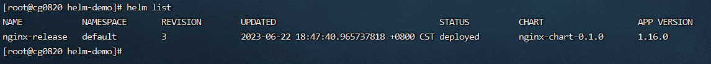

    2. 开始回退到指定版本

```yaml
helm rollback nginx-release 2  #回滚到指定的版本,指的是release的版本，不是镜像版本
```


    3. 再次查看现在版本

```yaml
 helm list
```

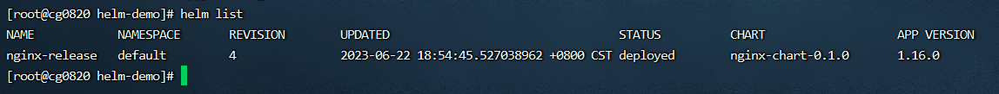

21. <font style="color:#ff7800;">回滚后查看</font>

```yaml
kubectl get pod,svc,ep #回滚后查看
```

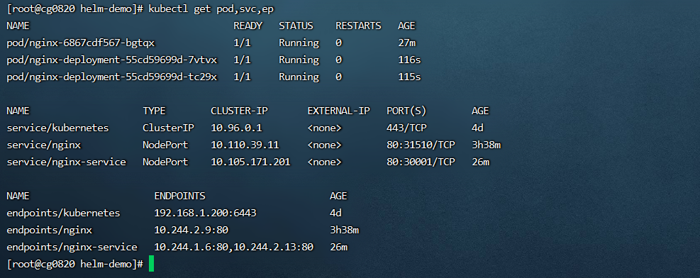

22.  查看回滚后部署的版本

```yaml
kubectl get pod nginx-deployment-7dd78bf775-sklx6 -o yaml |grep image  #查看回滚后部署的版本
```

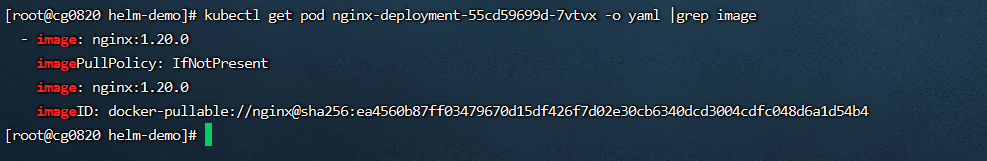

23. <font style="color:#ff7800;">卸载删除release实例</font>

```yaml
helm uninstall nginx-release #卸载删除release实例
```

24. 再次查看

```yaml
helm list
```

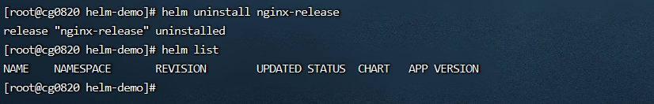

  
  
  
  
  
  
  
  
  
  
  
  
  
  
  
  
  
  
  
  
  
  
  
  


