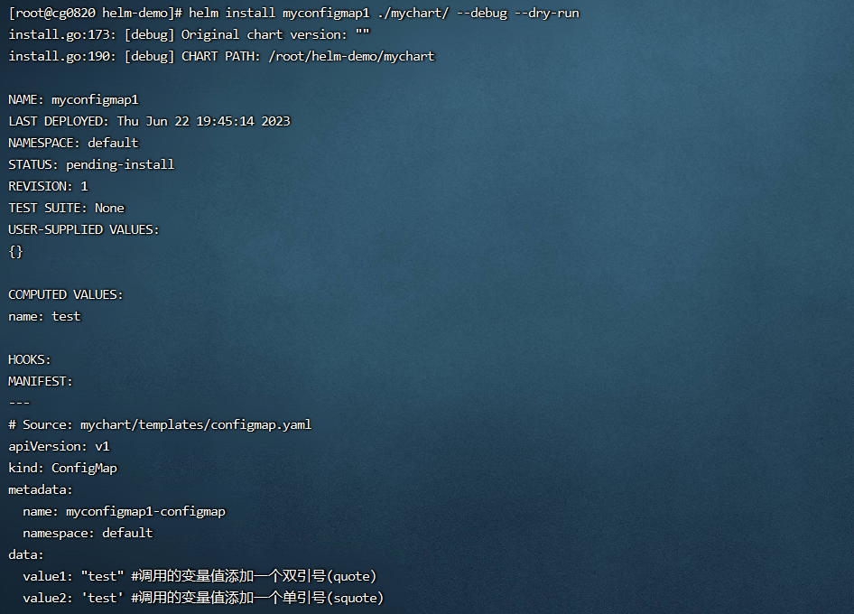
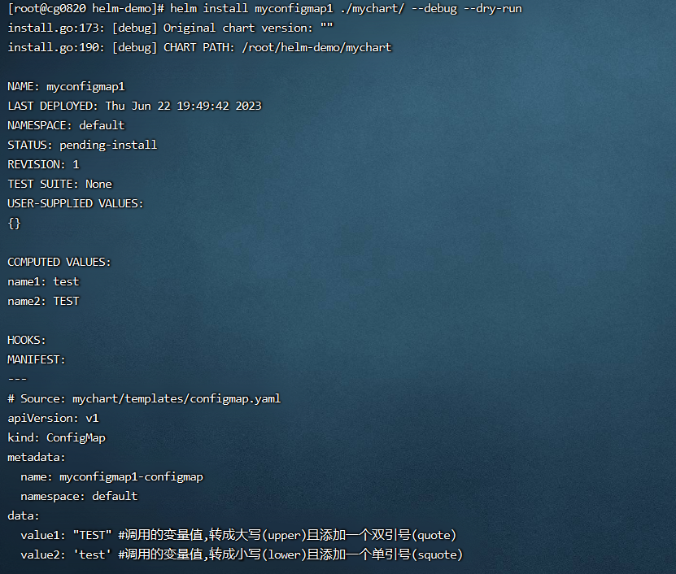

**<font style="color:#DF2A3F;background-color:#FFFFFF;">笔记来源：</font>**[**<font style="color:#DF2A3F;background-color:#FFFFFF;">k8s（Kubernetes）集群编排工具helm3实战教程</font>**](https://www.bilibili.com/video/BV12D4y1Y7Z7/?spm_id_from=333.337.search-card.all.click&vd_source=e8046ccbdc793e09a75eb61fe8e84a30)

# 112. <font style="color:#ff7800;">1 常用的helm3内置函数</font>
+ quote 或 squote 函数
+ <font style="color:#000000;">upper 和 lower 函数</font>
+ <font style="color:#000000;">repeat 函数</font>
+ <font style="color:#000000;">default 函数</font>
+ <font style="color:#000000;">lookup 函数</font>

<font style="color:#ff7800;"></font>

<font style="color:#ff7800;">函数的使用格式</font>  
格式1

```yaml
函数名 arg1 arg2 ...  # 然而在实际的使用中，我们更偏向于使用管道符 | 来将参数传递给函数
```

   
格式2

```yaml
arg1 | 函数名  # 这样使用可以使结构看起来更加直观，并且可以方便使用多个函数对数据进行链式处理。
```

# 2 <font style="color:#ff7800;">各内置函数使用的演示</font>
<font style="color:#ff7800;">环境准备 </font>

1. <font style="color:#ff7800;">k8s集群</font>

```yaml
kubectl get node
```

2. <font style="color:#ff7800;">创建一个chart包（用helm3发布创建一个configmap，创建的k8s集群中,发布其他应用也一样）</font>

```yaml
helm create mychart #创建一个chart包，chart包名为： mychart 
```

3. 进入

```yaml
rm -rf mychart/templates/*
```

<font style="color:#ff7800;">编写自己需要的yaml文件，使用上面的各个内置函数演示</font>

## <font style="color:#ff7800;">2.1 quote和squote函数</font>
通过向quote或squote函数中传递一个参数，即可为这个参数（调用的变量值）添加一个双引号（quote）或单引号（squote）

1. 定义 values.yaml

```yaml
vim mychart/values.yaml #定义变量和赋值
```

```yaml
name: test
```

2. 编写一个自己需要的模板文件

```yaml
vim mychart/templates/configmap.yaml  #编写一个自己需要的模板文件，调用values.yaml的变量，并使用相应函数加双引号或单引号
```

```yaml
apiVersion: v1
kind: ConfigMap
metadata:
  name: {{ .Release.Name }}-configmap
  namespace: {{ .Release.Namespace }}
data:
  value1: {{ quote .Values.name }} #调用的变量值添加一个双引号(quote)
  value2: {{ squote .Values.name }} #调用的变量值添加一个单引号(squote)
```

3. 执行

```yaml
helm install myconfigmap1 ./mychart/ --debug --dry-run #不真正执行，只是试运行看是否能运行
```


<font style="color:#ff7800;">使用格式2演示：</font>（效果一样）

1. 编写一个自己需要的模板文件

```yaml
vim /root/mychart/templates/configmap.yaml  #编写一个自己需要的模板文件，调用values.yaml的变量，并使用相应函数加双引号或单引号
```

```yaml
apiVersion: v1
kind: ConfigMap
metadata:
  name: {{ .Release.Name }}-configmap
  namespace: {{ .Release.Namespace }}
data: 
  value1: {{ .Values.name | quote }} #调用的变量值添加一个双引号(quote)
  value2: {{ .Values.name | squote }} #调用的变量值添加一个单引号(squote)
```

2. 执行

```yaml
helm install myconfigmap1 ./mychart/ --debug --dry-run #不真正执行，只是试运行看是否能运行
```



## <font style="color:#ff7800;">2.2 upper 和 lower 函数</font> 
使用 upper 和 lower 函数可以分别将字符串转换为大写（upper）和小写字母（lower）的样式

1. 定义变量和赋值

```yaml
vim /root/mychart/values.yaml #定义变量和赋值
```

```yaml
name1: test
name2: TEST
```

2. 编写一个自己需要的模板文件

```yaml
vim mychart/templates/configmap.yaml  #编写一个自己需要的模板文件，调用values.yaml的变量，并使用相应函数
```

```yaml
apiVersion: v1
kind: ConfigMap
metadata:
  name: {{ .Release.Name }}-configmap
  namespace: {{ .Release.Namespace }}
data: 
  value1: {{ .Values.name1 | upper | quote }} #调用的变量值,转成大写(upper)且添加一个双引号(quote)
  value2: {{ .Values.name2 | lower | squote }} #调用的变量值,转成小写(lower)且添加一个单引号(squote)
```

3. 执行

```yaml
helm install myconfigmap1 ./mychart/ --debug --dry-run #不真正执行，只是试运行看是否能运行
```



## <font style="color:#ff7800;">2.3 repeat 函数 </font> 
使用repeat 函数可以<font style="color:#ff7800;">将指定字符串重复输出</font>指定的次数，repeat 函数可以带有一个参数，用于设置重复多少次。

1. 定义变量和赋值

```yaml
vim /root/mychart/values.yaml #定义变量和赋值
```

```yaml
name1: test
name2: TEST
```

2. 编写一个自己需要的模板文件

```yaml
vim mychart/templates/configmap.yaml  #编写一个自己需要的模板文件，调用values.yaml的变量，并使用相应函数
```

```yaml
apiVersion: v1
kind: ConfigMap
metadata:
  name: {{ .Release.Name }}-configmap
  namespace: {{ .Release.Namespace }}
data: 
  value1: {{ .Values.name1 | repeat 3 | quote }} #调用的变量值,输出重复3次且添加一个双引号(quote)
  value2: {{ .Values.name2 | repeat 2 | squote }} #调用的变量值,输出重复2次且添加一个单引号(squote)
```

3. 执行

```yaml
helm install myconfigmap1 ./mychart/ --debug --dry-run #不真正执行，只是试运行看是否能运行
```


## <font style="color:#ff7800;">2.4 default 函数 </font> 
使用default函数<font style="color:#ff7800;">指定一个默认值</font>，这样当引入的值不存在时，就可以使用这个默认值

1. 定义变量和赋值

```yaml
vim mychart/values.yaml #定义变量和赋值
```

```yaml
name1: test
name2: TEST
```

2. 编写一个自己需要的模板文件

```yaml
vim /root/mychart/templates/configmap.yaml  #编写一个自己需要的模板文件，调用values.yaml的变量，并使用相应函数
```

```yaml
apiVersion: v1
kind: ConfigMap
metadata:
  name: {{ .Release.Name }}-configmap
  namespace: {{ .Release.Namespace }}
data:
  value1: {{ .Values.location | default "beijing" | quote }}  #调用的变量值,引用的变量location不存在时使用定义的默认值且添加一个双引号(quote)
```

3.  执行

```yaml
helm install myconfigmap1 ./mychart/ --debug --dry-run #不真正执行，只是试运行看是否能运行
```


## <font style="color:#ff7800;">2.5 lookup 函数 </font> 
使用lookup 函数<font style="color:#ff7800;">用于在当前的k8s集群中获取一些资源的信息</font>，功能有些类似于`<font style="color:#ff7800;">kubectl get ...</font>`

函数的格式如下：   
`lookup "apiVersion" "kind" "namespace" "name" `其中`"namespace"`和`"name" `都是可选的，或可以指定为空字符串`""`，函数执行完成后会返回特定的资源  
常用格式和kubect命令相互对应关系：

```yaml
kubectl命令	                                  lookup 函数
kubectl get pod mypod -n mynamespace	        lookup "v1" "Pod" "mynamespace" "mypod"
kubectl get pods -n mynamespace	              lookup "v1" "Pod" "mynamespace" ""
kubectl get pods --all-namespaces	            lookup "v1" "Pod" "" ""
kubectl get namespace mynamespace	            lookup "v1" "Namespace" "" "mynamespace"
kubectl get namespaces                        lookup "v1" "Namespace" "" "" 
```

1. 编写一个自己需要的模板文件

```yaml
vim mychart/templates/configmap.yaml  #编写一个自己需要的模板文件，调用values.yaml的变量，并使用相应函数
```

```yaml
apiVersion: v1
kind: ConfigMap
metadata:
  name: {{ .Release.Name }}-configmap
  namespace: {{ .Release.Namespace }}
data: 
  value1: {{ lookup "v1" "Namespace" "" "" | quote }} #相当于: kubectl get namespaces，并加上双引号(quote ) 
```

2. 执行

```yaml
helm install myconfigmap1 ./mychart/  #需要安装后才能查看到相应信息
helm get manifest myconfigmap1        #安装成功后,用helm get manifest release名 命令可以查看已经发布到k8s中的release信息
```


3. 清空环境

```yaml
helm uninstall myconfigmap1 #删除安装的release，清空环境
```


