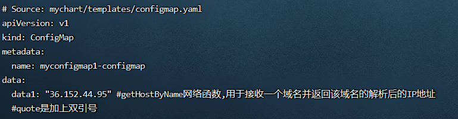
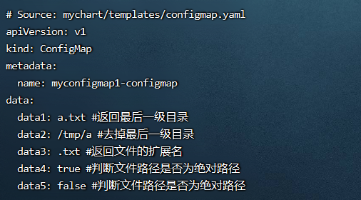
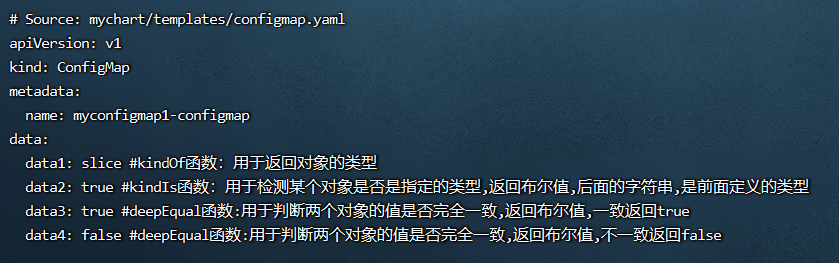

**<font style="color:#E4495B;background-color:#FFFFFF;">笔记来源：</font>**[**<font style="color:#E4495B;background-color:#FFFFFF;">k8s（Kubernetes）集群编排工具helm3实战教程</font>**](https://www.bilibili.com/video/BV12D4y1Y7Z7/?spm_id_from=333.337.search-card.all.click&vd_source=e8046ccbdc793e09a75eb61fe8e84a30)

# 113. <font style="color:#000000;">1 常用函数</font>
+ <font style="color:#000000;">网络函数：</font>`<font style="color:#000000;">getHostByName</font>`
+ <font style="color:#000000;">文件路径：</font>`<font style="color:#000000;">base</font>`<font style="color:#000000;"></font>`<font style="color:#000000;">dir</font>``<font style="color:#000000;">ext</font>``<font style="color:#000000;">isAbs</font>`<font style="color:#000000;">函数</font>
+ <font style="color:#000000;">类型检查和对比函数：</font>`<font style="color:#000000;">kindOf</font>``<font style="color:#000000;">kindIs</font>``<font style="color:#000000;">deepEqual</font>`<font style="color:#000000;">函数</font>

# 114. <font style="color:#000000;">2 演示</font>
<font style="color:#000000;">环境准备</font>

1. <font style="color:#000000;">k8s集群</font>

```yaml
kubectl get node
```

2. <font style="color:#000000;">创建一个chart包（用helm3发布创建一个configmap，创建的k8s集群中，发布其他应用也一样）</font>

```yaml
helm create mychart #创建一个chart包，chart包名为： mychart 
```

3. <font style="color:#000000;">删除mychart/templates目录下的文件</font>

```yaml
rm -rf mychart/templates/*  #全部删除
```

<font style="color:#000000;">编写自己需要的yaml文件，使用上面的各个内置函数演示</font>

## <font style="color:#000000;">2.1 网络函数：</font>`<font style="color:#000000;">getHostByName</font>`
<font style="color:#000000;">getHostByName网络函数使用的演示  用于接收一个域名并返回该域名的解析后的IP地址 </font>

<font style="color:#000000;">示例：</font>`<font style="color:#000000;">getHostByName "</font>[<font style="color:#000000;">www.baidu.com</font>](http://www.baidu.com)`

<font style="color:#000000;">流程演示</font>

1. <font style="color:#000000;">编写一个自己需要的模板文件</font>

```yaml
vim /root/mychart/templates/configmap.yaml  #编写一个自己需要的模板文件
```

```yaml
apiVersion: v1
kind: ConfigMap
metadata:
  name: {{ .Release.Name }}-configmap
data:
  data1: {{ getHostByName "www.baidu.com" | quote }} #getHostByName网络函数,用于接收一个域名并返回该域名的解析后的IP地址
  #quote是加上双引号
```

2. <font style="color:#000000;">运行</font>

```yaml
 helm install myconfigmap1 ./mychart/ --debug --dry-run #不真正执行，只是试运行看是否能运行
```



## <font style="color:#000000;">2.2 文件路径：</font>`<font style="color:#000000;">base</font>``<font style="color:#000000;">dir</font>``<font style="color:#000000;">ext</font>``<font style="color:#000000;">isAbs</font>`<font style="color:#000000;">函数</font>
<font style="color:#000000;">文件路径函数base函数、dir函数、ext函数、isAbs函数使用的演示 用于对文件路径进行处理</font>

<font style="color:#000000;">分别含义如下：</font>

+ <font style="color:#000000;">base函数： 用于返回指定路径的最后一级目录</font>
+ <font style="color:#000000;">dir函数： 用于返回指定路径的上一级路径（也就是去掉最后一级路径）</font>
+ <font style="color:#000000;">ext函数： 用于返回文件的拓展名</font>
+ <font style="color:#000000;">isAbs函数：用于判断文件路径是否是绝对路径，是绝对路径则返回 true，否则返回 false</font>

<font style="color:#000000;">流程演示：</font>

1. <font style="color:#000000;">编写一个自己需要的模板文件</font>

```yaml
vim /root/mychart/templates/configmap.yaml  #编写一个自己需要的模板文件
```

```yaml
apiVersion: v1
kind: ConfigMap
metadata:
  name: {{ .Release.Name }}-configmap
data:
  data1: {{ base "/tmp/a/a.txt" }} #返回最后一级目录
  data2: {{ dir "/tmp/a/a.txt" }} #去掉最后一级目录
  data3: {{ ext "a.txt" }} #返回文件的扩展名
  data4: {{ isAbs "/tmp/a" }} #判断文件路径是否为绝对路径
  data5: {{ isAbs "tmp/a" }} #判断文件路径是否为绝对路径
```

2. <font style="color:#000000;">运行</font>

```yaml
helm install myconfigmap1 ./mychart/ --debug --dry-run #不真正执行，只是试运行看是否能
```



## <font style="color:#000000;">2.3 类型检查和对比函数：</font>`<font style="color:#000000;">kindOf</font>``<font style="color:#000000;">kindIs</font>``<font style="color:#000000;">deepEqual</font>`<font style="color:#000000;">函数</font>
<font style="color:#000000;">分别含义如下：</font>

<font style="color:#000000;">kindOf： 用于返回对象的类型</font>

<font style="color:#000000;">kindIs： 用于检测某个对象是否是指定的类型，返回布尔值，第一个参数需要指定类型，第二个参数需要指定检查的数据对象</font>

<font style="color:#000000;">deepEqual：用于判断两个对象的值是否完全一致，返回布尔值</font>

<font style="color:#000000;">演示流程</font>

1. <font style="color:#000000;">编写一个自己需要的模板文件</font>

```yaml
vim /root/mychart/templates/configmap.yaml  #编写一个自己需要的模板文件
```

```yaml
apiVersion: v1
kind: ConfigMap
metadata:
  name: {{ .Release.Name }}-configmap
data:
  data1: {{ kindOf ( list 1 2 3 ) }} #kindOf函数：用于返回对象的类型
  data2: {{ kindIs "string" "hi" }} #kindIs函数：用于检测某个对象是否是指定的类型,返回布尔值,后面的字符串,是前面定义的类型
  data3: {{ deepEqual ( list 1 2 3) (list 1 2 3 ) }} #deepEqual函数:用于判断两个对象的值是否完全一致,返回布尔值,一致返回true
  data4: {{ deepEqual ( list 1 2 3) (list 2 3 4 ) }} #deepEqual函数:用于判断两个对象的值是否完全一致,返回布尔值,不一致返回false
```

2. <font style="color:#000000;">运行</font>

```yaml
helm install myconfigmap1 ./mychart/ --debug --dry-run #不真正执行，只是试运行看是否能运行
```



