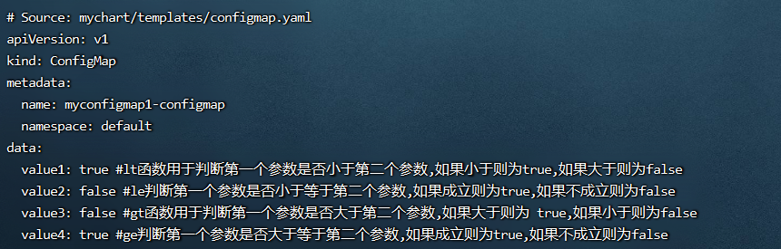
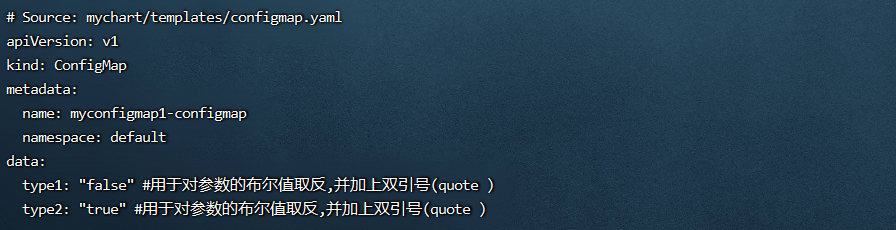

**<font style="color:#E4495B;background-color:#FFFFFF;">笔记来源：</font>**[**<font style="color:#E4495B;background-color:#FFFFFF;">k8s（Kubernetes）集群编排工具helm3实战教程</font>**](https://www.bilibili.com/video/BV12D4y1Y7Z7/?spm_id_from=333.337.search-card.all.click&vd_source=e8046ccbdc793e09a75eb61fe8e84a30)

# 115. <font style="color:#000000;">1 常见的逻辑和流控制函数</font>
| <font style="color:#000000;">函数</font> | <font style="color:#000000;">描述</font> |
| --- | --- |
| <font style="color:#000000;">eq</font> | <font style="color:#000000;">用于</font><font style="color:#000000;">判断两个参数是否相等</font><font style="color:#000000;">，如果等于则为 true，不等于则为 false。</font> |
| <font style="color:#000000;">ne</font> | <font style="color:#000000;">用于</font><font style="color:#000000;">判断两个参数是否不相等</font><font style="color:#000000;">，如果不等于则为 true，等于则为 false。</font> |
| <font style="color:#000000;">lt </font> | <font style="color:#000000;">lt 函数用于判断第一个参数是否</font><font style="color:#000000;">小于</font><font style="color:#000000;">第二个参数，如果小于则为 true，如果大于则为 false。</font> |
| <font style="color:#000000;">le</font> | <font style="color:#000000;">判断第一个参数是否</font><font style="color:#000000;">小于等于</font><font style="color:#000000;">第二个参数，如果成立则为 true，如果不成立则为 false。</font> |
| <font style="color:#000000;">gt</font> | <font style="color:#000000;">gt 函数用于判断第一个参数是否</font><font style="color:#000000;">大于</font><font style="color:#000000;">第二个参数，如果大于则为 true，如果小于则为 false。</font> |
| <font style="color:#000000;">ge</font> | <font style="color:#000000;">判断第一个参数是否</font><font style="color:#000000;">大于等于</font><font style="color:#000000;">第二个参数，如果成立则为 true，如果不成立则为 false。</font> |
| <font style="color:#000000;">and</font> | <font style="color:#000000;">返回两个参数的</font><font style="color:#000000;">逻辑与</font><font style="color:#000000;">结果（布尔值），也就是说</font><font style="color:#000000;">如果两个参数为真，则结果为 true</font><font style="color:#000000;">。否认哪怕一个为假，则返回false</font> |
| <font style="color:#000000;">or</font> | <font style="color:#000000;">判断两个参数的</font><font style="color:#000000;">逻辑或</font><font style="color:#000000;">的关系，</font><font style="color:#000000;">两个参数中有一个为真，则为真</font><font style="color:#000000;">。返回第一个不为空的参数或者是返回后一个参数</font> |
| <font style="color:#000000;">not</font> | <font style="color:#000000;">用于</font><font style="color:#000000;">对参数的布尔值取反</font><font style="color:#000000;">,如果</font><font style="color:#000000;">参数是正常参数(非空)，正常为true，取反后就为false</font><font style="color:#000000;">，参数是空的,正常是false，取反后是true</font> |
| <font style="color:#000000;">default</font> | <font style="color:#000000;"> 用来设置一个</font><font style="color:#000000;">默认值</font><font style="color:#000000;">，在参数的值为空的情况下，则会使用默认值</font> |
| <font style="color:#000000;">empty</font> | <font style="color:#000000;"> 用于</font><font style="color:#000000;">判断给定值是否为空</font><font style="color:#000000;">，如果为空则返回true</font> |
| <font style="color:#000000;">coalesce</font> | <font style="color:#000000;">用于</font><font style="color:#000000;">扫描一个给定的列表，并返回第一个非空</font><font style="color:#000000;">的值。</font> |
| <font style="color:#000000;">ternary</font> | <font style="color:#000000;">接受两个参数和一个 test 值，如果test 的布尔值为 true，则返回第一个参数的值，如果test 的布尔值为false，则返回第二个参数的值</font> |


# 116. <font style="color:#000000;">2 案例演示</font>
<font style="color:#000000;">环境准备</font>

1. <font style="color:#000000;">k8s集群</font>

```yaml
kubectl get node
```

2. <font style="color:#000000;">.创建一个chart包 （用helm3发布创建一个configmap，创建的k8s集群中,发布其他应用也一样）</font>

```yaml
helm create mychart  #创建一个chart包，chart包名为： mychart 
```

3. <font style="color:#000000;">删除mychart/templates目录下的所有文件</font>

```yaml
rm -rf mychart/templates/*  #全部删除
```

<font style="color:#000000;">编写自己需要的yaml文件，使用上面的各个内置函数演示</font>

## <font style="color:#000000;">2.1 </font>`<font style="color:#000000;">eq</font>`<font style="color:#000000;"> </font>`<font style="color:#000000;">ne</font>`<font style="color:#000000;">函数 </font>
<font style="color:#000000;">分别含义如下</font>

+ <font style="color:#000000;">eq函数： 用于判断两个参数是否相等，如果等于则为 true，不等于则为 false。</font>
+ <font style="color:#000000;">ne函数： 用于判断两个参数是否不相等，如果不等于则为 true，等于则为 false。</font>

<font style="color:#000000;">演示步骤</font>

1. <font style="color:#000000;">编辑configmap.yaml</font>

```yaml
vim mychart/templates/configmap.yaml
```

```yaml
apiVersion: v1
kind: ConfigMap
metadata:
  name: {{ .Release.Name }}-configmap
  namespace: {{ .Release.Namespace }}
data:
  value1: {{ eq 2 2 }} #使用eq函数判断两个参数是否相等,相等返回true,不等返回false
  value2: {{ eq 2 1 }} #使用eq函数判断两个参数是否相等,相等返回true,不等返回false
  value3: {{ ne 2 1 }} #使用nq函数判断两个参数是否不相等,不相等返回true,相等则返回false
```

2. <font style="color:#000000;">执行</font>

```yaml
helm install myconfigmap1 ./mychart/ --debug --dry-run #不真正执行，只是试运行看是否能运行
```


## <font style="color:#000000;">2.2 </font>`<font style="color:#000000;">lt</font>`<font style="color:#000000;"> </font>`<font style="color:#000000;">le</font>`<font style="color:#000000;"> </font>`<font style="color:#000000;">gt</font>`<font style="color:#000000;"> </font>`<font style="color:#000000;">ge</font>`<font style="color:#000000;">函数 </font>
<font style="color:#000000;">分别含义如下：</font>

+ <font style="color:#000000;">lt ： lt 函数用于判断第一个参数是否小于第二个参数，如果小于则为 true，如果大于则为 false。</font>
+ <font style="color:#000000;">le： le判断第一个参数是否小于等于第二个参数，如果成立则为 true，如果不成立则为 false。</font>
+ <font style="color:#000000;">gt： gt函数用于判断第一个参数是否大于第二个参数，如果大于则为 true，如果小于则为 false。</font>
+ <font style="color:#000000;">ge： ge判断第一个参数是否大于等于第二个参数，如果成立则为 true，如果不成立则为 false。</font>

<font style="color:#000000;">演示步骤</font>

1. <font style="color:#000000;">编辑configmap.yaml</font>

```yaml
 vim /root/mychart/templates/configmap.yaml
```

```yaml
apiVersion: v1
kind: ConfigMap
metadata:
  name: {{ .Release.Name }}-configmap
  namespace: {{ .Release.Namespace }}
data:
  value1: {{ lt 1 2 }} #lt函数用于判断第一个参数是否小于第二个参数,如果小于则为true,如果大于则为false
  value2: {{ le 2 1 }} #le判断第一个参数是否小于等于第二个参数,如果成立则为true,如果不成立则为false
  value3: {{ gt 1 2 }} #gt函数用于判断第一个参数是否大于第二个参数,如果大于则为 true,如果小于则为false
  value4: {{ ge 2 2 }} #ge判断第一个参数是否大于等于第二个参数,如果成立则为true,如果不成立则为false
```

2. 执行

```yaml
helm install myconfigmap1 ./mychart/ --debug --dry-run #不真正执行，只是试运行看是否能运行
```



## <font style="color:#000000;">2.3 </font>`<font style="color:#000000;">and</font>`<font style="color:#000000;"> 函数 </font>
<font style="color:#000000;">如果两个参数都返回为真，则结果为true，否认哪怕一个为假，则返回false</font>

<font style="color:#000000;">操作步骤</font>

1. <font style="color:#000000;">编辑values.yaml</font>

```yaml
vim mychart/values.yaml #定义变量和赋值
```

```yaml
name1: true
name2: false
```

2. <font style="color:#000000;">编写一个自己需要的模板文件</font>

```yaml
vim /root/mychart/templates/configmap.yaml  #编写一个自己需要的模板文件，调用values.yaml的变量，并使用相应函数加双引号
```

```yaml
apiVersion: v1
kind: ConfigMap
metadata:
  name: {{ .Release.Name }}-configmap
  namespace: {{ .Release.Namespace }}
data: 
  value1: {{ and .Values.name1 .Values.name2 | quote }}  #如果两个参数都返回为真,则结果为true,否认哪怕一个为假,则返回false
```

3. <font style="color:#000000;">执行</font>

```yaml
helm install myconfigmap1 ./mychart/ --debug --dry-run #不真正执行，只是试运行看是否能运行
```


4. <font style="color:#000000;">修改成两个都是 true</font>

```yaml
vim /mychart/values.yaml #定义变量和赋值
```

```yaml
name1: true
name2: true
```

5. <font style="color:#000000;">运行</font>

```yaml
helm install myconfigmap1 ./mychart/ --debug --dry-run #不真正执行，只是试运行看是否能运行
```


## <font style="color:#000000;">2.4 </font>`<font style="color:#000000;">or</font>`<font style="color:#000000;"> 函数 </font>
<font style="color:#000000;">判断两个参数的逻辑或的关系，两个参数中有一个为真，则为真，会返回第一个不为空的参数或者是返回后一个参数</font>

<font style="color:#000000;">什么是空类型？主要有以下几种：</font>

+ <font style="color:#000000;">整型：0</font>
+ <font style="color:#000000;">字符串: </font>`<font style="color:#000000;">""</font>`
+ <font style="color:#000000;">列表: []</font>
+ <font style="color:#000000;">字典: {}</font>
+ <font style="color:#000000;">布尔: false</font>
+ <font style="color:#000000;">以及所有的</font>`<font style="color:#000000;">nil</font>`<font style="color:#000000;"> (或 </font>`<font style="color:#000000;">null</font>`<font style="color:#000000;">)</font>

<font style="color:#000000;">演示步骤</font>

1. <font style="color:#000000;">编写一个自己需要的模板文件</font>

```yaml
vim /root/mychart/templates/configmap.yaml  #编写一个自己需要的模板文件，并使用相应函数加双引号
```

```yaml
apiVersion: v1
kind: ConfigMap
metadata:
  name: {{ .Release.Name }}-configmap
  namespace: {{ .Release.Namespace }}
data: 
  value1: {{ or 1 "" 2 | quote }} #返回1,返回第一个不为空的参数或者是返回后一个参数,并加上双引号(quote ) 
  value2: {{ or 1 2 "" | quote }} #返回1,返回第一个不为空的参数或者是返回后一个参数,并加上双引号(quote ) 
  value3: {{ or "" 2 3 | quote }} #返回2,返回第一个不为空的参数或者是返回后一个参数,并加上双引号(quote ) 
  value4: {{ or "" "" 3 | quote }} #返回3,返回第一个不为空的参数或者是返回后一个参数,并加上双引号(quote ) 
  value5: {{ or "" "" "" | quote }} #返回空,返回第一个不为空的参数或者是返回后一个参数,并加上双引号(quote ) 
```

2. <font style="color:#000000;">运行</font>

```yaml
helm install myconfigmap1 ./mychart/ --debug --dry-run #不真正执行，只是试运行看是否能运行
```


## <font style="color:#000000;">2.5 </font>`<font style="color:#000000;">not</font>`<font style="color:#000000;"> 函数 </font>
<font style="color:#000000;">用于对参数的布尔值取反,如果参数是正常参数（非空），正常为true，取反后就为false，参数是空的，正常是false，取反后是true</font>

<font style="color:#000000;">演示流程 </font>

1. <font style="color:#000000;">编写一个自己需要的模板文件</font>

```yaml
 vim /root/mychart/templates/configmap.yaml  #编写一个自己需要的模板文件，并使用相应函数加双引号
```

```yaml
apiVersion: v1
kind: ConfigMap
metadata:
  name: {{ .Release.Name }}-configmap
  namespace: {{ .Release.Namespace }}
data: 
  type1: {{ not 2 | quote }} #用于对参数的布尔值取反,并加上双引号(quote ) 
  type2: {{ not "" | quote }} #用于对参数的布尔值取反,并加上双引号(quote ) 
```

2. <font style="color:#000000;">运行</font>

```yaml
helm install myconfigmap1 ./mychart/ --debug --dry-run #不真正执行，只是试运行看是否能运行
```



## <font style="color:#000000;">2.6 </font>`<font style="color:#000000;">default</font>`<font style="color:#000000;"> 函数  </font>
<font style="color:#000000;">使用default函数指定一个默认值，这样当引入的值不存在时，就可以使用这个默认值</font>

<font style="color:#000000;">演示步骤</font>

1. <font style="color:#000000;">values.yaml</font>

```yaml
vim /root/mychart/values.yaml #定义变量和赋值
```

```yaml
name1: test
name2: TEST
```

2. <font style="color:#000000;">编写一个自己需要的模板文件</font>

```yaml
 vim /root/mychart/templates/configmap.yaml  #编写一个自己需要的模板文件，调用values.yaml的变量，并使用相应函数
```

```yaml
apiVersion: v1
kind: ConfigMap
metadata:
  name: {{ .Release.Name }}-configmap
  namespace: {{ .Release.Namespace }}
data:
  value1: {{ .Values.address | default "bj" | quote }}  #调用的变量值,引用的变量location不存在时使用定义的默认值且添加一个双引号(quote)
```

3. <font style="color:#000000;">运行</font>

```yaml
helm install myconfigmap1 ./mychart/ --debug --dry-run #不真正执行，只是试运行看是否能运行
```


## <font style="color:#000000;">2.7 </font>`<font style="color:#000000;">empty</font>`<font style="color:#000000;"> 函数 </font>
<font style="color:#000000;">用于判断给定值是否为空，如果为空则返回true，不为空返回false</font>

<font style="color:#000000;">演示流程</font>

1. <font style="color:#000000;">编写一个自己需要的模板文件</font>

```yaml
vim /root/mychart/templates/configmap.yaml  #编写一个自己需要的模板文件
```

```yaml
apiVersion: v1
kind: ConfigMap
metadata:
  name: {{ .Release.Name }}-configmap
  namespace: {{ .Release.Namespace }}
data:
  type1: {{ 0 | empty }} #用于判断给定值是否为空，如果为空则返回true，0是空值
  type2: {{ 1 | empty }} #用于判断给定值是否为空，如果为空则返回true 
  type3: {{ "" | empty }} #用于判断给定值是否为空，如果为空则返回true，""是空值
  type4: {{ false | empty }} #用于判断给定值是否为空，如果为空则返回true，false是空值
```

2. <font style="color:#000000;">运行</font>

```yaml
helm install myconfigmap1 ./mychart/ --debug --dry-run #不真正执行，只是试运行看是否能运行
```


## <font style="color:#000000;">2.8 </font>`<font style="color:#000000;">coalesce</font>`<font style="color:#000000;"> 函数 </font>
<font style="color:#000000;">用于扫描一个给定的列表，并返回第一个非空的值</font>

<font style="color:#000000;">演示流程</font>

1. <font style="color:#000000;">编写一个自己需要的模板文件</font>

```yaml
vim /root/mychart/templates/configmap.yaml  #编写一个自己需要的模板文件
```

```yaml
apiVersion: v1
kind: ConfigMap
metadata:
  name: {{ .Release.Name }}-configmap
  namespace: {{ .Release.Namespace }}
data: 
  type1: {{ coalesce 0 1 2 }} #用于扫描一个给定的列表，并返回第一个非空的值
  type2: {{ coalesce "" false "Test" }} #用于扫描一个给定的列表，并返回第一个非空的值
```

2. <font style="color:#000000;">运行</font>

```yaml
helm install myconfigmap1 ./mychart/ --debug --dry-run #不真正执行，只是试运行看是否能运行
```


## <font style="color:#000000;">2.9 </font>`<font style="color:#000000;">ternary</font>`<font style="color:#000000;"> 函数</font>
<font style="color:#000000;">接受两个参数和一个test 值，如果test 的布尔值为true，则返回第一个参数的值，如果test 的布尔值为false，则返回第二个参数的值</font>

<font style="color:#000000;">演示流程</font>

1. <font style="color:#000000;">编写一个自己需要的模板文件</font>

```yaml
vim /root/mychart/templates/configmap.yaml  #编写一个自己需要的模板文件
```

```yaml
apiVersion: v1
kind: ConfigMap
metadata:
  name: {{ .Release.Name }}-configmap
  namespace: {{ .Release.Namespace }}
data: 
  type1: {{ ternary "First" "Second" true }} #接受两个参数和一个 test值,如果test的布尔值为true,则返回第一个参数的值
  type2: {{ ternary "First" "Second" false }} #接受两个参数和一个 test值,如果test的布尔值为false,则返回第二个参数的值
```

2. <font style="color:#000000;">运行</font>

```yaml
vim /root/mychart/templates/configmap.yaml  #编写一个自己需要的模板文件
```


