**<font style="color:#E4495B;background-color:#FFFFFF;">笔记来源：</font>**[**<font style="color:#E4495B;background-color:#FFFFFF;">k8s（Kubernetes）集群编排工具helm3实战教程</font>**](https://www.bilibili.com/video/BV12D4y1Y7Z7/?spm_id_from=333.337.search-card.all.click&vd_source=e8046ccbdc793e09a75eb61fe8e84a30)

# 117. <font style="color:#000000;">1 常用helm3的字符串函数</font>
+ <font style="color:#000000;">print 和 println函数 </font>
+ <font style="color:#000000;">printf函数</font>
+ <font style="color:#000000;">trim函数、trimAll 函数、trimPrefix函数 和 trimSuffix函数</font>
+ <font style="color:#000000;">lower函数、upper函数、title函数 和 untitle函数</font>
+ <font style="color:#000000;">snakecase函数、camelcase函数 和 kebabcase函数</font>
+ <font style="color:#000000;">swapcase函数</font>
+ <font style="color:#000000;">substr函数</font>
+ <font style="color:#000000;">trunc函数</font>
+ <font style="color:#000000;">abbrev函数</font>
+ <font style="color:#000000;">randAlphaNum函数、randAlpha函数、randNumeric函数 和 randAscii 函数</font>
+ <font style="color:#000000;">contains函数 </font>
+ <font style="color:#000000;">hasPrefix函数 和 hasSuffix函数 </font>
+ <font style="color:#000000;">repeat函数、nospace函数 和 initials 函数</font>
+ <font style="color:#000000;">wrapWith函数</font>
+ <font style="color:#000000;">quote函数 和 squote 函数</font>
+ <font style="color:#000000;">replace函数</font>
+ <font style="color:#000000;">shuffle函数</font>
+ <font style="color:#000000;">indent函数和 nindent函数</font>
+ <font style="color:#000000;">plural 函数</font>

# 118. <font style="color:#000000;">2 案例演示</font>
<font style="color:#000000;">环境准备 </font>

1. <font style="color:#000000;">k8s集群</font>

```yaml
kubectl get node
```

2. <font style="color:#000000;">创建一个chart包（用helm3发布创建一个configmap，创建的k8s集群中，发布其他应用也一样）</font>

```yaml
helm create mychart #创建一个chart包，chart包名为： mychart 
```

3. <font style="color:#000000;">删除mychart/templates下的所有文件</font>

```yaml
 rm -rf mychart/templates/*  #全部删除
```

4. <font style="color:#000000;">编写自己需要的yaml文件，使用上面的各个内置函数演示</font>

## <font style="color:#000000;">2.1 </font>`<font style="color:#000000;">print</font>`<font style="color:#000000;"> </font>`<font style="color:#000000;">println</font>`<font style="color:#000000;">函数 </font>
<font style="color:#000000;">print 和 println 函数用于将所有的参数按照字符串进行输出</font>

<font style="color:#000000;">与print 不同的是，println 会在每个字符串后面添加一个空格，并且会在输出的末尾添加一个换行符。如果参数中包含非字符串类型，那么输出的时候会转成字符串类型。当相邻两个参数不是字符串时，会在它们中间添加一个空格</font>

<font style="color:#000000;">演示流程</font>

1. <font style="color:#000000;">编写一个自己需要的模板文件</font>

```yaml
vim /root/mychart/templates/configmap.yaml  #编写一个自己需要的模板文件
```

```yaml
apiVersion: v1
kind: ConfigMap
metadata:
  name: {{ .Release.Name }}-configmap
  namespace: {{ .Release.Namespace }}
data: 
  type1: {{ print "this is" "test" "message" }} 
  type2: {{ println "this is" "test" "message" }} 
  type3: {{ print "this is" 2 3 "message" }}  
  #print 和 println 函数用于将所有的参数按照字符串进行输出
```

2. <font style="color:#000000;">执行</font>

```yaml
helm install myconfigmap1 ./mychart/ --debug --dry-run #不真正执行，只是试运行看是否能运行
```

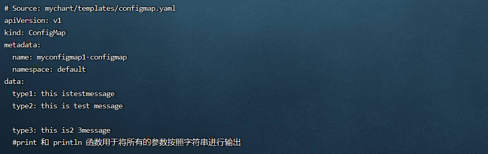

## <font style="color:#000000;">2.2 </font>`<font style="color:#000000;">printf</font>`<font style="color:#000000;"> 函数 </font>
<font style="color:#000000;">用于格式化输出字符串内容，并且支持使用占位符。占位符取决于传入参数的类型。  
</font><font style="color:#000000;">printf 函数常用类型</font>

+ <font style="color:#000000;">整数</font>
    - <font style="color:#000000;">%b ：二进制</font>
    - <font style="color:#000000;">%c ：表示普通字符</font>
    - <font style="color:#000000;">%d ：十进制</font>
    - <font style="color:#000000;">%o ：8进制</font>
    - <font style="color:#000000;">%O ：带0o前缀的8进制</font>
    - <font style="color:#000000;">%q ：安全转义的单引号字符</font>
    - <font style="color:#000000;">%x ：16进制，使用小写字符a-f</font>
    - <font style="color:#000000;">%X ：16进制，使用小写字符A-F</font>
    - <font style="color:#000000;">%U ：Unicode格式： U+1234; 和</font>`<font style="color:#000000;">"U+%04X"</font>`<font style="color:#000000;">相同</font>
+ <font style="color:#000000;">浮点数</font>
    - <font style="color:#000000;">%b ：指数二次幂的无小数科学计数法，比如 -123456p-78</font>
    - <font style="color:#000000;">%e ：科学计数法，比如： -1.234456e+78</font>
    - <font style="color:#000000;">%E ：科学计数法，比如： -1.234456E+78</font>
    - <font style="color:#000000;">%f ：无指数的小数，比如： 123.456</font>
    - <font style="color:#000000;">%F ：与%f同义</font>
    - <font style="color:#000000;">%g ：%e的大指数，否则是%f</font>
    - <font style="color:#000000;">%G ：%E的大指数，否则是%F</font>
    - <font style="color:#000000;">%x ：十六进制计数法(和两个指数的十进制幂)，比如： -0x1.23abcp+20</font>
    - <font style="color:#000000;">%X ：大写的十六进制计数法，比如： -0X1.23ABCP+20</font>
+ <font style="color:#000000;">字符串</font>
    - <font style="color:#000000;">%s ：未解析的二进制字符串或切片</font>
    - <font style="color:#000000;">%q ：安全转义的双引号字符串</font>
    - <font style="color:#000000;">%x ：十六进制，小写，每个字节两个字符</font>
    - <font style="color:#000000;">%X ：十六进制，大写，每个字节两个字符</font>
+ <font style="color:#000000;">布尔值</font>
    - <font style="color:#000000;">%t ：输出指定的布尔值</font>

<font style="color:#000000;">演示流程</font>

1. <font style="color:#000000;">编写一个自己需要的模板文件</font>

```yaml
vim /root/mychart/templates/configmap.yaml  #编写一个自己需要的模板文件
```

```yaml
apiVersion: v1
kind: ConfigMap
metadata:
  name: {{ .Release.Name }}-configmap
  namespace: {{ .Release.Namespace }}
data:
  type1: {{ printf "the bollean is %t" true }} #%t 布尔值占位符: 输出指定的布尔值
  type2: {{ printf "the str is %s" "strtest" }} #%s 字符串占位符: 未解析的二进制字符串或切片
  type3: {{ printf "the num is %d" 18 }} #%d 整数型占位符: 十进制
  type4: {{ printf "the float is %.2f" 3.123 }} #%f 浮点数型占位符，保留两位小数
  #printf 用于格式化输出字符串内容，并且支持使用占位符
```

2. <font style="color:#000000;">运行</font>

```yaml
helm install myconfigmap1 ./mychart/ --debug --dry-run #不真正执行，只是试运行看是否能运行
```

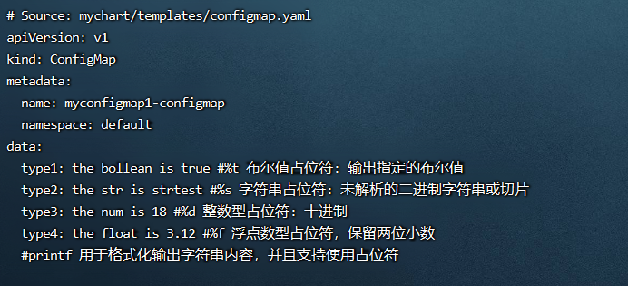

## <font style="color:#000000;">2.3 </font>`<font style="color:#000000;">trim</font>`<font style="color:#000000;"> </font>`<font style="color:#000000;">trimAll</font>`<font style="color:#000000;"> </font>`<font style="color:#000000;">trimPrefix</font>`<font style="color:#000000;"> </font>`<font style="color:#000000;">trimSuffix</font>`<font style="color:#000000;">函数</font>
<font style="color:#000000;">分别含义如下：</font>

+ <font style="color:#000000;">trim函数： 可以用来去除字符串两边的空格，示例：</font>`<font style="color:#000000;">trim " hello "</font>`
+ <font style="color:#000000;">trimAll函数： 用于移除字符串中指定的字符，示例：</font>`<font style="color:#000000;">trimAll "

$$

$$

" "
$$

$$

5.00"</font>`
+ <font style="color:#000000;">trimPrefix 和 trimSuffix 函数： 分别用于移除字符串中指定的前缀和后缀</font>
    - <font style="color:#000000;">示例1：</font>`<font style="color:#000000;">trimPrefix "-" "-hello"</font>`<font style="color:#000000;"> </font>
    - <font style="color:#000000;">示例2：</font>`<font style="color:#000000;">trimSuffix "+" "hello+"</font>`

<font style="color:#000000;">演示流程：</font>

1. <font style="color:#000000;">编写一个自己需要的模板文件</font>

```yaml
vim /root/mychart/templates/configmap.yaml  #编写一个自己需要的模板文件
```

```yaml
apiVersion: v1
kind: ConfigMap
metadata:
  name: {{ .Release.Name }}-configmap
  namespace: {{ .Release.Namespace }}
data: 
  data1: {{ trim " Test " }} #trim函数可以用来去除字符串两边的空格
  data2: {{ trimAll "%" "%Test" }} #trimAll函数用于移除字符串中指定的字符，此处指定的字符为"%"
  data3: {{ trimPrefix "-" "-hello" }} #trimPrefix函数用于移除字符串中指定的前缀，此处指定的前缀是:"-"
  data4: {{ trimSuffix "+" "hello+" }} #trimSuffix函数用于移除字符串中指定的后缀，此处指定的后缀是:"+"
```

2. <font style="color:#000000;">运行</font>

```yaml
helm install myconfigmap1 ./mychart/ --debug --dry-run #不真正执行，只是试运行看是否能运行
```

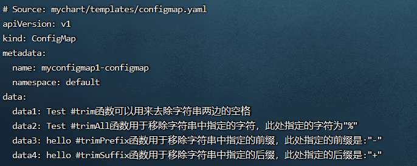

## <font style="color:#000000;">2.4 </font>`<font style="color:#000000;">lower</font>`<font style="color:#000000;"> </font>`<font style="color:#000000;">upper</font>`<font style="color:#000000;"> </font>`<font style="color:#000000;">title</font>`<font style="color:#000000;"> </font>`<font style="color:#000000;">untitle</font>`<font style="color:#000000;">函数</font>
<font style="color:#000000;">分别含义如下：</font>

+ <font style="color:#000000;">lower函数： 用于将所有字母转换成小写，示例1：</font>`<font style="color:#000000;">lower "HELLO"</font>`
+ <font style="color:#000000;">upper函数： 用于将所有字母转换成大写，示例2：</font>`<font style="color:#000000;">upper "hello"</font>`
+ <font style="color:#000000;">title函数： 用于将首字母转换成大写，示例3：</font>`<font style="color:#000000;">title "test"</font>`
+ <font style="color:#000000;">untitle函数: 用于将大写的首字母转换成小写，示例4：</font>`<font style="color:#000000;">untitle "Test"</font>`

<font style="color:#000000;">演示流程</font>

1. <font style="color:#000000;">编写一个自己需要的模板文件</font>

```yaml
vim /root/mychart/templates/configmap.yaml  #编写一个自己需要的模板文件
```

```yaml
apiVersion: v1
kind: ConfigMap
metadata:
  name: {{ .Release.Name }}-configmap
  namespace: {{ .Release.Namespace }}
data: 
  data1: {{ lower "HELLO" }} #lower函数用于将所有字母转换成小写
  data2: {{ upper "hello" }} #upper函数用于将所有字母转换成大写
  data3: {{ title "test" }} #title函数用于将首字母转换成大写
  data4: {{ untitle "Test" }} #untitle函数用于将大写的首字母转换成小写
```

2. <font style="color:#000000;">运行</font>

```yaml
helm install myconfigmap1 ./mychart/ --debug --dry-run #不真正执行，只是试运行看是否能运行
```

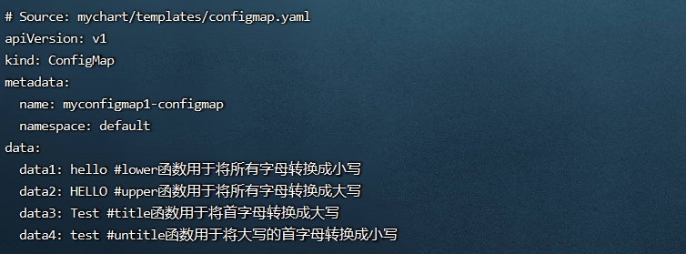

## <font style="color:#000000;">2.5 </font>`<font style="color:#000000;">snakecase</font>`<font style="color:#000000;"> </font>`<font style="color:#000000;">camelcase</font>`<font style="color:#000000;"> </font>`<font style="color:#000000;">kebabcase</font>`<font style="color:#000000;">函数</font>
<font style="color:#000000;">分别含义如下：</font>

+ <font style="color:#000000;">snakecase函数： 用于将驼峰写法转换为下划线命名写法， 示例：</font>`<font style="color:#000000;">snakecase "UserName"</font>`<font style="color:#000000;">，返回结果 user_name</font>
+ <font style="color:#000000;">camelcase函数： 用于将下划线命名写法转换为驼峰写法，示例：</font>`<font style="color:#000000;">camelcase "user_name"</font>`<font style="color:#000000;">，返回结果 UserName</font>
+ <font style="color:#000000;">kebabcase函数： 用于将驼峰写法转换为中横线写法，示例：</font>`<font style="color:#000000;">kebabcase "UserName"</font>`<font style="color:#000000;">，返回结果 user-name</font>

<font style="color:#000000;">演示流程</font>

1. <font style="color:#000000;">编写一个自己需要的模板文件</font>

```yaml
vim /root/mychart/templates/configmap.yaml  #编写一个自己需要的模板文件
```

```yaml
apiVersion: v1
kind: ConfigMap
metadata:
  name: {{ .Release.Name }}-configmap
  namespace: {{ .Release.Namespace }}
data:
  data1: {{ snakecase "UserName" }} #snakecase函数,用于将驼峰写法转换为下划线命名写法,返回结果 user_name
  data2: {{ camelcase "user_name" }} #camelcase函数,用于将下划线命名写法转换为驼峰写法,返回结果 UserName
  data3: {{ kebabcase "UserName" }} #kebabcase函数,用于将驼峰写法转换为中横线写法,返回结果 user-name
```

2. <font style="color:#000000;">运行</font>

```yaml
helm install myconfigmap1 ./mychart/ --debug --dry-run #不真正执行，只是试运行看是否能运行
```

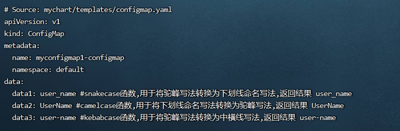

## <font style="color:#000000;">2.6 </font>`<font style="color:#000000;">swapcase</font>`<font style="color:#000000;">函数 </font>
<font style="color:#000000;">作用是基于内置的算法来切换字符串的大小写</font>

<font style="color:#000000;">算法规则如下：</font>

1. <font style="color:#000000;">大写字符变成小写字母</font>
2. <font style="color:#000000;">首字母变成小写字母</font>
3. <font style="color:#000000;">空格后或开头的小写字母转换成大写字母</font>
4. <font style="color:#000000;">其他小写字母转换成大写字母</font>
5. <font style="color:#000000;">示例：</font>`<font style="color:#000000;">swapcase "This Is A.Test"</font>`<font style="color:#000000;"> 返回结果：</font>`<font style="color:#000000;">"tHIS iS a.tEST"</font>`

<font style="color:#000000;">演示流程</font>

1. <font style="color:#000000;">编写一个自己需要的模板文件</font>

```yaml
vim /root/mychart/templates/configmap.yaml  #编写一个自己需要的模板文件
```

```yaml
apiVersion: v1
kind: ConfigMap
metadata:
  name: {{ .Release.Name }}-configmap
  namespace: {{ .Release.Namespace }}
data:
  data1: {{ swapcase "This Is A.Test" }} #作用是基于内置的算法来切换字符串的大小写,返回结果："tHIS iS a.tEST"
```

2. <font style="color:#000000;">运行</font>

```yaml
helm install myconfigmap1 ./mychart/ --debug --dry-run #不真正执行，只是试运行看是否能运行
```

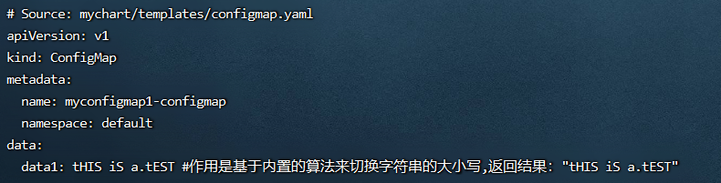

## <font style="color:#000000;">2.7 </font>`<font style="color:#000000;">substr</font>`<font style="color:#000000;">函数 </font>
<font style="color:#000000;">用于切割字符串（指定切割起、始位置），并且返回切割后的字串</font>

<font style="color:#000000;">该函数需要指定三个参数：</font>

+ <font style="color:#000000;">start (int)：起始位置，索引位置从0开始</font>
+ <font style="color:#000000;">end (int)：结束位置，索引位置从0开始</font>
+ <font style="color:#000000;">string (string)：需要切割的字符串</font>
+ <font style="color:#000000;">示例：</font>`<font style="color:#000000;">substr 3 5 "message"</font>`<font style="color:#000000;">返回结果 "sa"</font>

<font style="color:#000000;">演示流程</font>

1. <font style="color:#000000;">编写一个自己需要的模板文件</font>

```yaml
vim /root/mychart/templates/configmap.yaml  #编写一个自己需要的模板文件
```

```yaml
apiVersion: v1
kind: ConfigMap
metadata:
  name: {{ .Release.Name }}-configmap
  namespace: {{ .Release.Namespace }}
data: 
  data1: {{ substr 3 5 "message" }}  #substr函数用于切割字符串,起始位置:3,结束位置:5,并且返回切割后的字串,返回结果"sa"
```

2. <font style="color:#000000;">运行</font>

```yaml
helm install myconfigmap1 ./mychart/ --debug --dry-run #不真正执行，只是试运行看是否能运行
```

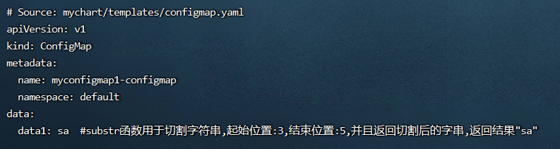

## <font style="color:#000000;">2.8 </font>`<font style="color:#000000;">trunc</font>`<font style="color:#000000;">函数 </font>
<font style="color:#000000;">用于截断字符串。trunc 可以使用正整数或负整数来分别表示从左向右截取的个数和从右向左截取的个数</font>

+ <font style="color:#000000;">示例：</font>`<font style="color:#000000;">trunc 5 "Hello World"</font>`<font style="color:#000000;"> 返回结果：</font>`<font style="color:#000000;">"Hello"</font>`
+ <font style="color:#000000;">示例：</font>`<font style="color:#000000;">trunc -5 "Hello World"</font>`<font style="color:#000000;"> 返回结果：</font>`<font style="color:#000000;">"World"</font>`

<font style="color:#000000;">演示流程</font>

1. <font style="color:#000000;">编写一个自己需要的模板文件</font>

```yaml
vim /root/mychart/templates/configmap.yaml  #编写一个自己需要的模板文件
```

```yaml
apiVersion: v1
kind: ConfigMap
metadata:
  name: {{ .Release.Name }}-configmap
  namespace: {{ .Release.Namespace }}
data: 
  data1: {{ trunc 5 "Hello World" }} #函数用于截断字符串,从左向右截取5个,返回结果："Hello"
  data2: {{ trunc -5 "Hello World" }} #函数用于截断字符串,从右向左截取5个,返回结果："World"
```

2. <font style="color:#000000;">运行</font>

```yaml
helm install myconfigmap1 ./mychart/ --debug --dry-run #不真正执行，只是试运行看是否能运行
```

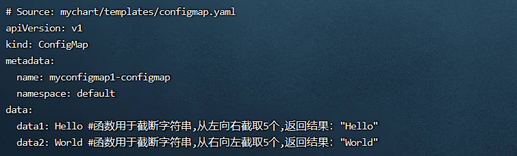

## <font style="color:#000000;">2.9 </font>`<font style="color:#000000;">abbrev</font>`<font style="color:#000000;">函数 </font>
<font style="color:#000000;">作用是使用省略号（...）切割字符串，保留指定的长度，注意省略号的长度是3个。其中省略号也是计算在长度之内的。</font>

<font style="color:#000000;">例如要将一个字符串保留长度为5，那么字符的个数只有两个，剩下三个是省略号。</font>

<font style="color:#000000;">示例：</font>`<font style="color:#000000;">abbrev 5 "Hello World"</font>`<font style="color:#000000;"> 返回结果：</font>`<font style="color:#000000;">"He..."</font>`

<font style="color:#000000;">演示流程</font>

1. <font style="color:#000000;">编写一个自己需要的模板文件</font>

```yaml
vim /root/mychart/templates/configmap.yaml  #编写一个自己需要的模板文件
```

```yaml
apiVersion: v1
kind: ConfigMap
metadata:
  name: {{ .Release.Name }}-configmap
  namespace: {{ .Release.Namespace }}
data:
  data1: {{ abbrev 5 "Hello World" }}  #使用省略号（...）切割字符串，保留指定的长度，注意省略号的长度是3个,此处保留5个长度,结果:He...
  
```

2. <font style="color:#000000;">运行</font>

```yaml
helm install myconfigmap1 ./mychart/ --debug --dry-run #不真正执行，只是试运行看是否能运行
```

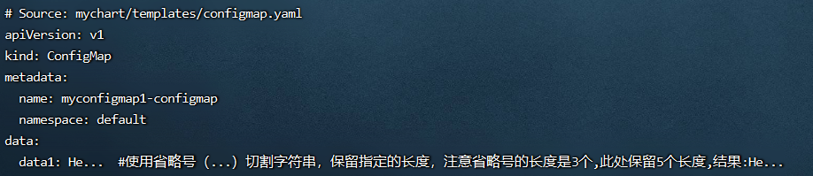

## <font style="color:#000000;">2.10 </font>`<font style="color:#000000;">randAlphaNum</font>`<font style="color:#000000;"> </font>`<font style="color:#000000;">randAlpha</font>`<font style="color:#000000;"> </font>`<font style="color:#000000;">randNumeric</font>`<font style="color:#000000;"> </font>`<font style="color:#000000;">randAscii</font>`<font style="color:#000000;"> 函数 </font>
<font style="color:#000000;">用于生成加密的随机字符串，指定生成的字符串长度（生成几个长度）</font>

<font style="color:#000000;">分别含义如下：这四个函数用于生成加密的随机字符串，但是有如下区别：</font>

+ <font style="color:#000000;">randAlphaNum： 使用 0-9a-zA-Z，生成随机字符串</font>
+ <font style="color:#000000;">randAlpha： 使用 a-zA-Z，生成随机字符串</font>
+ <font style="color:#000000;">randNumeric： 使用 0-9，生成随机字符串</font>
+ <font style="color:#000000;">randAscii： 使用所有的可使用的 ASCII 字符，生成随机字符串</font>

<font style="color:#000000;">注意: 每个函数都需要传递一个参数用于指定生成的字符串长度。示例：</font>`<font style="color:#000000;">randNumeric 3</font>`

<font style="color:#000000;">演示流程</font>

1. <font style="color:#000000;">编写一个自己需要的模板文件</font>

```yaml
vim /root/mychart/templates/configmap.yaml  #编写一个自己需要的模板文件
```

```yaml
apiVersion: v1
kind: ConfigMap
metadata:
  name: {{ .Release.Name }}-configmap
  namespace: {{ .Release.Namespace }}
data: 
  data1: {{ randAlphaNum 10 }} #randAlphaNum函数：使用 0-9a-zA-Z，生成随机字符串
  data2: {{ randAlpha 10 }} #randAlpha函数： 使用 a-zA-Z，生成随机字符串
  data3: {{ randNumeric 10 }} #randNumeric函数： 使用 0-9，生成随机字符串
  data4: {{ randAscii 10 }} #randAscii函数： 使用所有的可使用的 ASCII 字符，生成随机字符串
```

2. <font style="color:#000000;">运行</font>

```yaml
helm install myconfigmap1 ./mychart/ --debug --dry-run #不真正执行，只是试运行看是否能运行
```

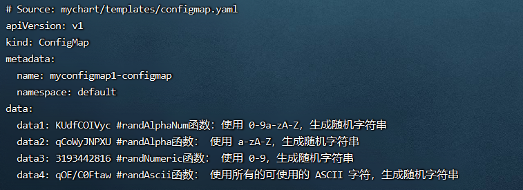

## <font style="color:#000000;">2.11 </font>`<font style="color:#000000;">contains</font>`<font style="color:#000000;">函数 </font>
<font style="color:#000000;">用于测试一个字符串是否包含在另一个字符串里面，返回布尔值，true 或 false，包含返回 true，不包含返回 false</font>

<font style="color:#000000;">示例：</font>`<font style="color:#000000;">contains "llo" "Hello"</font>`<font style="color:#000000;"> 结果返回 true</font>

<font style="color:#000000;">演示流程</font>

1. <font style="color:#000000;">编写一个自己需要的模板文件</font>

```yaml
vim /root/mychart/templates/configmap.yaml  #编写一个自己需要的模板文件
```

```yaml
apiVersion: v1
kind: ConfigMap
metadata:
  name: {{ .Release.Name }}-configmap
  namespace: {{ .Release.Namespace }}
data:
  data1: {{ contains "llo" "Hello" }} #用于测试一个字符串是否包含在另一个字符串里面，返回布尔值，true或false,结果:true
```

2. <font style="color:#000000;">运行</font>

```yaml
helm install myconfigmap1 ./mychart/ --debug --dry-run #不真正执行，只是试运行看是否能运行
```

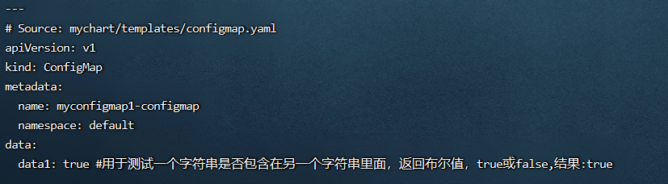

## <font style="color:#000000;">2.12 </font>`<font style="color:#000000;">hasPrefix</font>`<font style="color:#000000;"> </font>`<font style="color:#000000;">hasSuffix</font>`<font style="color:#000000;">函数 </font>
<font style="color:#000000;">这两个函数用于测试一个字符串是否是指定字符串的前缀或者后缀，返回布尔值，true或false，包含返回true，不包含返回false</font>

+ <font style="color:#000000;">示例：</font>`<font style="color:#000000;">hasPrefix "He" "Hello"</font>`<font style="color:#000000;">判断前缀，是前缀，结果返回 true</font>
+ <font style="color:#000000;">示例：</font>`<font style="color:#000000;">hasSuffix "le" "Hello"</font>`<font style="color:#000000;">判断后缀，是后缀，结果返回 false</font>

<font style="color:#000000;">演示流程 </font>

1. <font style="color:#000000;">编写一个自己需要的模板文件</font>

```yaml
 vim /root/mychart/templates/configmap.yaml  #编写一个自己需要的模板文件
```

```yaml
apiVersion: v1
kind: ConfigMap
metadata:
  name: {{ .Release.Name }}-configmap
  namespace: {{ .Release.Namespace }}
data: 
  data1: {{ hasPrefix "He" "Hello" }} #测试一个字符串是否是指定字符串的前缀,返回布尔值,true或false,结果:true
  data2: {{ hasSuffix "le" "Hello" }} #测试一个字符串是否是指定字符串的后缀,返回布尔值,true或false,结果:false
```

2. <font style="color:#000000;">运行</font>

```yaml
helm install myconfigmap1 ./mychart/ --debug --dry-run #不真正执行，只是试运行看是否能运行
```

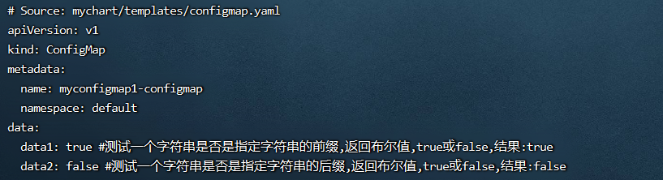

## <font style="color:#000000;">2.13 </font>`<font style="color:#000000;">repeat</font>`<font style="color:#000000;"> </font>`<font style="color:#000000;">nospace</font>`<font style="color:#000000;"> </font>`<font style="color:#000000;">initials</font>`<font style="color:#000000;">函数</font>
<font style="color:#000000;">分别含义如下：</font>

+ <font style="color:#000000;">repeat函数用于将字符串重复输出指定的次数。示例：</font>`<font style="color:#000000;">repeat 3 "Hello"</font>`<font style="color:#000000;"> 结果返回 HelloHelloHello</font>
+ <font style="color:#000000;">nospace函数用于去掉字符串中所有的空格。示例：</font>`<font style="color:#000000;">nospace "T e s t"</font>`<font style="color:#000000;">返回 Test</font>
+ <font style="color:#000000;">initials函数用于截取指定字符串的每个单词的首字母，并拼接在一起。示例：</font>`<font style="color:#000000;">initials "People Like Peace"</font>`<font style="color:#000000;"> 返回 PLP</font>

<font style="color:#000000;">演示流程</font>

1. <font style="color:#000000;">编写一个自己需要的模板文件</font>

```yaml
vim /root/mychart/templates/configmap.yaml  #编写一个自己需要的模板文件
```

```yaml
apiVersion: v1
kind: ConfigMap
metadata:
  name: {{ .Release.Name }}-configmap
  namespace: {{ .Release.Namespace }}
data: 
  data1: {{ repeat 3 "Hello" }} #repeat函数用于将字符串重复输出指定的次数,结果: HelloHelloHello
  data2: {{ nospace "T e s t" }} #nospace函数用于去掉字符串中所有的空格
  data3: {{ initials "People Like Peace" }} #initials函数用于截取指定字符串的每个单词的首字母,并拼接在一起,结果:PLP
```

2. <font style="color:#000000;">运行</font>

```yaml
helm install myconfigmap1 ./mychart/ --debug --dry-run #不真正执行，只是试运行看是否能运行
```

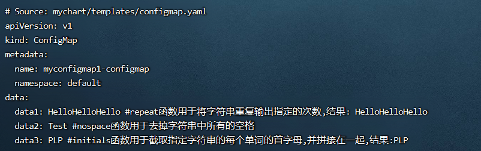

## <font style="color:#000000;">2.14 </font>`<font style="color:#000000;">wrapWith</font>`<font style="color:#000000;">函数 </font>
<font style="color:#000000;">作用是在文档中在指定的列数添加内容，例如添加内容: </font>`<font style="color:#000000;">"\t" </font>`

<font style="color:#000000;">示例：</font>`<font style="color:#000000;">wrapWith 5 "\t" "HelloWorld"</font>`<font style="color:#000000;">, 会在第五个索引的位置添加</font>`<font style="color:#000000;">"\t"</font>`<font style="color:#000000;">，所以结果为：</font>`<font style="color:#000000;">"Hello World"</font>`

<font style="color:#000000;">演示流程</font>

1. <font style="color:#000000;">编写一个自己需要的模板文件</font>

```yaml
 vim /root/mychart/templates/configmap.yaml  #编写一个自己需要的模板文件
```

```yaml
apiVersion: v1
kind: ConfigMap
metadata:
  name: {{ .Release.Name }}-configmap
  namespace: {{ .Release.Namespace }}
data: 
  data1: {{ wrapWith 5 "\t" "HelloWorld" }} #会在第五个索引的位置添加"\t"，所以结果为："Hello World"
```

2. <font style="color:#000000;">运行</font>

```yaml
helm install myconfigmap1 ./mychart/ --debug --dry-run #不真正执行，只是试运行看是否能运行
```

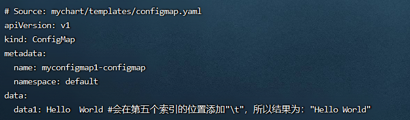

## <font style="color:#000000;">2.15 </font>`<font style="color:#000000;">quote</font>`<font style="color:#000000;"> </font>`<font style="color:#000000;">squote</font>`<font style="color:#000000;"> 函数 </font>
<font style="color:#000000;">该函数将字符串用双引号（quote） 或者单引号（squote）括起来</font>

<font style="color:#000000;">演示流程</font>

1. <font style="color:#000000;">编写一个自己需要的模板文件</font>

```yaml
 vim /root/mychart/templates/configmap.yaml  #编写一个自己需要的模板文件
```

```yaml
apiVersion: v1
kind: ConfigMap
metadata:
  name: {{ .Release.Name }}-configmap
  namespace: {{ .Release.Namespace }}
data:
  data1: {{ hello | quote }} #该函数将字符串用双引号（quote）括起来,结果: "hello"
  data2: {{ hello | squote }} #该函数将字符串用单引号（squote）括起来,结果: 'hello'
```

2. <font style="color:#000000;">运行</font>

```yaml
helm install myconfigmap1 ./mychart/ --debug --dry-run #不真正执行，只是试运行看是否能运行
```

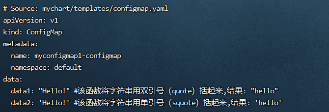

## <font style="color:#000000;">2.16  cat 函数 </font>
<font style="color:#000000;">用于将多个字符串合并成一个字符串，并使用空格分隔开</font>

<font style="color:#000000;">示例：</font>`<font style="color:#000000;">cat "Hello" "World"</font>`<font style="color:#000000;"> ,结果: Hello World</font>

<font style="color:#000000;">演示流程</font>

1. <font style="color:#000000;">编写一个自己需要的模板文件</font>

```yaml
vim /root/mychart/templates/configmap.yaml  #编写一个自己需要的模板文件
```

```yaml
apiVersion: v1
kind: ConfigMap
metadata:
  name: {{ .Release.Name }}-configmap
  namespace: {{ .Release.Namespace }}
data:
  data1: {{ cat "Hello" "World" }} #cat函数用于将多个字符串合并成一个字符串,并使用空格分隔开,结果: Hello World
```

2. <font style="color:#000000;">运行</font>

```yaml
helm install myconfigmap1 ./mychart/ --debug --dry-run #不真正执行，只是试运行看是否能运行
```

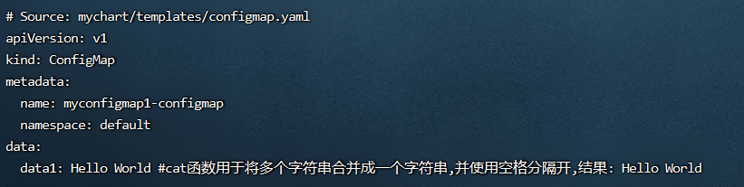

## <font style="color:#000000;">2.17 </font>`<font style="color:#000000;">replace</font>`<font style="color:#000000;">函数 </font>
<font style="color:#000000;">用于执行简单的字符串替换。该函数需要传递三个参数：待替换的字符串、将要替换的字符串、源字符串</font>

+ <font style="color:#000000;">第1个参数： 待替换的字符串</font>
+ <font style="color:#000000;">第2个参数： 将要替换的字符串</font>
+ <font style="color:#000000;">第3个参数： 源字符串</font>
+ <font style="color:#000000;">示例：</font>`<font style="color:#000000;">"I Am Test" | replace " " "-"</font>`<font style="color:#000000;"> 返回结果：</font>`<font style="color:#000000;">I-Am-Test</font>`

<font style="color:#000000;">演示流程</font>

1. <font style="color:#000000;">编写一个自己需要的模板文件</font>

```yaml
vim /root/mychart/templates/configmap.yaml  #编写一个自己需要的模板文件
```

```yaml
apiVersion: v1
kind: ConfigMap
metadata:
  name: {{ .Release.Name }}-configmap
  namespace: {{ .Release.Namespace }}
data:
  data1: {{ "I Am Test" | replace " " "-" }} #执行简单的字符串替换.该函数需要传递三个参数:待替换的字符串、将要替换的字符串、源字符串,结果:I-Am-Test
```

2. <font style="color:#000000;">运行</font>

```yaml
helm install myconfigmap1 ./mychart/ --debug --dry-run #不真正执行，只是试运行看是否能运行
```

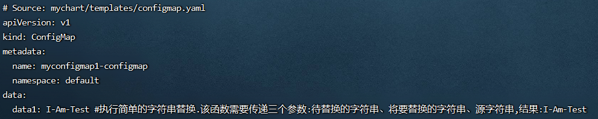

## <font style="color:#000000;">2.18 </font>`<font style="color:#000000;">shuffle</font>`<font style="color:#000000;">函数 </font>
<font style="color:#000000;">用于对字符串中的字符进行重新排序,是基于他内部的一个算法</font>

<font style="color:#000000;">示例：</font>`<font style="color:#000000;">shuffle "Hello"</font>`

<font style="color:#000000;">演示流程</font>

1. <font style="color:#000000;">编写一个自己需要的模板文件</font>

```yaml
vim /root/mychart/templates/configmap.yaml  #编写一个自己需要的模板文件
```

```yaml
apiVersion: v1
kind: ConfigMap
metadata:
  name: {{ .Release.Name }}-configmap
  namespace: {{ .Release.Namespace }}
data:
  data1: {{ shuffle "Hello" }} #用于对字符串中的字符进行重新排序
```

2. <font style="color:#000000;">运行</font>

```yaml
helm install myconfigmap1 ./mychart/ --debug --dry-run #不真正执行，只是试运行看是否能运行
```

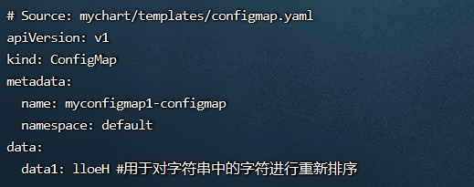

## <font style="color:#000000;">2.19 </font>`<font style="color:#000000;">indent</font>``<font style="color:#000000;">nindent</font>`<font style="color:#000000;">函数 </font>
<font style="color:#000000;">用于以指定长度来缩进指定字符串的所在行。其中nindent 函数可以在缩进时在字符串开头添加新行。  
</font><font style="color:#000000;">示例：</font>`<font style="color:#000000;">indent 4 "this is indent"</font>`<font style="color:#000000;">  
</font><font style="color:#000000;">示例：</font>`<font style="color:#000000;">nindent 4 "this is nindent"</font>`

<font style="color:#000000;">演示流程</font>

1. <font style="color:#000000;">编写一个自己需要的模板文件</font>

```yaml
vim /root/mychart/templates/configmap.yaml  #编写一个自己需要的模板文件
```

```yaml
apiVersion: v1
kind: ConfigMap
metadata:
  name: {{ .Release.Name }}-configmap
  namespace: {{ .Release.Namespace }}
data: 
 data1: | #定义多行字符串时候用|
{{ nindent 4 "this is nindent" }} 
{{ indent 4 "this is indent" }}  

```

2. <font style="color:#000000;">运行</font>

```yaml
helm install myconfigmap1 ./mychart/ --debug --dry-run #不真正执行，只是试运行看是否能运行
```

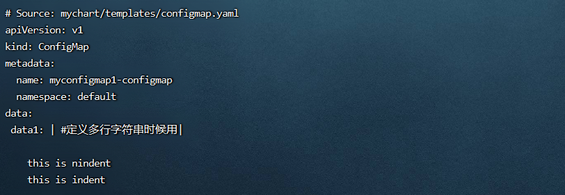

<font style="color:#000000;">indent函数 和 nindent函数，用法一样，都是用于以指定的长度缩进来缩进指定字符串的所在行。</font>

<font style="color:#000000;">区别是: nindent函数可以在缩进时在字符串开头添加新行，也就是在该行字符串上方会添加一行新的空行。</font>

<font style="color:#000000;">注意：上面两各都没有缩进，data1缩进是2个空格，而两行都缩进4个空格</font>

<font style="color:#000000;">但是由于nindent会在缩进时在字符串开头添加新行，也就是在该行字符串上方会添加一行新的空行，然后另起一行，所有另起的结果还是缩进4个字符</font>

<font style="color:#000000;">一般为了防止麻烦，一般indent和nindent所在行都顶格写最好。</font>

## <font style="color:#000000;">2.20 </font>`<font style="color:#000000;">plural</font>`<font style="color:#000000;"> 函数</font>
<font style="color:#000000;">判断字符串的长度，并且根据长度返回不同的值。如：字符串的长度为1，会返回plural函数的第一个参数，若不是1，则返回第二个参数(包括0)</font>

<font style="color:#000000;">示例：</font>`<font style="color:#000000;">len "a" | plural "one" "many"</font>`<font style="color:#000000;">结果返回 one  
</font><font style="color:#000000;">示例：</font>`<font style="color:#000000;">len "abc" | plrual "one" "many"</font>`<font style="color:#000000;">	结果返回 many </font>

<font style="color:#000000;">演示流程</font>

1. <font style="color:#000000;">编写一个自己需要的模板文件</font>

```yaml
vim /root/mychart/templates/configmap.yaml  #编写一个自己需要的模板文件
```

```yaml
apiVersion: v1
kind: ConfigMap
metadata:
  name: {{ .Release.Name }}-configmap
  namespace: {{ .Release.Namespace }}
data:
  data1: {{ len "a" | plural "one" "many" }} #字符串长度为1,返回第1个参数,结果返回one 
  data2: {{ len "abc" | plural "one" "many" }} #字符串长度不为1,返回第2个参数,结果返回many
  data3: {{ len "" | plural "one" "many" }} #字符串长度不为1(为0),返回第2个参数,结果返回many
  #字符串的长度为1，会返回plural函数的第一个参数,如果不是1则返回第二个参数(包括0)
```

2. <font style="color:#000000;">运行</font>

```yaml
helm install myconfigmap1 ./mychart/ --debug --dry-run #不真正执行，只是试运行看是否能运行
```

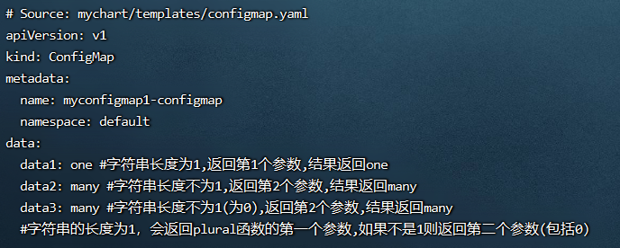<font style="color:#000000;"></font>

