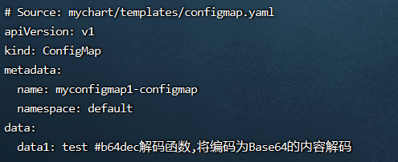

**<font style="color:#E4495B;background-color:#FFFFFF;">笔记来源：</font>**[**<font style="color:#E4495B;background-color:#FFFFFF;">k8s（Kubernetes）集群编排工具helm3实战教程</font>**](https://www.bilibili.com/video/BV12D4y1Y7Z7/?spm_id_from=333.337.search-card.all.click&vd_source=e8046ccbdc793e09a75eb61fe8e84a30)

# 119. <font style="color:#000000;">1 常用helm3的加密函数和编码解码函数</font>
<font style="color:#000000;">helm提供了以下几种加密函数：</font>

+ <font style="color:#000000;">sha1sum 函数</font>
+ <font style="color:#000000;">sha256sum 函数</font>
+ <font style="color:#000000;">adler32sum 函数</font>
+ <font style="color:#000000;">htpasswd 函数</font>
+ <font style="color:#000000;">encryptAES 函数</font>
+ <font style="color:#000000;">decryptAES 函数</font>

<font style="color:#000000;"></font>

<font style="color:#000000;">helm有以下编码和解码函数：</font>

+ <font style="color:#000000;">b64enc编码函数和b64dec解码函数：编码或解码 Base64</font>
+ <font style="color:#000000;">b32enc编码函数和b32dec解码函数：编码或解码 Base32</font>

# 120. <font style="color:#000000;">2 演示</font>
<font style="color:#000000;">环境准备</font>

1. <font style="color:#000000;">k8s集群</font>

```yaml
kubectl get node
```

2. <font style="color:#000000;">创建一个chart包（用helm3发布创建一个configmap，创建的k8s集群中，发布其他应用也一样）</font>

```yaml
helm create mychart #创建一个chart包，chart包名为： mychart 
```

3. <font style="color:#000000;">删除mychart/templates目录下的文件</font>

```yaml
rm -rf mychart/templates/*  #全部删除
```

<font style="color:#000000;">编写自己需要的yaml文件，使用上面的各个内置函数演示</font>

## <font style="color:#000000;">2.1 </font>`<font style="color:#000000;">sha1sum</font>`<font style="color:#000000;"> </font>`<font style="color:#000000;">sha256sum</font>`<font style="color:#000000;"> </font>`<font style="color:#000000;">adler32sum</font>`<font style="color:#000000;"> </font>`<font style="color:#000000;">htpasswd</font>`<font style="color:#000000;">函数</font>
<font style="color:#000000;">分别含义如下：</font>

+ <font style="color:#000000;">sha1sum 函数： 用于计算字符串的SHA1值进行加密</font>
+ <font style="color:#000000;">sha256sum 函数：用于计算字符串的SHA256值进行加密</font>
+ <font style="color:#000000;">adler32sum 函数：用于计算字符串的Adler-32校验和进行加密</font>
+ <font style="color:#000000;">htpasswd 函数： 可以根据传入的username和password生成一个密码的bcrypt 哈希值，可以用于HTTP Server的基础认证</font>

<font style="color:#000000;">演示流程</font>

1. <font style="color:#000000;">编写一个自己需要的模板文件</font>

```yaml
vim /root/mychart/templates/configmap.yaml  #编写一个自己需要的模板文件
```

```yaml
apiVersion: v1
kind: ConfigMap
metadata:
  name: {{ .Release.Name }}-configmap
  namespace: {{ .Release.Namespace }}
data:
  data1: {{ sha1sum "hello world" }} #sha1sum函数:用于计算字符串的SHA1值进行加密
  data2: {{ sha256sum "hello world" }} #sha256sum函数:用于计算字符串的SHA256值进行加密
  data3: {{ adler32sum "hello world" }} #adler32sum函数:用于计算字符串的Adler-32校验和进行加密
  data4: {{ htpasswd "user1" "123456" }} #htpasswd函数:可以根据传入的username和password生成一个密码的bcrypt 哈希值,可以用于HTTP Server的基础认证
```

2. <font style="color:#000000;">运行</font>

```yaml
helm install myconfigmap1 ./mychart/ --debug --dry-run #不真正执行，只是试运行看是否能运行
```


## <font style="color:#000000;">2.2 </font>`<font style="color:#000000;">encryptAES</font>`<font style="color:#000000;"> </font>`<font style="color:#000000;">decryptAES</font>`<font style="color:#000000;">解密函数</font>
<font style="color:#000000;">分别含义如下：</font>

+ <font style="color:#000000;">encryptAES 函数：是加密函数，使用AES-256 CBC 加密文本并返回一个base64编码字符串</font>
+ <font style="color:#000000;">decryptAES 函数：是解密函数，接收一个AES-256 CBC编码的字符串并返回解密文本</font>

<font style="color:#000000;">演示流程</font>

1. <font style="color:#000000;">编写一个自己需要的模板文件</font>

```yaml
 vim /root/mychart/templates/configmap.yaml  #编写一个自己需要的模板文件
```

```yaml
apiVersion: v1
kind: ConfigMap
metadata:
  name: {{ .Release.Name }}-configmap
  namespace: {{ .Release.Namespace }}
data:
  data1: {{ encryptAES "testkey" "hello" }} #encryptAES是加密函数,传入两个参数,第一个是自定义了一个加密后的key名,后面是要加密的内容
```

2. <font style="color:#000000;">运行</font>

```yaml
helm install myconfigmap1 ./mychart/ --debug --dry-run #不真正执行，只是试运行看是否能运行
```


3. <font style="color:#000000;">再次编写configmap.yaml</font>

```yaml
 vim /root/mychart/templates/configmap.yaml
```

```yaml
apiVersion: v1
kind: ConfigMap
metadata:
  name: {{ .Release.Name }}-configmap
  namespace: {{ .Release.Namespace }}
data:
  data1: {{ decryptAES "testkey" "2AnIy3sM8jp7LFMDslBF+Mks3W9ngZvUZFtZ6Wpip8c=" }} #解密,传两个参数,前:指定一个要解密的key名,后:要解密的内容
```

4. <font style="color:#000000;">运行</font>

```yaml
helm install myconfigmap1 ./mychart/ --debug --dry-run #不真正执行，只是试运行看是否能运行
```


## <font style="color:#000000;">2.3 </font>`<font style="color:#000000;">b64enc</font>`<font style="color:#000000;"> </font>`<font style="color:#000000;">b64dec</font>`<font style="color:#000000;">解码函数</font>
<font style="color:#000000;">编写k8s的secret文件时候会用到</font>

<font style="color:#000000;">分别含义如下：b64enc编码函数和b64dec解码函数：编码或解码 Base64</font>

<font style="color:#000000;">演示流程</font>

1. <font style="color:#000000;">编写一个自己需要的模板文件</font>

```yaml
vim /root/mychart/templates/configmap.yaml  #编写一个自己需要的模板文件
```

```yaml
apiVersion: v1
kind: ConfigMap
metadata:
  name: {{ .Release.Name }}-configmap
  namespace: {{ .Release.Namespace }}
data:
  data1: {{ "test" | b64enc }} #b64enc编码函数,将字符串编码为Base64
```

2. <font style="color:#000000;">运行</font>

```yaml
helm install myconfigmap1 ./mychart/ --debug --dry-run #不真正执行，只是试运行看是否能运行
```


3. <font style="color:#000000;">解密: b64dec</font>

```yaml
 vim /root/mychart/templates/configmap.yaml  #编写一个自己需要的模板文件
```

```yaml
apiVersion: v1
kind: ConfigMap
metadata:
  name: {{ .Release.Name }}-configmap
  namespace: {{ .Release.Namespace }}
data:
  data1: {{ "dGVzdA==" | b64dec }} #b64dec解码函数,将编码为Base64的内容解码
```

4. <font style="color:#000000;">运行</font>

```yaml
helm install myconfigmap1 ./mychart/ --debug --dry-run #不真正执行，只是试运行看是否能运行
```

<font style="color:#000000;"></font>

