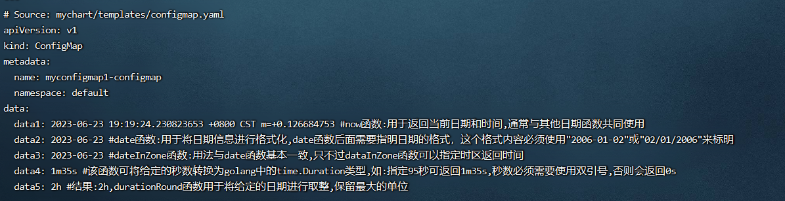

**<font style="color:#E4495B;background-color:#FFFFFF;">笔记来源：</font>**[**<font style="color:#E4495B;background-color:#FFFFFF;">k8s（Kubernetes）集群编排工具helm3实战教程</font>**](https://www.bilibili.com/video/BV12D4y1Y7Z7/?spm_id_from=333.337.search-card.all.click&vd_source=e8046ccbdc793e09a75eb61fe8e84a30)

# 121. <font style="color:#000000;">1 常用的helm3的日期函数</font>
+ <font style="color:#000000;">now函数</font>
+ <font style="color:#000000;">date函数</font>
+ <font style="color:#000000;">dateInZone函数</font>
+ <font style="color:#000000;">duration函数和durationRound函数</font>
+ <font style="color:#000000;">unixEpoch函数</font>
+ <font style="color:#000000;">dateModify函数 和 mustDateModify函数</font>
+ <font style="color:#000000;">toDate函数 和 mustToDate函数</font>

<font style="color:#000000;"></font>

# 122. <font style="color:#000000;">2 演示</font>
<font style="color:#000000;">环境准备</font>

1. <font style="color:#000000;">k8s集群</font>

```yaml
kubectl get node
```

2. <font style="color:#000000;">创建一个chart包（用helm3发布创建一个configmap，创建的k8s集群中，发布其他应用也一样）</font>

```yaml
helm create mychart #创建一个chart包，chart包名为： mychart 
```

3. <font style="color:#000000;">删除mychart/templates目录下的文件</font>

```yaml
rm -rf mychart/templates/*  #全部删除
```

<font style="color:#000000;">编写自己需要的yaml文件，使用上面的各个内置函数演示</font>

## <font style="color:#000000;">2.1 </font>`<font style="color:#000000;">now</font>`<font style="color:#000000;"> </font>`<font style="color:#000000;">date</font>`<font style="color:#000000;"> </font>`<font style="color:#000000;">dateInZone</font>`<font style="color:#000000;"> </font>`<font style="color:#000000;">duration</font>`<font style="color:#000000;"> </font>`<font style="color:#000000;">durationRound</font>`<font style="color:#000000;">函数</font>
<font style="color:#000000;">分别含义如下：</font>

+ <font style="color:#000000;">now函数：用于返回当前日期和时间，通常与其他日期函数共同使用</font>
    - <font style="color:#000000;">示例：</font>`<font style="color:#000000;">now | date "2006-01-02"</font>`<font style="color:#000000;"> 或 </font>`<font style="color:#000000;">now | date "02/01/2006"</font>`<font style="color:#000000;"> 注意: 格式内容必须是这两个示例的内容，内容换成其他日期都不行。</font>
+ <font style="color:#000000;">date函数：用于将日期信息进行格式化。date 函数后面需要指明日期的格式。</font>
    - <font style="color:#000000;">这个格式内容必须使用</font>`<font style="color:#000000;">"2006-01-02"</font>`<font style="color:#000000;"> 或 </font>`<font style="color:#000000;">"02/01/2006"</font>`<font style="color:#000000;"> 来标明，否则会出错</font>
+ <font style="color:#000000;">dateInZone函数：用法与date函数基本一致，只不过dataInZone函数可以指定时区返回时间，如：指定UTC时区返回时间</font>
    - <font style="color:#000000;">示例：</font>`<font style="color:#000000;">dateInZone "2006-01-02" (now) "UTC"</font>`<font style="color:#000000;"> 指定UTC时区返回时间</font>
+ <font style="color:#000000;">duration函数：该函数可以将给定的秒数转换为golang 中的 time.Duration 类型，例如指定 95秒可以返回1m35s，秒数必须需要使用双引号，否则会返回 0s</font>
    - <font style="color:#000000;">示例：</font>`<font style="color:#000000;">duration "95"</font>`<font style="color:#000000;"> 结果: 1m35s</font>
+ <font style="color:#000000;">durationRound函数：durationRound函数用于将给定的日期进行取整，保留最大的单位</font>
    - <font style="color:#000000;">示例：</font>`<font style="color:#000000;">durationRound "2h10m5s"</font>`<font style="color:#000000;"> 结果: 2h </font>

<font style="color:#000000;">演示流程</font>

1. <font style="color:#000000;">编写一个自己需要的模板文件</font>

```yaml
vim /root/mychart/templates/configmap.yaml  #编写一个自己需要的模板文件
```

```yaml
apiVersion: v1
kind: ConfigMap
metadata:
  name: {{ .Release.Name }}-configmap
  namespace: {{ .Release.Namespace }}
data:
  data1: {{ now }} #now函数:用于返回当前日期和时间,通常与其他日期函数共同使用
  data2: {{ now | date "2006-01-02" }} #date函数:用于将日期信息进行格式化,date函数后面需要指明日期的格式，这个格式内容必须使用"2006-01-02"或"02/01/2006"来标明
  data3: {{ dateInZone "2006-01-02" (now) "UTC" }} #dateInZone函数:用法与date函数基本一致,只不过dataInZone函数可以指定时区返回时间
  data4: {{ duration "95" }} #该函数可将给定的秒数转换为golang中的time.Duration类型,如:指定95秒可返回1m35s,秒数必须需要使用双引号,否则会返回0s 
  data5: {{ durationRound "2h10m5s" }} #结果:2h,durationRound函数用于将给定的日期进行取整,保留最大的单位 
```

2. <font style="color:#000000;">运行</font>

```yaml
helm install myconfigmap1 ./mychart/ --debug --dry-run #不真正执行，只是试运行看是否能运行
```



## <font style="color:#000000;">2.2 </font>`<font style="color:#000000;">unixEpoch</font>`<font style="color:#000000;"> </font>`<font style="color:#000000;">dateModify</font>`<font style="color:#000000;"> </font>`<font style="color:#000000;">mustDateModify</font>`<font style="color:#000000;"> </font>`<font style="color:#000000;">toDate</font>`<font style="color:#000000;"> </font>`<font style="color:#000000;">mustToDate</font>`<font style="color:#000000;">函数</font>
<font style="color:#000000;">分别含义如下：</font>

+ <font style="color:#000000;">unixEpoch函数：用于返回给定时间的时间戳格式</font>
    - <font style="color:#000000;">示例：now | unixEpoch</font>
+ <font style="color:#000000;">dateModify 和 mustDateModify函数：这两个函数用于将一个给定的日期修改一定的时间，并返回修改后的时间</font>
    - <font style="color:#000000;">区别是：如果修改格式错误，dateModify会返回日期未定义，而mustDateModify会返回错误</font>
    - <font style="color:#000000;">示例：</font>`<font style="color:#000000;">now | date_modify "-2h"</font>`<font style="color:#000000;">  将当前的时间减去2h再返回</font>
+ <font style="color:#000000;">toDate函数和mustToDate函数：这两个函数都是用于将指定的字符串转换成日期，第一个参数需要指明要转成的日期格式，第二个参数需要传递要转换的字符串</font>
    - <font style="color:#000000;">区别是：如果字符串无法转换，toDate函数就会返回0值。mustToDate 函数无法转换时会抛出错误</font>
    - <font style="color:#000000;">示例： </font>`<font style="color:#000000;">toDate "2006-01-02" "2017-12-31"</font>`

<font style="color:#000000;">演示流程</font>

1. <font style="color:#000000;">编写一个自己需要的模板文件</font>

```yaml
 vim /root/mychart/templates/configmap.yaml  #编写一个自己需要的模板文件
```

```yaml
apiVersion: v1
kind: ConfigMap
metadata:
  name: {{ .Release.Name }}-configmap
  namespace: {{ .Release.Namespace }}
data:
  data1: {{ now | unixEpoch }} #unixEpoch函数:用于返回给定时间的时间戳格式 
  data2: {{ now | date_modify "-2h" }} #将当前的时间减去2h再返回
  data3: {{ now | mustDateModify "-2h" }} #将当前的时间减去2h再返回
  date4: {{ toDate "2006-01-02" "2017-12-31" }} #将后面的字符串以前面的格式进行转换输出
  date5: {{ mustToDate "2006-01-02" "2017-12-31" }} #将后面的字符串以前面的日期格式进行转换输出
  #dateModify和mustDateModify函数:这两个函数用于将一个给定的日期修改一定的时间,并返回修改后的时间
  #区别是: 如果修改格式错误,dateModify会返回日期未定义.而mustDateModify会返回错误
  #toDate函数和mustToDate函数：这两个函数都是用于将字符串转换成日期,第一个参数需要指明要转成的日期格式,第二个参数需要传递要转换的日期字符串
  #区别是：如果字符串无法转换,toDate函数就会返回0值。mustToDate 函数无法转换时会抛出错误
```

2. <font style="color:#000000;">运行</font>

```yaml
helm install myconfigmap1 ./mychart/ --debug --dry-run #不真正执行，只是试运行看是否能运行
```


