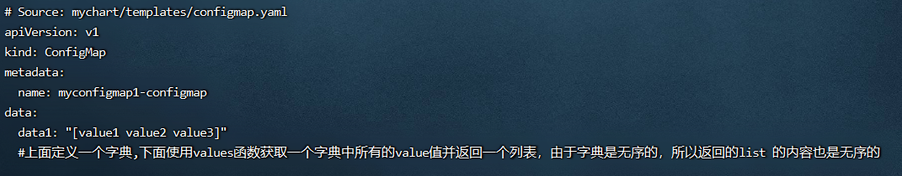

**<font style="color:#E4495B;background-color:#FFFFFF;">笔记来源：</font>**[**<font style="color:#E4495B;background-color:#FFFFFF;">k8s（Kubernetes）集群编排工具helm3实战教程</font>**](https://www.bilibili.com/video/BV12D4y1Y7Z7/?spm_id_from=333.337.search-card.all.click&vd_source=e8046ccbdc793e09a75eb61fe8e84a30)

# 123. <font style="color:#000000;">1 常用的helm3的字典函数</font>
+ `<font style="color:#000000;">dict</font>``<font style="color:#000000;">get</font>``<font style="color:#000000;">set</font>``<font style="color:#000000;">unset</font>`<font style="color:#000000;">函数</font>
    - <font style="color:#000000;">dict字典函数：用于存储key/value键值对，其中字典的key必须是字符串，value可以是任何类型</font>
    - <font style="color:#000000;">get函数： 函数来获取定义字典myDict的值</font>
    - <font style="color:#000000;">set函数： 用于向已有的字典中添加新的键值对,也可修改原来键值对的值</font>
    - <font style="color:#000000;">unset函数： 用于删除字典中指定的key</font>
+ <font style="color:#000000;">keys函数</font>
+ <font style="color:#000000;">hasKey函数</font>
+ <font style="color:#000000;">pluck函数</font>
+ <font style="color:#000000;">merge函数 和 mustMerge函数</font>
+ <font style="color:#000000;">mergeOverwrite函数 和 mustMergeOverwrite函数</font>
+ <font style="color:#000000;">values函数</font>
+ <font style="color:#000000;">pick函数 和 omit函数</font>
+ <font style="color:#000000;">deepCopy函数 和 mustDeepCopy函数</font>

# 124. <font style="color:#000000;">2 演示</font>
<font style="color:#000000;">环境准备</font>

1. <font style="color:#000000;">k8s集群</font>

```yaml
kubectl get node
```

2. <font style="color:#000000;">创建一个chart包（用helm3发布创建一个configmap，创建的k8s集群中，发布其他应用也一样）</font>

```yaml
helm create mychart #创建一个chart包，chart包名为： mychart 
```

3. <font style="color:#000000;">删除mychart/templates目录下的文件</font>

```yaml
rm -rf mychart/templates/*  #全部删除
```

<font style="color:#000000;">编写自己需要的yaml文件，使用上面的各个内置函数演示</font>

## <font style="color:#000000;">2.1 </font>`<font style="color:#000000;">dict</font>`<font style="color:#000000;"> </font>`<font style="color:#000000;">get</font>`<font style="color:#000000;"> </font>`<font style="color:#000000;">set</font>`<font style="color:#000000;"> </font>`<font style="color:#000000;">unset</font>`<font style="color:#000000;">函数</font>
`<font style="color:#000000;">dict</font>``<font style="color:#000000;">get</font>``<font style="color:#000000;">set</font>``<font style="color:#000000;">unset</font>`<font style="color:#000000;">函数</font>

+ <font style="color:#000000;">dict字典函数：dict字典类型函数用于存储 key/value 键值对。其中字典的 key 必须是字符串，value 可以是任何类型，包括 dict 或 list （列表会在后面讲解）。</font>
    - <font style="color:#000000;">dict函数用于声明一个字典，并且可以将键值对列表传入初始化的字典中：</font>
    - <font style="color:#000000;">示例：</font>`<font style="color:#000000;">$myDict := dict "name1" "value1" "name2" "value2" "name3" "value 3"</font>`
    - <font style="color:#000000;">打印这个变量可以获取如下结果：</font>`<font style="color:#000000;">map[name1:value1 name2:value2 name3:value 3]</font>`
+ <font style="color:#000000;">get函数：get 函数用于从一个映射（变量名）中根据 key 值获取对应的 value</font>
    - <font style="color:#000000;">示例：</font>`<font style="color:#000000;">get $myDict "name1"</font>`
    - <font style="color:#000000;">如果该 key 不存在，或者 value 为空，则会返回</font>`<font style="color:#000000;">""</font>`<font style="color:#000000;">，不会抛出异常。</font>
+ <font style="color:#000000;">set函数：set 函数用于向已有的字典中添加新的键值对</font>
    - <font style="color:#000000;">示例：</font>`<font style="color:#000000;">set $myDict "name4" "value4"</font>`
    - <font style="color:#000000;">set 函数执行完成后会返回一个字典，所以返回结果如下：</font>`<font style="color:#000000;">map[name1:value1 name2:value2 name3:value 3 name4:value4]</font>`<font style="color:#000000;">，如果指定的 key 值已存在，那么会更新 key 的 value</font>
+ <font style="color:#000000;">unset函数：unset 函数用于删除字典中指定的 key</font>
    - <font style="color:#000000;">示例：</font>`<font style="color:#000000;">unset $myDict "name3"</font>`
    - <font style="color:#000000;">unset 也会返回字典，所以结果如下：</font>`<font style="color:#000000;">map[name1:value1 name2:value2]</font>`<font style="color:#000000;">如果这个 key 没有找到，则会返回原字典，不会报错。</font>

<font style="color:#000000;">演示流程</font>

1. <font style="color:#000000;">编写一个自己需要的模板文件</font>

```yaml
vim /root/mychart/templates/configmap.yaml  #编写一个自己需要的模板文件
```

```yaml
apiVersion: v1
kind: ConfigMap
metadata:
  name: {{ .Release.Name }}-configmap
data:
 {{- $myDict := dict "name1" "value1" "name2" "value2" "name3" "value3" }}
  data1: {{ $myDict }}
  data2: {{ get $myDict "name1" }}
  data3: {{ set $myDict "name4" "value4"}}
  data4: {{ get $myDict "name4" }}
  data5: {{ unset $myDict "name4" }}
  #dict字典类型函数用于存储key/value键值对.其中字典的key必须是字符串,value可以是任何类型
  #

$$

$$

myDict是声明变量的格式,后面会讲解.这里是将字典赋值给$myDict变量(相当于映射),下面
$$

$$

myDict是调用变量输出
  #data2: 使用get函数来获取定义字典myDict的值,获取key是name1的值,结果是:value1
  #data3: 使用set函数用于向已有的字典中添加新的键值对,也可修改原来键值对的值
  #data4: 使用get函数来获取定义字典myDict的值,获取key是name4的值,结果是:value4
  #data5: 使用unset函数来删除字典中指定的key
```

2. <font style="color:#000000;">运行</font>

```yaml
helm install myconfigmap1 ./mychart/ --debug --dry-run #不真正执行，只是试运行看是否能运行
```


## <font style="color:#000000;">2.2 keys 函数</font>
<font style="color:#000000;">keys 函数用于获取一个或多个字典中所有的key 并返回一个列表。由于字典是无序的，所以每次返回的列表中key 的顺序也是会变化的。</font>

<font style="color:#000000;">在指定多个字典并且字典中存在相同key的时候，这些key 都会保存在列表中。 </font>

<font style="color:#000000;">列表内如果包含多个相同的key，并且是无序的。可以使用sortAlpha 函数对列表进行排序，再使用uniq函数去重。</font>

<font style="color:#000000;">演示流程</font>

1. <font style="color:#000000;">编写一个自己需要的模板文件</font>

```yaml
vim /root/mychart/templates/configmap.yaml  #编写一个自己需要的模板文件
```

```yaml
apiVersion: v1
kind: ConfigMap
metadata:
  name: {{ .Release.Name }}-configmap
data:
{{- $myDict1 := dict "name1" "value1" "name2" "value2" }}
{{- $myDict2 := dict "name1" "value1" "name3" "value3" }}
{{- $myDict3 := dict "name1" "value1" "name4" "value4" }}
  data1: {{ keys 

$$

$$

myDict1 $myDict2 
$$

$$

myDict3 | quote }}
  data2: {{ keys 

$$

$$

myDict1 $myDict2 
$$

$$

myDict3 | sortAlpha | uniq | quote }}
  #上面定义3个字典,下面使用keys函数获取多个字典中所有的key名,key名相同也获取,因为返回的是列表可能会报错,用quote函数加上双引号
  #data2是在上面基础上用sortAlpha函数排序,再用uniq去重
```

2. <font style="color:#000000;">运行</font>

```yaml
helm install myconfigmap1 ./mychart/ --debug --dry-run #不真正执行，只是试运行看是否能运行
```


## <font style="color:#000000;">2.3 hasKey函数</font>
<font style="color:#000000;">hasKey函数用于判断字典中是否包含指定的key，如果包含则返回 true，否则返回 false</font>

<font style="color:#000000;">示例：</font>`<font style="color:#000000;">hasKey $myDict "name4"</font>`

<font style="color:#000000;">演示流程：</font>

1. <font style="color:#000000;">编写一个自己需要的模板文件</font>

```yaml
vim /root/mychart/templates/configmap.yaml  #编写一个自己需要的模板文件
```

```yaml
apiVersion: v1
kind: ConfigMap
metadata:
  name: {{ .Release.Name }}-configmap
data:
{{- $myDict1 := dict "name1" "value1" "name2" "value2" }}
{{- $myDict2 := dict "name1" "value1" "name3" "value3" }}
  data1: {{ hasKey $myDict1 "name1" }}
  data2: {{ hasKey $myDict2 "name4" }}
  #上面是定义两个字典
  #使用haskey函数判断字典中是否包含后面指定的key,包含返回true,不包含返回false
```

2. <font style="color:#000000;">运行</font>

```yaml
helm install myconfigmap1 ./mychart/ --debug --dry-run #不真正执行，只是试运行看是否能运行
```


## <font style="color:#000000;">2.4 pluck函数</font>
<font style="color:#000000;">pluck 函数可以根据一个key在多个字典中时获得所有匹配的value，并返回一个value组成的列表。</font>

<font style="color:#000000;">如果key值在两个字典中都不存在，则会返回一个空列表。</font>

<font style="color:#000000;">演示流程</font>

1. <font style="color:#000000;">编写一个自己需要的模板文件</font>

```yaml
vim /root/mychart/templates/configmap.yaml  #编写一个自己需要的模板文件
```

```yaml
apiVersion: v1
kind: ConfigMap
metadata:
  name: {{ .Release.Name }}-configmap
data:
{{- $myDict1 := dict "name1" "value1" "name2" "value2" }}
{{- $myDict2 := dict "name1" "value2" "name3" "value3" }}
  data1: {{ pluck "name1" 

$$

$$

myDict1 
$$

$$

myDict2 | quote }}
  data2: {{ pluck "name4" 

$$

$$

myDict1 
$$

$$

myDict2 | quote }}
  #上面两行是定义两个字典
  #下面两行是用pluck函数根据一个key在多个字典中时获得所有匹配的value,并返回一个value组成的列表
  #如果key值在两个字典中都不存在,则会返回一个空列表
```

2. <font style="color:#000000;">运行</font>

```yaml
helm install myconfigmap1 ./mychart/ --debug --dry-run #不真正执行，只是试运行看是否能运行
```


## <font style="color:#000000;">2.5 merge  mustMerge函数</font>
<font style="color:#000000;">两个函数都是用于合并两个或多个字典，由源字典向目标字典合并，如果目标字典中已经存在相同的key 值，则忽略源字典中对应的键值对，以目标字典为主。</font>

<font style="color:#000000;">如果源字典中的key没有包含在目标字典中，那么将对应的键值对合并到目标字典中。</font>

<font style="color:#000000;">使用 mustMerge 合并时，如果合并不成功会抛出错误。</font>

<font style="color:#000000;">merge 函数的使用格式如下：</font>`<font style="color:#000000;">merge 

$$

$$

destDict $sourceDict1 
$$

$$

sourceDict2</font>`<font style="color:#000000;"></font>

+ `<font style="color:#000000;">$destDict</font>`<font style="color:#000000;"> 是目标字典，把后面的所有字典都合并到第一个字典中</font>

<font style="color:#000000;">演示流程</font>

1. <font style="color:#000000;">编写一个自己需要的模板文件</font>

```yaml
vim /root/mychart/templates/configmap.yaml  #编写一个自己需要的模板文件
```

```yaml
apiVersion: v1
kind: ConfigMap
metadata:
  name: {{ .Release.Name }}-configmap
data:
{{- $myDict1 := dict "name1" "value1" "name2" "value2" }}
{{- $myDict2 := dict "name1" "value2" "name3" "value3" }}
{{- $myDict3 := dict "name1" "value4" "name5" "value5" }}
  data1: {{ merge 

$$

$$

myDict1 $myDict2 
$$

$$

myDict3 }}
  data1: {{ mustMerge 

$$

$$

myDict1 $myDict2 
$$

$$

myDict3 }}
  #上面两行是定义三个字典,下面是使用merge函数或mustMerge函数合并字典,第一个是目标字典,把后面的所有字典都合并到第一个字典中
```

2. <font style="color:#000000;">运行</font>

```yaml
helm install myconfigmap1 ./mychart/ --debug --dry-run #不真正执行，只是试运行看是否能运行
```


## <font style="color:#000000;">2.6 mergeOverwrite  mustMergeOverwrite函数</font>
<font style="color:#000000;">这两个函数也是用来合并字典，但与merge函数不同的是，如果目标字典中存在与源字典中相同的key，那么目标字典中的key会被覆盖，mustMergeOverwrite会返回错误，以防出现不成功的合并。  
</font><font style="color:#000000;">演示流程</font>

1. <font style="color:#000000;">编写一个自己需要的模板文件</font>

```yaml
vim /root/mychart/templates/configmap.yaml  #编写一个自己需要的模板文件
```

```yaml
apiVersion: v1
kind: ConfigMap
metadata:
  name: {{ .Release.Name }}-configmap
data:
{{- $myDict1 := dict "name1" "value1" "name2" "value2" }}
{{- $myDict2 := dict "name1" "value2" "name3" "value3" }}
{{- $myDict3 := dict "name1" "value4" "name5" "value5" }}
  data1: {{ mergeOverwrite 

$$

$$

myDict1 $myDict2 
$$

$$

myDict3 }}
  data1: {{ mustMergeOverwrite 

$$

$$

myDict1 $myDict2 
$$

$$

myDict3 }}
  #上面两行是定义三个字典,下面是使用mergeOverwrite函数或mustMergeOverwrite函数合并字典,第一个是目标字典,把后面的所有字典都合并到第一个字典中
```

2. <font style="color:#000000;">运行</font>

```yaml
helm install myconfigmap1 ./mychart/ --debug --dry-run #不真正执行，只是试运行看是否能运行
```


## <font style="color:#000000;">2.7 values函数</font>
<font style="color:#000000;">values函数用于获取一个字典中所有的value值并返回一个列表，由于字典是无序的，所以返回的list 的内容也是无序的，如果需要排序和去重，可以使用 sortAlpha 函数对 list 进行排序，再使用 uniq 函数去重。</font>

<font style="color:#000000;">演示流程</font>

1. <font style="color:#000000;">编写一个自己需要的模板文件</font>

```yaml
 vim /root/mychart/templates/configmap.yaml  #编写一个自己需要的模板文件
```

```yaml
apiVersion: v1
kind: ConfigMap
metadata:
  name: {{ .Release.Name }}-configmap
data:
{{- $myDict1 := dict "name1" "value1" "name2" "value2" "name3" "value3" }}
  data1: {{ values $myDict1 | quote }}
  #上面定义一个字典,下面使用values函数获取一个字典中所有的value值并返回一个列表，由于字典是无序的，所以返回的list 的内容也是无序的
```

2. <font style="color:#000000;">运行</font>

```yaml
helm install myconfigmap1 ./mychart/ --debug --dry-run #不真正执行，只是试运行看是否能运行
```



## <font style="color:#000000;">2.8 pick omit函数</font>
<font style="color:#000000;">pick函数用于根据指定的字典和key值获取value，并将key和value 组成一个新的字典返回。</font>

<font style="color:#000000;">omit函数与pick 函数正好相反，该函数会将指定的key值忽略，获取的是未被指定的key和value（也就是取反），并返回一个新的字典。</font>

<font style="color:#000000;">演示流程</font>

1. <font style="color:#000000;">编写一个自己需要的模板文件</font>

```yaml
vim /root/mychart/templates/configmap.yaml  #编写一个自己需要的模板文件
```

```yaml
apiVersion: v1
kind: ConfigMap
metadata:
  name: {{ .Release.Name }}-configmap
data:
{{- $myDict1 := dict "name1" "value1" "name2" "value2" "name3" "value3" }}
  data1: {{ pick $myDict1 "name1" "name2" }}
  data2: {{ omit $myDict1 "name1" "name2" }}
  #上面定义一个字典,下面使用pick函数用于根据指定的字典和key值获取value，并将key和value 组成一个新的字典返回
  #omit函数与pick函数正好相反,该函数会将指定的key值忽略,获取的是未被指定的key和value(也就是取反),并返回一个新的字典
```

2. <font style="color:#000000;">运行</font>

```yaml
helm install myconfigmap1 ./mychart/ --debug --dry-run #不真正执行，只是试运行看是否能运行
```


## <font style="color:#000000;">2.9 deepCopy mustDeepCopy函数</font>
<font style="color:#000000;">这两个函数都是用于深度拷贝一个字典并返回一个字典（也就是复制一个字典）</font>

<font style="color:#000000;">deepCopy有问题时会出错，而mustDeepCopy出错时，会返回一个错误给模板系统。</font>

<font style="color:#000000;">演示流程</font>

1. <font style="color:#000000;">编写一个自己需要的模板文件</font>

```yaml
 vim /root/mychart/templates/configmap.yaml  #编写一个自己需要的模板文件
```

```yaml
apiVersion: v1
kind: ConfigMap
metadata:
  name: {{ .Release.Name }}-configmap
data:
{{- $myDict1 := dict "name1" "value1" "name2" "value2" "name3" "value3" }}
  data1: {{ $myDict1 | deepCopy }}
  data2: {{ $myDict1 | mustDeepCopy }}
  #这两个函数都是用于深度拷贝一个字典并返回一个字典(也就是复制一个字典)
  #deepCopy有问题时会出错,而mustDeepCopy出错时,会返回一个错误给模板系统
```

2. <font style="color:#000000;">运行</font>

```yaml
helm install myconfigmap1 ./mychart/ --debug --dry-run #不真正执行，只是试运行看是否能运行
```


