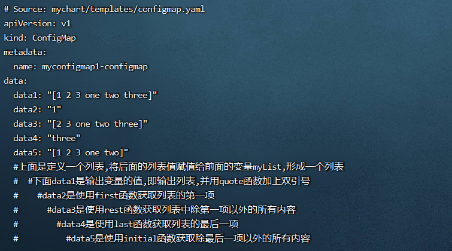
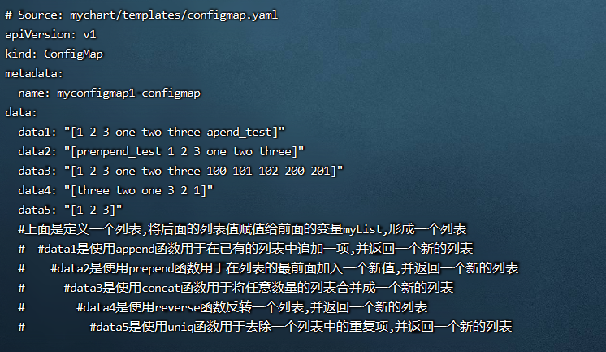
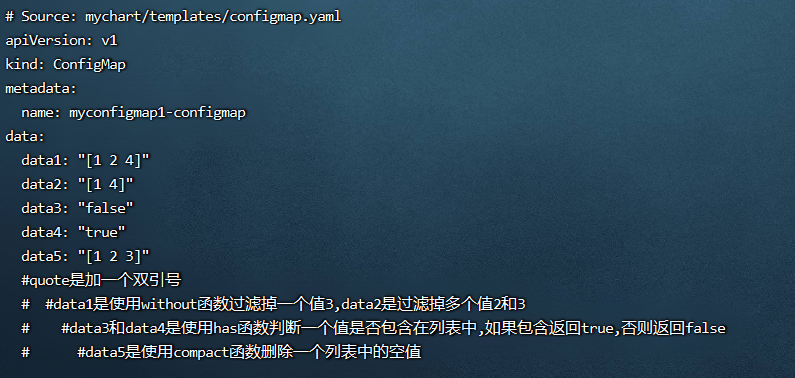
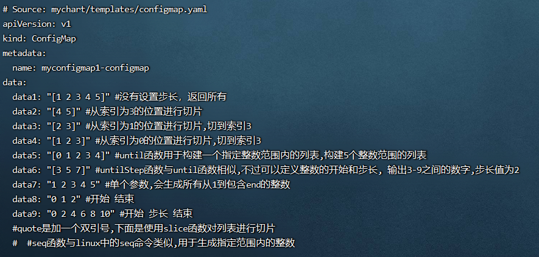

**<font style="color:#E4495B;background-color:#FFFFFF;">笔记来源：</font>**[**<font style="color:#E4495B;background-color:#FFFFFF;">k8s（Kubernetes）集群编排工具helm3实战教程</font>**](https://www.bilibili.com/video/BV12D4y1Y7Z7/?spm_id_from=333.337.search-card.all.click&vd_source=e8046ccbdc793e09a75eb61fe8e84a30)

# 125. <font style="color:#000000;">1 常用的helm3的列表函数</font>
+ `<font style="color:#000000;">list</font>``<font style="color:#000000;">first</font>``<font style="color:#000000;">rest</font>``<font style="color:#000000;">last</font>``<font style="color:#000000;">initial</font>`<font style="color:#000000;">函数</font>
+ `<font style="color:#000000;">append</font>``<font style="color:#000000;">prepend</font>``<font style="color:#000000;">concat</font>``<font style="color:#000000;">reverse</font>``<font style="color:#000000;">uniq</font>`<font style="color:#000000;">函数</font>
+ `<font style="color:#000000;">without</font>``<font style="color:#000000;">has</font>``<font style="color:#000000;">compact</font>`<font style="color:#000000;">函数</font>
+ `<font style="color:#000000;">slice</font>``<font style="color:#000000;">until</font>``<font style="color:#000000;">untilStep</font>``<font style="color:#000000;">seq</font>`<font style="color:#000000;">函数</font>

# 126. <font style="color:#000000;">2 演示</font>
<font style="color:#000000;">环境准备</font>

1. <font style="color:#000000;">k8s集群</font>

```yaml
kubectl get node
```

2. <font style="color:#000000;">创建一个chart包（用helm3发布创建一个configmap，创建的k8s集群中，发布其他应用也一样）</font>

```yaml
helm create mychart #创建一个chart包，chart包名为： mychart 
```

3. <font style="color:#000000;">删除mychart/templates目录下的文件</font>

```yaml
rm -rf mychart/templates/*  #全部删除
```

<font style="color:#000000;">编写自己需要的yaml文件，使用上面的各个内置函数演示</font>

## <font style="color:#000000;">2.1 </font>`<font style="color:#000000;">list</font>``<font style="color:#000000;">first</font>``<font style="color:#000000;">rest</font>``<font style="color:#000000;">last</font>``<font style="color:#000000;">initial</font>`<font style="color:#000000;">函数</font>
<font style="color:#000000;">分别含义如下:</font>

+ <font style="color:#000000;">list函数：list函数用于生成一个列表，传入的参数将会作为列表中的值，示例：</font>`<font style="color:#000000;">$myList := list 1 2 3 "one" "two" "three"</font>`
+ <font style="color:#000000;">first函数：first函数用于获取列表的第一项，示例：</font>`<font style="color:#000000;">first $myList</font>`
+ <font style="color:#000000;">rest函数：rest函数用于获取列表中除第一项以外的所有内容，示例：</font>`<font style="color:#000000;">rest $myList</font>`
+ <font style="color:#000000;">last函数：last函数用于获取列表的最后一项，示例：</font>`<font style="color:#000000;">last $myList</font>`
+ <font style="color:#000000;">initial函数：initial函数会获取到列表中除最后一项以外的所有内容，与rest 正好相反，示例：</font>`<font style="color:#000000;">initial $myList</font>`

<font style="color:#000000;">演示流程</font>

1. <font style="color:#000000;">编写一个自己需要的模板文件</font>

```yaml
vim /root/mychart/templates/configmap.yaml  #编写一个自己需要的模板文件
```

```yaml
apiVersion: v1
kind: ConfigMap
metadata:
  name: {{ .Release.Name }}-configmap
data:
{{- $myList := list 1 2 3 "one" "two" "three" }}
  data1: {{ $myList | quote }}
  data2: {{ first $myList | quote }}
  data3: {{ rest $myList | quote }}
  data4: {{ last $myList | quote }}
  data5: {{ initial $myList | quote }}
  #上面是定义一个列表,将后面的列表值赋值给前面的变量myList,形成一个列表
  #下面data1是输出变量的值,即输出列表,并用quote函数加上双引号
  #data2是使用first函数获取列表的第一项
  #data3是使用rest函数获取列表中除第一项以外的所有内容
  #data4是使用last函数获取列表的最后一项
  #data5是使用initial函数获取除最后一项以外的所有内容
```

2. <font style="color:#000000;">只是试运行看是否能运行</font>

```yaml
helm install myconfigmap1 ./mychart/ --debug --dry-run #不真正执行，只是试运行看是否能运行
```



## <font style="color:#000000;">2.2 </font>`<font style="color:#000000;">append</font>``<font style="color:#000000;">prepend</font>``<font style="color:#000000;">concat</font>``<font style="color:#000000;">reverse</font>``<font style="color:#000000;">uniq</font>`<font style="color:#000000;">函数</font>
<font style="color:#000000;">分别含义如下:</font>

+ <font style="color:#000000;">append函数： 用于在已有的列表中追加一项，并返回一个新的列表。原列表内容保持不变。</font>
    - <font style="color:#000000;">格式：</font>`<font style="color:#000000;">

$$
newList = append 
$$
列表变量 要追加的内容</font>`<font style="color:#000000;"> </font>
+ <font style="color:#000000;">prepend函数：用于在列表的最前面加入一个新值，并返回一个新的列表，原列表内容不变。</font>
    - <font style="color:#000000;">格式：</font>`<font style="color:#000000;">

$$
newList = prepend 
$$
列表变量 最前面加的值</font>`<font style="color:#000000;"> </font>
+ <font style="color:#000000;">concat函数： 用于将任意数量的列表合并成一个新的列表，原列表内容保持不变。</font>
    - <font style="color:#000000;">格式：</font>`<font style="color:#000000;">concat $原列表名 新列表1 新列表2 ...</font>`
    - <font style="color:#000000;">示例：</font>`<font style="color:#000000;">concat $myList (list 100 101 102) (list a b c)</font>`
+ <font style="color:#000000;">reverse函数：用于反转一个列表，并返回一个新的列表。 示例：</font>`<font style="color:#000000;">reverse $myList</font>`
+ <font style="color:#000000;">uniq函数：用于去除一个列表中的重复项，并返回一个新的列表：示例：</font>`<font style="color:#000000;">list 1 1 2 2 3 3 | uniq</font>`

<font style="color:#000000;">演示流程</font>

1. <font style="color:#000000;">编写一个自己需要的模板文件</font>

```yaml
vim /root/mychart/templates/configmap.yaml  #编写一个自己需要的模板文件
```

```yaml
apiVersion: v1
kind: ConfigMap
metadata:
  name: {{ .Release.Name }}-configmap
data:
{{- $myList := list 1 2 3 "one" "two" "three" }}
  data1: {{ append $myList "apend_test" | quote }}
  data2: {{ prepend $myList "prenpend_test" | quote }}
  data3: {{ concat $myList (list 100 101 102) (list 200 201) | quote }}
  data4: {{ reverse $myList | quote }}
  data5: {{ list 1 1 2 2 3 3 | uniq | quote}}
  #上面是定义一个列表,将后面的列表值赋值给前面的变量myList,形成一个列表
  #data1是使用append函数用于在已有的列表中追加一项,并返回一个新的列表
  #data2是使用prepend函数用于在列表的最前面加入一个新值,并返回一个新的列表
  #data3是使用concat函数用于将任意数量的列表合并成一个新的列表
  #data4是使用reverse函数反转一个列表,并返回一个新的列表
  #data5是使用uniq函数用于去除一个列表中的重复项,并返回一个新的列表
```

2. <font style="color:#000000;">运行</font>

```yaml
helm install myconfigmap1 ./mychart/ --debug --dry-run #不真正执行，只是试运行看是否能运行
```



## <font style="color:#000000;">2.3 </font>`<font style="color:#000000;">without</font>``<font style="color:#000000;">has</font>``<font style="color:#000000;">compact</font>`<font style="color:#000000;">函数</font>
<font style="color:#000000;">分别作用如下：</font>

+ <font style="color:#000000;">without函数： 用于过滤掉列表中的指定值（即:不要某某个值或多个值），并返回包含剩下值的列表：</font>
    - <font style="color:#000000;">示例：</font>`<font style="color:#000000;">without (list 1 2 3 4) 3</font>`<font style="color:#000000;"> （过滤掉3） </font>
    - <font style="color:#000000;">也可过滤掉多个值：示例：</font>`<font style="color:#000000;">without (list 1 2 3 4) 2 3</font>`<font style="color:#000000;"> (过滤掉2 3)</font>
+ <font style="color:#000000;">has函数：用于判断一个值是否包含在列表中，如果包含返回 true，否则返回 false  
</font><font style="color:#000000;">示例：</font>`<font style="color:#000000;">has "hello" ( list 1 2 3 4 ) | quote</font>`
+ <font style="color:#000000;">compact函数：用来删除一个列表中的空值，并返回一个新的列表</font>
    - <font style="color:#000000;">示例：</font>`<font style="color:#000000;">compact ( list 1 2 3 "" ) | quote</font>`
    - <font style="color:#000000;">需要注意的是，空值不仅仅只是 ""，在逻辑和流控制函数的部分，讲解 default 函数的时候提到过，空值包括：</font>
        * <font style="color:#000000;">整型：0</font>
        * <font style="color:#000000;">字符串: </font>`<font style="color:#000000;">""</font>`
        * <font style="color:#000000;">列表: []</font>
        * <font style="color:#000000;">字典: {}</font>
        * <font style="color:#000000;">布尔: false</font>
        * <font style="color:#000000;">以及所有的nil (或 null)</font>
        * <font style="color:#000000;">所以如果列表中包含这些也会被 compact 函数给删除</font>

<font style="color:#000000;">演示流程</font>

1. <font style="color:#000000;">编写一个自己需要的模板文件</font>

```yaml
vim /root/mychart/templates/configmap.yaml  #编写一个自己需要的模板文件
```

```yaml
apiVersion: v1
kind: ConfigMap
metadata:
  name: {{ .Release.Name }}-configmap
data:
  data1: {{ without (list 1 2 3 4) 3 | quote }}
  data2: {{ without (list 1 2 3 4) 2 3 | quote }}
  data3: {{ has "hello" ( list 1 2 3 4 ) | quote }}
  data4: {{ has 2 ( list 1 2 3 4 ) | quote }}
  data5: {{ compact ( list 1 2 3 "" ) | quote }}
  #quote是加一个双引号
  #data1是使用without函数过滤掉一个值3,data2是过滤掉多个值2和3
  #data3和data4是使用has函数判断一个值是否包含在列表中,如果包含返回true,否则返回false
  #data5是使用compact函数删除一个列表中的空值
```

2. <font style="color:#000000;">运行</font>

```yaml
helm install myconfigmap1 ./mychart/ --debug --dry-run #不真正执行，只是试运行看是否能运行
```



## <font style="color:#000000;">2.4 </font>`<font style="color:#000000;">slice</font>``<font style="color:#000000;">until</font>``<font style="color:#000000;">untilStep</font>``<font style="color:#000000;">seq</font>`<font style="color:#000000;">函数</font>
+ <font style="color:#000000;">slice函数： 用于对列表进行切片，命令格式为</font>`<font style="color:#000000;"> slice list [n] [m]</font>`<font style="color:#000000;">，相当于</font>`<font style="color:#000000;">list[n:m]</font>`

<font style="color:#000000;">示例：</font>

```yaml
{{- $myList := list 1 2 3 4 5 }}
slice $myList                     # 返回 [1 2 3 4 5]。 等同于 myList[:]，没有设置步长，返回所有
slice $myList 3 									# 返回 [4 5]等同于 myList[3:]，从索引为3的位置进行切片
slice $myList 1 3 								# 返回 [2 3]等同于 myList[1:3]，从索引为1的位置进行切片，切到索引3
slice $myList 0 3 								# 返回 [1 2 3]等同于 myList[:3]，从索引为0的位置进行切片，切到索引3
```

+ <font style="color:#000000;">until函数： 用于构建一个指定整数范围内的列表：示例：</font>`<font style="color:#000000;">until 5</font>`
+ <font style="color:#000000;">untilStep函数：与until 作用类似，不过可以定义整数的开始和步长：</font>
    - <font style="color:#000000;">示例：</font>`<font style="color:#000000;">untilStep 3 9 2</font>`<font style="color:#000000;"> 输出3-9之间的数字,切步长值为2</font>
+ <font style="color:#000000;">seq 函数：与linux 中的seq命令类似，用于生成指定范围内的整数。最多可以传递三个参数：</font>
    - <font style="color:#000000;">单个参数 (结束位置) ：会生成所有从1到包含 end 的整数。</font>
    - <font style="color:#000000;">多个参数 (开始，结束) ： 会生成所有包含start 和 end 的整数，递增或者递减。</font>
    - <font style="color:#000000;">多个参数 (开始，步长，结束) ：会生成所有包含 start 和 end 按 step递增或递减的整数。</font>

<font style="color:#000000;">  示例</font>

```yaml
seq 5 => 1 2 3 4 5
seq -3 => 1 0 -1 -2 -3
seq 0 2 => 0 1 2
seq 2 -2 => 2 1 0 -1 -2
seq 0 2 10 => 0 2 4 6 8 10
seq 0 -2 -5 => 0 -2 -4
```

<font style="color:#000000;">案例演示</font>

1. <font style="color:#000000;">编写一个自己需要的模板文件</font>

```yaml
vim /root/mychart/templates/configmap.yaml  #编写一个自己需要的模板文件
```

```yaml
apiVersion: v1
kind: ConfigMap
metadata:
  name: {{ .Release.Name }}-configmap
data:
{{- $myList := list 1 2 3 4 5 }}
  data1: {{ slice $myList | quote }} #没有设置步长，返回所有
  data2: {{ slice $myList 3 | quote }} #从索引为3的位置进行切片
  data3: {{ slice $myList 1 3 | quote }} #从索引为1的位置进行切片,切到索引3
  data4: {{ slice $myList 0 3 | quote }} #从索引为0的位置进行切片,切到索引3
  data5: {{ until 5 | quote }} #until函数用于构建一个指定整数范围内的列表,构建5个整数范围的列表
  data6: {{ untilStep 3 9 2 | quote }} #untilStep函数与until函数相似,不过可以定义整数的开始和步长, 输出3-9之间的数字,步长值为2
  data7: {{ seq 5 | quote }} #单个参数,会生成所有从1到包含end的整数
  data8: {{ seq 0 2 | quote }} #开始 结束 
  data9: {{ seq 0 2 10 | quote }} #开始 步长 结束
  #quote是加一个双引号,下面是使用slice函数对列表进行切片
  #seq函数与linux中的seq命令类似,用于生成指定范围内的整数
```

2. <font style="color:#000000;">运行</font>

```yaml
helm install myconfigmap1 ./mychart/ --debug --dry-run #不真正执行，只是试运行看是否能运行
```



