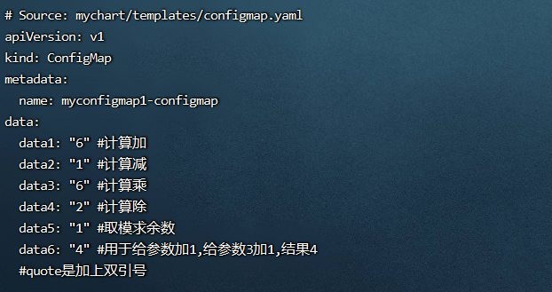
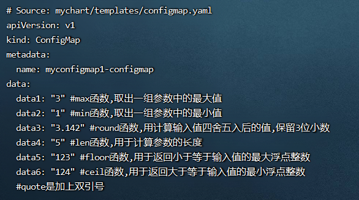

**<font style="color:#E4495B;background-color:#FFFFFF;">笔记来源：</font>**[**<font style="color:#E4495B;background-color:#FFFFFF;">k8s（Kubernetes）集群编排工具helm3实战教程</font>**](https://www.bilibili.com/video/BV12D4y1Y7Z7/?spm_id_from=333.337.search-card.all.click&vd_source=e8046ccbdc793e09a75eb61fe8e84a30)

# 127. <font style="color:#000000;">1 常用helm3的数学计算函数</font>
+ `<font style="color:#000000;">add</font>``<font style="color:#000000;">mul</font>``<font style="color:#000000;">div</font>``<font style="color:#000000;">mod</font>``<font style="color:#000000;">add1</font>`<font style="color:#000000;">函数</font>
+ `<font style="color:#000000;">max</font>``<font style="color:#000000;">min</font>``<font style="color:#000000;">round</font>``<font style="color:#000000;">len</font>``<font style="color:#000000;">floor</font>``<font style="color:#000000;">ceil</font>`<font style="color:#000000;">函数 </font>

# 128. <font style="color:#000000;">2 演示</font>
<font style="color:#000000;">环境准备</font>

1. <font style="color:#000000;">k8s集群</font>

```yaml
kubectl get node
```

2. <font style="color:#000000;">创建一个chart包（用helm3发布创建一个configmap，创建的k8s集群中，发布其他应用也一样）</font>

```yaml
helm create mychart #创建一个chart包，chart包名为： mychart 
```

3. <font style="color:#000000;">删除mychart/templates目录下的文件</font>

```yaml
rm -rf mychart/templates/*  #全部删除
```

<font style="color:#000000;">编写自己需要的yaml文件，使用上面的各个内置函数演示</font>

## <font style="color:#000000;">2.1 </font>`<font style="color:#000000;">add</font>`<font style="color:#000000;"> </font>`<font style="color:#000000;">mul</font>`<font style="color:#000000;"> </font>`<font style="color:#000000;">div</font>`<font style="color:#000000;"> </font>`<font style="color:#000000;">mod</font>`<font style="color:#000000;"> </font>`<font style="color:#000000;">add1</font>`<font style="color:#000000;">函数</font>
<font style="color:#000000;">add、sub、mul、div 、mod函数： 分别用来计算加减乘除和取模，可以接受两个或多个参数  
</font><font style="color:#000000;">示例</font>

```yaml
add 1 2 3	 # 计算加，返回 6
sub 3 2		 # 计算减，返回 1
mul 3 2		 # 计算乘，返回 6
div 6 3		 # 计算除，返回 2
mod 9 2    #取模，求余数，返回1
```

<font style="color:#000000;">add1函数： 用于给参数加 1。只能接受一个参数，示例：add1 3 给参数3加1，结果是4</font>

<font style="color:#000000;">演示流程</font>

1. <font style="color:#000000;">编写一个自己需要的模板文件</font>

```yaml
 vim /root/mychart/templates/configmap.yaml  #编写一个自己需要的模板文件
```

```yaml
apiVersion: v1
kind: ConfigMap
metadata:
  name: {{ .Release.Name }}-configmap
data:
  data1: {{ add 1 2 3 | quote }} #计算加
  data2: {{ sub 3 2 | quote }} #计算减
  data3: {{ mul 3 2 | quote }} #计算乘
  data4: {{ div 6 3 | quote }} #计算除
  data5: {{ mod 9 2 | quote }} #取模求余数
  data6: {{ add1 3 | quote }} #用于给参数加1,给参数3加1,结果4
  #quote是加上双引号
```

2. <font style="color:#000000;">运行</font>

```yaml
helm install myconfigmap1 ./mychart/ --debug --dry-run #不真正执行，只是试运行看是否能运行
```



## <font style="color:#000000;">2.2 </font>`<font style="color:#000000;">max</font>`<font style="color:#000000;"> </font>`<font style="color:#000000;">min</font>`<font style="color:#000000;"> </font>`<font style="color:#000000;">round</font>`<font style="color:#000000;"> </font>`<font style="color:#000000;">len</font>`<font style="color:#000000;"> </font>`<font style="color:#000000;">floor</font>`<font style="color:#000000;"> </font>`<font style="color:#000000;">ceil</font>`<font style="color:#000000;">函数 </font>
<font style="color:#000000;">分别含义如下：</font>

+ <font style="color:#000000;">max函数 和 min 函数： 分别用于取出一组参数中的最大值和最小值。 </font>
    - <font style="color:#000000;">示例1: </font>`<font style="color:#000000;">max 1 2 3</font>`
    - <font style="color:#000000;">示例2: </font>`<font style="color:#000000;">min 1 2 3</font>`
+ <font style="color:#000000;">round函数： 用计算输入值四舍五入后的值，需传入两个参数，最后一个参数代表保留的小数位。</font>
    - <font style="color:#000000;">示例: </font>`<font style="color:#000000;">round 3.1415926 3</font>`
+ <font style="color:#000000;">len函数： 用于计算参数的长度。 </font>
    - <font style="color:#000000;">示例: </font>`<font style="color:#000000;">len "abcde"</font>`
+ <font style="color:#000000;">floor函数：用于返回小于等于输入值的最大浮点整数。 </font>
    - <font style="color:#000000;">示例：</font>`<font style="color:#000000;"> floor 123.9999</font>`<font style="color:#000000;">返回 123</font>
+ <font style="color:#000000;">ceil函数：用于返回大于等于输入值的最小浮点整数，返回的值一定要大于或等于输入的值。 </font>
    - <font style="color:#000000;">示例：</font>`<font style="color:#000000;">ceil 123.9999</font>`
    - <font style="color:#000000;">返回 124</font>

<font style="color:#000000;">演示流程</font>

1. <font style="color:#000000;">编写一个自己需要的模板文件</font>

```yaml
vim /root/mychart/templates/configmap.yaml  #编写一个自己需要的模板文件
```

```yaml
apiVersion: v1
kind: ConfigMap
metadata:
  name: {{ .Release.Name }}-configmap
data:
  data1: {{ max 1 2 3 | quote }} #max函数,取出一组参数中的最大值
  data2: {{ min 1 2 3 | quote }} #min函数,取出一组参数中的最小值
  data3: {{ round 3.1415926 3 | quote }} #round函数,用计算输入值四舍五入后的值,保留3位小数
  data4: {{ len "abcde" | quote }} #len函数,用于计算参数的长度
  data5: {{ floor 123.9999 | quote }} #floor函数,用于返回小于等于输入值的最大浮点整数
  data6: {{ ceil 123.9999 | quote }} #ceil函数,用于返回大于等于输入值的最小浮点整数
  #quote是加上双引号
```

2. 运行

```yaml
helm install myconfigmap1 ./mychart/ --debug --dry-run #不真正执行，只是试运行看是否能运行
```



