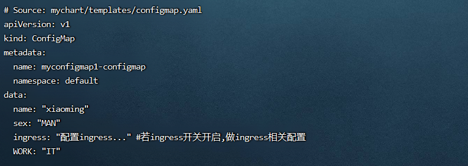
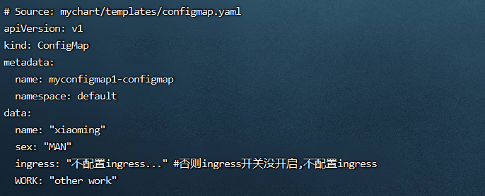
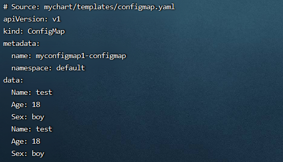
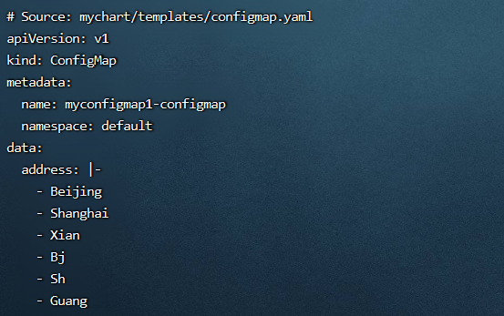

**<font style="color:#DF2A3F;background-color:#FFFFFF;">笔记来源：</font>**[**<font style="color:#DF2A3F;background-color:#FFFFFF;">k8s（Kubernetes）集群编排工具helm3实战教程</font>**](https://www.bilibili.com/video/BV12D4y1Y7Z7/?spm_id_from=333.337.search-card.all.click&vd_source=e8046ccbdc793e09a75eb61fe8e84a30)

# 129. <font style="color:#ff7800;">1 helm3中的几种流控制结构语句</font>
## 1.1 if/else
<font style="color:#ff7800;">if/else语句主要用于条件判断，不同的条件做不同的事情</font>

if/else语句中的条件在模板中称为管道，基本结构如下：

```yaml
{{- if PIPELINE }}
	#do something
{{- else if OTHER PIPELINE }}
	#do something else
{{- else }}
	#default case
{{- end }}
```

如果管道中存在空值时,管道的返回值会设置为 false

## <font style="color:#ff7800;">1.2 with 语句</font> 
with语句主要是<font style="color:#ff7800;">用来控制变量的范围</font>，<font style="color:#000000;">也就是</font><font style="color:#ff7800;">修改查找变量的作用域</font>

<font style="color:#ff7800;">示例：</font>

```yaml
...
data:
  #正常方式调用values.yaml文件,引用好多变量对象时,会重复写很多相同的引用
  Name: {{ .Values.people.info.name }}
  Age: {{ .Values.people.info.age }}
  Sex: {{ .Values.people.info.sex }}
  #通过with语句,效果和上面一样,引用很多重复的变量对象时,可用with语句将重复的路径作用域设置过来
  {{- with .Values.people }}
  Name: {{ .info.name }}
  Age: {{ .info.age }}
  Sex: {{ .info.sex }}
  {{- end }}
```

## 1.3<font style="color:#ff7800;"> range语句</font><font style="color:#000000;"> </font>
<font style="color:#000000;">range</font><font style="color:#ff7800;">用于提供循环遍历集合输出的功能</font>

用法格式：

```yaml
{{- range 要遍历的对象 }}
  # do something
{{- end }}
```

# 130. <font style="color:#ff7800;">2 案例使用</font>
<font style="color:#000000;">环境准备</font>

1. <font style="color:#000000;">k8s集群</font>

```yaml
kubectl get node
```

2. <font style="color:#000000;">创建一个chart包（用helm3发布创建一个configmap，创建的k8s集群中，发布其他应用也一样）</font>

```yaml
helm create mychart #创建一个chart包，chart包名为： mychart 
```

3. <font style="color:#000000;">删除mychart/templates目录下的文件</font>

```yaml
rm -rf mychart/templates/*  #全部删除
```

<font style="color:#000000;">编写自己需要的yaml文件，使用上面的各个内置函数演示</font>

## <font style="color:#ff7800;">2.1 if/else语句</font> 
操作流程

1. 定义变量和赋值

```yaml
vim /root/mychart/values.yaml #定义变量和赋值
```

```yaml
Person:
  name: xiaoming
  age: 16
  sex: man
  work: IT
ingress:
  enabled: true
```

2. 编写一个自己需要的模板文件，调用values.yaml的变量

```yaml
 vim /root/mychart/templates/configmap.yaml  #编写一个自己需要的模板文件，调用values.yaml的变量
```

```yaml
apiVersion: v1
kind: ConfigMap
metadata:
  name: {{ .Release.Name }}-configmap
  namespace: {{ .Release.Namespace }}
data:
  name: {{ .Values.Person.name | default "test_name" | quote }}
  sex: {{ .Values.Person.sex | upper | quote }}
  {{- if .Values.ingress.enabled }}
  ingress: "配置ingress..." #若ingress开关开启,做ingress相关配置
  {{- else }}
  ingress: "不配置ingress..." #否则ingress开关没开启,不配置ingress
  {{- end }}
  {{- if eq .Values.Person.work "IT" }} 
  WORK: {{ .Values.Person.work | quote }}
  {{- else }}
  WORK: "other work"
  {{- end }}
```

`{{- }}` 表示向左删除空白包括删除空格和换行,不加可能会增加一个换行,前面加横线是为了去掉该行的空格,如果不加,该行渲染时会形成空格

`{{ -}}` 表示向右删除空白,并且会删除换行,一般慎用(因为删除换行时候，打印内容就乱了,还可能语法报错)

3. 测试1: 当ingress开关开启，工作为IT时候，如下输出

```yaml
helm install myconfigmap1 ./mychart/ --debug --dry-run #不真正执行，只是试运行看是否能运行
```



4. <font style="color:#ff7800;">测试2: 当ingress开关不开启，工作不是IT时候</font>
    1. 定义变量和赋值

```yaml
vim /root/mychart/values.yaml #定义变量和赋值
```

```yaml
Person:
  name: xiaoming
  age: 16
  sex: man
  work: IT1
ingress:
  enabled: false
```

    2. 运行

```yaml
helm install myconfigmap1 ./mychart/ --debug --dry-run #不真正执行，只是试运行看是否能运行
```



## <font style="color:#ff7800;">2.2 with语句</font> 
with语句主要是用来控制变量的范围，也就是<font style="color:#ff7800;">修改查找变量的作用域</font>。

在前面我们讲到，代表的含义是当前作用域，那么 `.Values` 就是在当前作用域中查找Values 对象。

我们可以使用 with 语句来将特定对象设置为当前作用域，这样设定完成后，就可以使用 . 来代表在这个特定的对象下获取变量了。

最后使用 `{{ end }}` 作为结束，代表作用域被重置。

引用很多重复的变量对象时，<font style="color:#ff7800;">可用with语句将重复的路径作用域设置过来，即：将要引用的作用域设置到当前，那么后面用，引用就是引用的设置的作用域</font>  


演示流程

1. 定义变量和赋值

```yaml
 vim /root/mychart/values.yaml #定义变量和赋值
```

```yaml
people:
  info:
    name: test
    age: 18
    sex: boy
```

2. 编写一个自己需要的模板文件，调用values.yaml的变量

```yaml
vim /root/mychart/templates/configmap.yaml #编写一个自己需要的模板文件，调用values.yaml的变量
```

```yaml
apiVersion: v1
kind: ConfigMap
metadata:
  name: {{ .Release.Name }}-configmap
  namespace: {{ .Release.Namespace }}
data:
  #正常方式调用values.yaml文件,引用好多变量对象时,会重复写很多相同的引用
  Name: {{ .Values.people.info.name }}
  Age: {{ .Values.people.info.age }}
  Sex: {{ .Values.people.info.sex }}
  #通过with语句,效果和上面一样,引用很多重复的变量对象时,可用with语句将重复的路径作用域设置过来
  {{- with .Values.people }}
  Name: {{ .info.name }}
  Age: {{ .info.age }}
  Sex: {{ .info.sex }}
  {{- end }}
```

      当不能运行时，删除里面的注释即可

`{{- }}` 表示向左删除空白包括删除空格和换行,不加可能会增加一个换行,前面加横线是为了去掉该行的空格,如果不加,该行渲染时会形成空格  
`{{ -}}` 表示向右删除空白,并且会删除换行,一般慎用(因为删除换行时候，打印内容就乱了,还可能语法报错)

3. 不真正执行，只是试运行看是否能运行

```yaml
helm install myconfigmap1 ./mychart/ --debug --dry-run #不真正执行，只是试运行看是否能运行
```



## <font style="color:#ff7800;">2.3  range语句</font> 
range<font style="color:#ff7800;">用于提供循环遍历集合输出</font>的功能

range指定遍历指定对象，每次循环的时候，都会将作用域设置为当前的对象。直接使用 . 来代表当前作用域并对当前的对象进行输出

除了Values 对象中的集合，range 也可以对 tuple、dict、list 等进行遍历

演示流程

1. 定义变量和赋值

```yaml
vim /root/mychart/values.yaml #定义变量和赋值
```

```yaml
address:
  - beijing
  - shanghai
  - xian
```

2. 编写一个自己需要的模板文件，调用values.yaml的变量

```yaml
vim /root/mychart/templates/configmap.yaml #编写一个自己需要的模板文件，调用values.yaml的变量
```

```yaml
apiVersion: v1
kind: ConfigMap
metadata:
  name: {{ .Release.Name }}-configmap
  namespace: {{ .Release.Namespace }}
data:
  address: |-
    {{- range .Values.address }}
    - {{ . | title }}
    {{- end }}
    {{- range tuple "bj" "sh" "guang" }}
    - {{ . | title }}
    {{- end }}
```

:::info
range用于提供循环遍历集合输出的功能,  
`- {{ . | title }}` <font style="color:#ff7800;">用</font>`<font style="color:#ff7800;">.</font>`<font style="color:#ff7800;">作为输出,并使用title函数进行了修饰为首字母大写，</font>或去掉tile函数，仅使用用作为输出  
上面是用range对获取的变量字符串内容进行遍历输出  
下面是用range对元组进行遍历输出

:::

3. 运行

```yaml
helm install myconfigmap1 ./mychart/ --debug --dry-run #不真正执行，只是试运行看是否能运行
```

  
  
  
  


