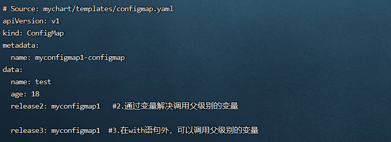
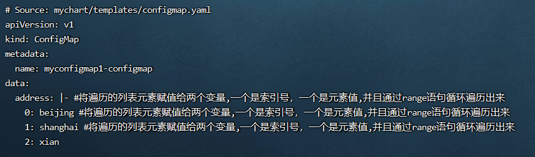
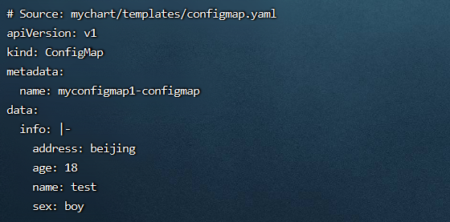
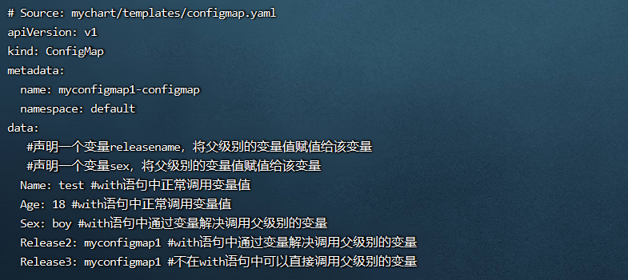
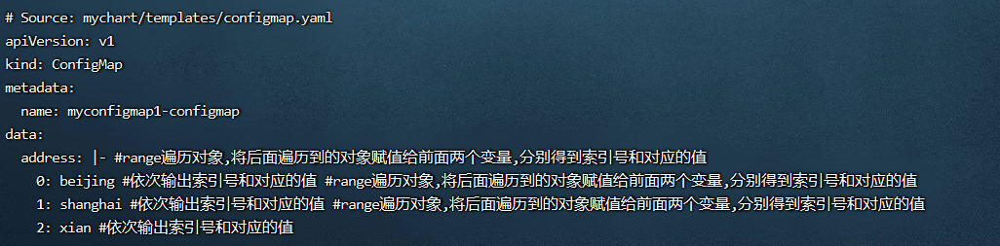
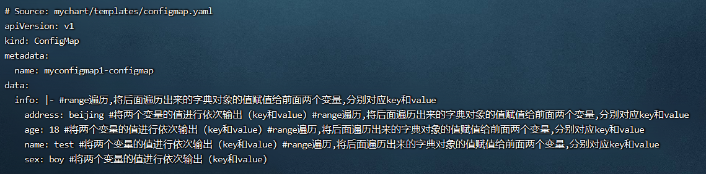

**<font style="color:#DF2A3F;background-color:#FFFFFF;">笔记来源：</font>**[**<font style="color:#DF2A3F;background-color:#FFFFFF;">k8s（Kubernetes）集群编排工具helm3实战教程</font>**](https://www.bilibili.com/video/BV12D4y1Y7Z7/?spm_id_from=333.337.search-card.all.click&vd_source=e8046ccbdc793e09a75eb61fe8e84a30)

# 131. <font style="color:#ff7800;">1 helm3中声明变量的格式和作用 </font> 
在 helm3中，变量通常是搭配 with语句 和 range语句 使用，这样能有效的简化代码。

变量的定义格式如下： 

```yaml
$name := value  #（ := 称为赋值运算符，将后面值赋值给前面的变量name）
```

## 1.1 <font style="color:#ff7800;">使用变量解决对象作用域问题</font> 
<font style="color:#ff7800;">因为with语句里不能调用父级别的变量</font><font style="color:#000000;">，</font>所以如果需要调用父级别的变量，需要声明一个变量名，将父级别的变量值赋值给声明的变量

前面关于helm流控制结构的文章中提到过，使用with 更改当前作用域的用法，当时存在一个问题是在with语句中，无法使用父作用域中的对象，需要使用 `$` 符号或者将语句移到 `{{- end }}`  的外面才可以。现在使用变量也可以解决这个问题。

示例流程

1. 定义变量和赋值

```yaml
vim /root/mychart/values.yaml #定义变量和赋值
```

```yaml
people:
  info:
    name: test
    age: 18
    sex: boy
```

2. 编辑

```yaml
vim configmap.yml
```

```yaml
apiVersion: v1
kind: ConfigMap
metadata:
  name: {{ .Release.Name }}-configmap
data:
  {{- $releaseName := .Release.Name }}
  {{- with .Values.people.info }}
  name: {{ .name }}
  age: {{ .age }}
  #release1: {{ .Release.Name }} #1.在with语句内（因为改变了变量作用域），不能调用父级别的变量,且会报错
  release2: {{ $releaseName }}   #2.通过变量解决调用父级别的变量
  {{ end }}
  release3: {{ .Release.Name }}  #3.在with语句外，可以调用父级别的变量
```

3. 运行

```yaml
helm install myconfigmap1 ./mychart/ --debug --dry-run
```



## <font style="color:#ff7800;">1.2 变量在列表或元组中的使用 </font> 
变量也常用在遍历列表或元组中，可以获取到索引和值（<font style="color:#ff7800;">索引号和值都可以打印出来</font>）

1. 定义变量和赋值

```yaml
vim /root/mychart/values.yaml #定义变量和赋值
```

```yaml
address:
  - beijing
  - shanghai
  - xian
```

2. 编辑

```yaml
vim configmap.yml
```

```yaml
apiVersion: v1
kind: ConfigMap
metadata:
  name: {{ .Release.Name }}-configmap
data:
  address: |-
    {{- range 

$$
index, 
$$
add := .Values.address }} #将遍历的列表元素赋值给两个变量,一个是索引号，一个是元素值,并且通过range语句循环遍历出来
    {{ 

$$
index }}: {{ 
$$
add }}
    {{- end }}
```

3. 运行

```yaml
helm install myconfigmap1 ./mychart/ --debug --dry-run
```



## <font style="color:#ff7800;">1.3 变量在字典中的使用</font> 
变量也能用于变量字典，<font style="color:#ff7800;">获取每个键值对（k和v) </font>   
对于字典类型的结构，可以使用 range 获取到每个键值对的 key 和 value（注意，字典是无序的，所以遍历出来的结果也是无序的。）

1. 定义变量和赋值

```yaml
vim /root/mychart/values.yaml #定义变量和赋值
```

```yaml
person:
  info:
    name: test
    sex: boy
    address: beijing
    age: 18
```

2. 编辑

```yaml
vim configmap.yml
```

```yaml
apiVersion: v1
kind: ConfigMap
metadata:
  name: {{ .Release.Name }}-configmap
data:
  info: |-
    {{- range 

$$
key, 
$$
value := .Values.person.info }} 
    {{ 

$$
key }}: {{ 
$$
value }}  
    {{- end }}
```

3. 运行

```yaml
helm install myconfigmap1 ./mychart/ --debug --dry-run
```



# 132. <font style="color:#ff7800;">2 helm3中的声明变量的实际案例使用</font>
<font style="color:#000000;">环境准备</font>

1. <font style="color:#000000;">k8s集群</font>

```yaml
kubectl get node
```

2. <font style="color:#000000;">创建一个chart包（用helm3发布创建一个configmap，创建的k8s集群中，发布其他应用也一样）</font>

```yaml
helm create mychart #创建一个chart包，chart包名为： mychart 
```

3. <font style="color:#000000;">删除mychart/templates目录下的文件</font>

```yaml
rm -rf mychart/templates/*  #全部删除
```

<font style="color:#000000;">编写自己需要的yaml文件，使用上面的各个内置函数演示</font>

## <font style="color:#ff7800;">2.1 使用变量解决对象作用域问题的演示 </font> 
变量的定义格式如下：

```yaml
$name := value  #（ := 称为赋值运算符，将后面值赋值给前面的变量:name）
```

 因为使用with语句时，里面不能调用父级别的变量,所以如果需要调用父级别的变量,需要声明一个变量名,将父级别的变量值赋值给声明的变量

演示流程

1. 定义变量和赋值

```yaml
vim /root/mychart/values.yaml #定义变量和赋值
```

```yaml
people:
  info:
    name: test
    age: 18
    sex: boy
```

2. 编写一个自己需要的模板文件

```yaml
vim /root/mychart/templates/configmap.yaml  #编写一个自己需要的模板文件，调用values.yaml的变量
```

```yaml
apiVersion: v1
kind: ConfigMap
metadata:
  name: {{ .Release.Name }}-configmap
  namespace: {{ .Release.Namespace }}
data:
  #通过with语句,效果和上面一样,引用很多重复的变量对象时,可用with语句将重复的路径作用域设置过来
  #但是with语句里不能调用父级别的变量,所以如果需要调用父级别的变量,需要声明一个变量名,将父级别的变量值赋值给声明的变量
  {{ $releasename := .Release.Name }} #声明一个变量releasename，将父级别的变量值赋值给该变量
  {{ $sex := .Values.people.info.sex }} #声明一个变量sex，将父级别的变量值赋值给该变量
  {{- with .Values.people.info }}
  Name: {{ .name }} #with语句中正常调用变量值
  Age: {{ .age }} #with语句中正常调用变量值
  Sex: {{ $sex }} #with语句中通过变量解决调用父级别的变量
  Release2: {{ $releasename }} #with语句中通过变量解决调用父级别的变量
  #Release4: {{ .Release.Name }} #with语句中不能直接调用父级别的变量,会报错，注释都会报错
  {{- end }}
  Release3: {{ .Release.Name }} #不在with语句中可以直接调用父级别的变量
```

3. 执行

```yaml
helm install myconfigmap1 ./mychart/ --debug --dry-run #不真正执行，只是试运行看是否能运行
```



## <font style="color:#ff7800;">2.2 变量在列表或元组中的使用 </font> 
变量也常用在遍历列表或元组中，可以获取到索引和值（索引号和值都可以打印出来）

1. 编辑configmap

```yaml
vim /root/mychart/templates/configmap.yaml  #编写一个自己需要的模板文件，调用values.yaml的变量
```

```yaml
apiVersion: v1
kind: ConfigMap
metadata:
  name: {{ .Release.Name }}-configmap
data:
  address: |-
    {{- range 

$$
index, 
$$
add := .Values.address }} #range遍历对象,将后面遍历到的对象赋值给前面两个变量,分别得到索引号和对应的值
    {{ 

$$
index }}: {{ 
$$
add }} #依次输出索引号和对应的值
    {{- end }}
```

2. 定义变量和赋值

```yaml
vim /root/mychart/values.yaml #定义变量和赋值
```

```yaml
address:
  - beijing
  - shanghai
  - xian
```

3. 执行

```yaml
helm install myconfigmap1 ./mychart/ --debug --dry-run #不真正执行，只是试运行看是否能运行
```



## <font style="color:#ff7800;">2.3 变量在字典中的使用</font> 
变量也能用于变量字典，<font style="color:#ff7800;">获取每个键值对（k和v) </font>  
对于字典类型的结构，可以使用 range 获取到每个键值对的 key 和 value（注意，字典是无序的，所以遍历出来的结果也是无序的。）

1. 定义变量和赋值

```yaml
vim /root/mychart/values.yaml #定义变量和赋值
```

```yaml
person:
  info:
    name: test
    sex: boy
    address: beijing
    age: 18
```

2. 编写一个自己需要的模板文件

```yaml
vim /root/mychart/templates/configmap.yaml  #编写一个自己需要的模板文件，调用values.yaml的变量
```

```yaml
apiVersion: v1
kind: ConfigMap
metadata:
  name: {{ .Release.Name }}-configmap
data:
  info: |-
    {{- range 

$$
key, 
$$
value := .Values.person.info }} #range遍历,将后面遍历出来的字典对象的值赋值给前面两个变量,分别对应key和value
    {{ 

$$
key }}: {{ 
$$
value }} #将两个变量的值进行依次输出（key和value)
    {{- end }}
```

3. 执行

```yaml
helm install myconfigmap1 ./mychart/ --debug --dry-run #不真正执行，只是试运行看是否能运行
```

  
  
  
  
  
  


