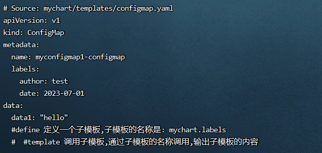
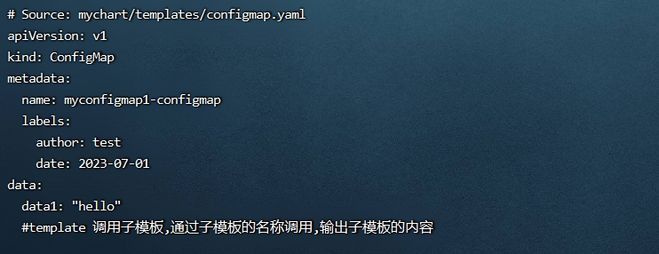
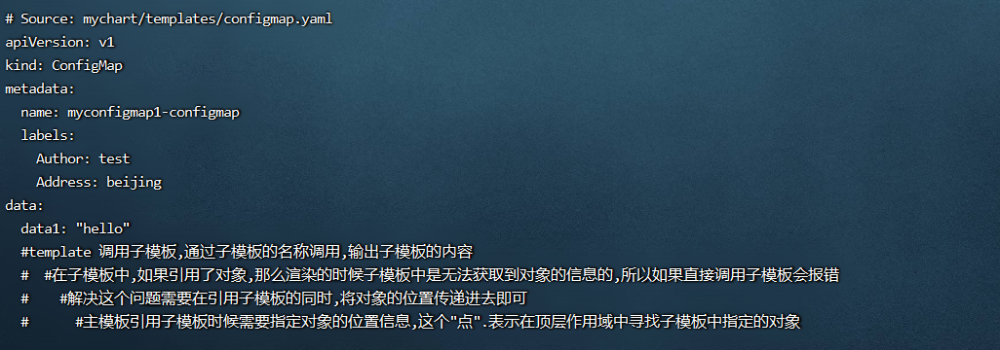
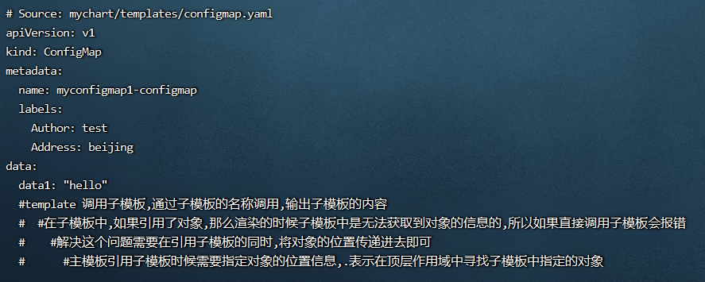
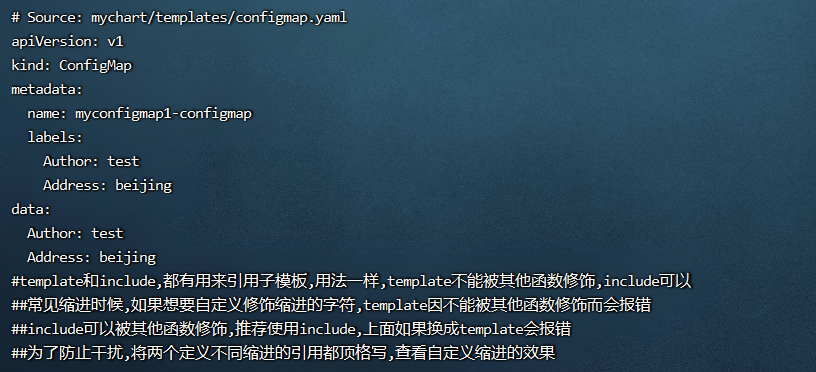

**<font style="color:#DF2A3F;background-color:#FFFFFF;">笔记来源：</font>**[**<font style="color:#DF2A3F;background-color:#FFFFFF;">k8s（Kubernetes）集群编排工具helm3实战教程</font>**](https://www.bilibili.com/video/BV12D4y1Y7Z7/?spm_id_from=333.337.search-card.all.click&vd_source=e8046ccbdc793e09a75eb61fe8e84a30)

# 133. <font style="color:#ff7800;">1 定义子模板的两个位置</font>
+ <font style="color:#ff7800;">主模板中</font>
+ `<font style="color:#ff7800;">._helpers.tpl</font>`<font style="color:#ff7800;">文件内</font>

定义子模板，可以在主模板中定义，也可在其他文件中定义（`_helpers.tpl` 文件内,是专门提供的定义子模板的文件）

实际使用中，这些子模板的内容应当放在单独的文件中，通常是`_helpers.tpl`文件内

# 134. <font style="color:#ff7800;">2 子模板的定义和调用</font>
定义子模板： 通过`define`定义

调用子模板： 通过`template`或`include`调用(推荐)

`template`和`include`都有用来引用子模板，用法一样，稍微有点区别，下面详细介绍

# 135. <font style="color:#ff7800;">3 helm3中定义和使用子模板的实际案例使用</font>
<font style="color:#000000;">环境准备</font>

1. <font style="color:#000000;">k8s集群</font>

```yaml
kubectl get node
```

2. <font style="color:#000000;">创建一个chart包（用helm3发布创建一个configmap，创建的k8s集群中，发布其他应用也一样）</font>

```yaml
helm create mychart #创建一个chart包，chart包名为： mychart 
```

3. <font style="color:#000000;">删除mychart/templates目录下的文件</font>

```yaml
rm -rf mychart/templates/*  #全部删除
```

<font style="color:#000000;">编写自己需要的yaml文件，使用上面的各个内置函数演示</font>

## <font style="color:#ff7800;">3.1 使用define在主模板中定义子模板的演示，使用template进行调用子模板</font> 
注意： define 定义的子模板，需要通过调用才能输出，如果不调用是不会有输出的。

格式：

```yaml
{{- define "mychart.labels" }}
  labels:
    author: test
    date: {{ now | htmlDate }}
{{- end }}
```

演示流程

1. 编写一个自己需要的模板文件

```yaml
vim /root/mychart/templates/configmap.yaml  #编写一个自己需要的模板文件
```

```yaml
{{- define "mychart.labels" }}
  labels:
    author: test
    date: {{ now | htmlDate }}
{{- end }}
apiVersion: v1
kind: ConfigMap
metadata:
  name: {{ .Release.Name }}-configmap
  {{- template "mychart.labels" }}
data:
  data1: "hello"
  #define 定义一个子模板,子模板的名称是: mychart.labels
  #template 调用子模板,通过子模板的名称调用,输出子模板的内容
```

2. 执行

```yaml
helm install myconfigmap1 ./mychart/ --debug --dry-run #不真正执行，只是试运行看是否能运行
```



## <font style="color:#ff7800;">3.2 使用define在_helpers.tpl文件中定义子模板的演示，使用template进行调用子模板 </font> 
注意： define定义的子模板，需要通过调用才能输出，如果不调用是不会有输出的。

演示流程

1. 在`_helpers.tpl`中定义子模板

```yaml
vim /root/mychart/templates/_helpers.tpl  #在_helpers.tpl中定义子模板, 原文件以清空,换成下面模板内容
```

```yaml
{{/* 注释 */}}
{{- define "mychart.labels" }}
  labels:
    author: test
    date: {{ now | htmlDate }}
{{- end }}
#define 定义一个子模板,子模板的名称是: mychart.labels
```

2. 编写一个自己需要的模板文件

```yaml
vim /root/mychart/templates/configmap.yaml  #编写一个自己需要的模板文件
```

```yaml
apiVersion: v1
kind: ConfigMap
metadata:
  name: {{ .Release.Name }}-configmap
  {{- template "mychart.labels" }}
data:
  data1: "hello"
  #template 调用子模板,通过子模板的名称调用,输出子模板的内容
```

3. 执行

```yaml
helm install myconfigmap1 ./mychart/ --debug --dry-run #不真正执行，只是试运行看是否能运行
```



## <font style="color:#ff7800;">3.3 向子模板中传入对象，使用template进行调用子模板的演示</font>
<font style="color:#ff7800;">以上面其中一种定义子模板方式演示，以</font>`<font style="color:#ff7800;">define</font>`<font style="color:#ff7800;">在</font>`<font style="color:#ff7800;">_helpers.tpl</font>`<font style="color:#ff7800;">文件中定义子模板为例</font>

注意： define定义的子模板，需要通过调用才能输出，如果不调用是不会有输出的。

演示流程

1. 定义变量和赋值

```yaml
 vim /root/mychart/values.yaml #定义变量和赋值
```

```yaml
person:
  info:
    name: test
    sex: boy
    address: beijing
    age: 18
```

2. 在`_helpers.tpl`中定义子模板

```yaml
vim /root/mychart/templates/_helpers.tpl  #在_helpers.tpl中定义子模板, 原文件以清空,换成下面模板内容
```

```yaml
{{/* 注释 */}}
{{- define "mychart.labels" }}
  labels:
    Author: {{ .Values.person.info.name }} 
    Address: {{ .Values.person.info.address }}
{{- end }}

{{/* 在子模板中,如果引用了对象,那么渲染的时候子模板中是无法获取到对象的信息的,所以如果直接调用子模板会报错.解决这个问题需要在引用子模板的同时,将对象的位置传递进去即可*/}}
{{/*define 定义一个子模板,子模板的名称是: mychart.labels*/}}
```

3. 编写一个自己需要的模板文件

```yaml
vim /root/mychart/templates/configmap.yaml  #编写一个自己需要的模板文件
```

```yaml
apiVersion: v1
kind: ConfigMap
metadata:
  name: {{ .Release.Name }}-configmap
  {{- template "mychart.labels" . }} 
data:
  data1: "hello"
  #template 调用子模板,通过子模板的名称调用,输出子模板的内容
  #在子模板中,如果引用了对象,那么渲染的时候子模板中是无法获取到对象的信息的,所以如果直接调用子模板会报错
  #解决这个问题需要在引用子模板的同时,将对象的位置传递进去即可
  #主模板引用子模板时候需要指定对象的位置信息,这个"点".表示在顶层作用域中寻找子模板中指定的对象
```

4. 执行

```yaml
helm install myconfigmap1 ./mychart/ --debug --dry-run #不真正执行，只是试运行看是否能运行
```

  


<font style="color:#ff7800;">指定对象的位置信息，除了用.在顶层作用域寻找，也可用下面形式：</font>

1. 定义变量和赋值

```yaml
vim /root/mychart/values.yaml #定义变量和赋值
```

```yaml
person:
  info:
    name: test
    sex: boy
    address: beijing
    age: 18
```

2. 在`_helpers.tpl`中定义子模板

```yaml
vim /root/mychart/templates/_helpers.tpl  #在_helpers.tpl中定义子模板, 原文件以清空,换成下面模板内容
```

```yaml
{{/* 注释 */}}
{{- define "mychart.labels" }}
  labels:
    Author: {{ .name }} 
    Address: {{ .address }}
{{- end }}

{{/* 在子模板中,如果引用了对象,那么渲染的时候子模板中是无法获取到对象的信息的,所以如果直接调用子模板会报错，解决这个问题需要在引用子模板的同时,将对象的位置传递进去即可*/}}
```

3. 编写一个自己需要的模板文件

```yaml
vim /root/mychart/templates/configmap.yaml  #编写一个自己需要的模板文件
```

```yaml
apiVersion: v1
kind: ConfigMap
metadata:
  name: {{ .Release.Name }}-configmap
  {{- template "mychart.labels" .Values.person.info }} 
data:
  data1: "hello"
  #template 调用子模板,通过子模板的名称调用,输出子模板的内容
  #在子模板中,如果引用了对象,那么渲染的时候子模板中是无法获取到对象的信息的,所以如果直接调用子模板会报错
  #解决这个问题需要在引用子模板的同时,将对象的位置传递进去即可
  #主模板引用子模板时候需要指定对象的位置信息,.表示在顶层作用域中寻找子模板中指定的对象
```

4. 执行

```yaml
helm install myconfigmap1 ./mychart/ --debug --dry-run #不真正执行，只是试运行看是否能运行
```



## <font style="color:#ff7800;">3.4 向子模板中传入对象，使用include进行调用子模板</font>
<font style="color:#ff7800;">以上面其中一种定义子模板方式演示，以</font>`<font style="color:#ff7800;">define</font>`<font style="color:#ff7800;">在</font>`<font style="color:#ff7800;">_helpers.tpl</font>`<font style="color:#ff7800;">文件中定义子模板为例</font>

<font style="color:#e01b24;">template和include，都有用来引用子模板，用法一样，template不能被其他函数修饰，include可以</font>

<font style="color:#e01b24;">常见缩进时候，</font><font style="color:#000000;">如果想要自定义修饰缩进的字符，template因不能被其他函数修饰而会报错</font>

<font style="color:#000000;">include可以被其他函数修饰，推荐使用include，</font>上面如果换成template会报错

演示流程

1. 定义变量和赋值

```yaml
vim /root/mychart/values.yaml #定义变量和赋值
```

```yaml
person:
  info:
    name: test
    sex: boy
    address: beijing
    age: 18
```

2. 在`_helpers.tpl`中定义子模板

```yaml
vim /root/mychart/templates/_helpers.tpl  #在_helpers.tpl中定义子模板, 原文件以清空,换成下面模板内容
```

```yaml
{{/* 注释 */}}
{{- define "mychart.labels" }}
Author: {{ .Values.person.info.name }} 
Address: {{ .Values.person.info.address }}
{{- end }}
{{/* 在子模板中,如果引用了对象,那么渲染的时候子模板中是无法获取到对象的信息的,所以如果直接调用子模板会报错.解决这个问题需要在引用子模板的同时,将对象的位置传递进去即可，将所有的缩进都删除*/}}
```

3. 编写一个自己需要的模板文件

```yaml
 vim /root/mychart/templates/configmap.yaml  #编写一个自己需要的模板文件
```

```yaml
apiVersion: v1
kind: ConfigMap
metadata:
  name: {{ .Release.Name }}-configmap
  labels:
{{- include "mychart.labels" . | toString |indent 4 }} 
data:
{{- include "mychart.labels" . | toString |indent 2 }} 
#template和include,都有用来引用子模板,用法一样,template不能被其他函数修饰,include可以
#常见缩进时候,如果想要自定义修饰缩进的字符,template因不能被其他函数修饰而会报错
#include可以被其他函数修饰,推荐使用include,上面如果换成template会报错
#为了防止干扰,将两个定义不同缩进的引用都顶格写,查看自定义缩进的效果
```

4. 执行

```yaml
helm install myconfigmap1 ./mychart/ --debug --dry-run #不真正执行，只是试运行看是否能运行
```

  
  
  
  
  
  
  
  
  
  
  
  
  


