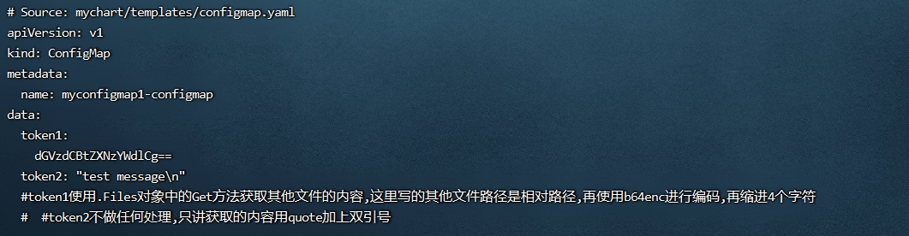
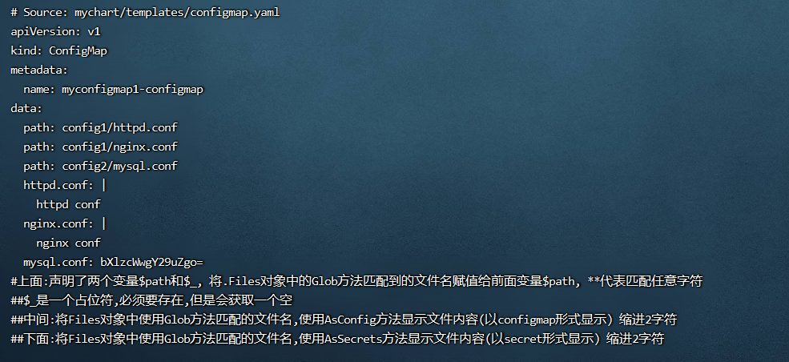
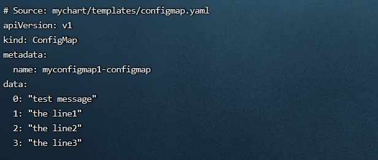

**<font style="color:#DF2A3F;background-color:#FFFFFF;">笔记来源：</font>**[**<font style="color:#DF2A3F;background-color:#FFFFFF;">k8s（Kubernetes）集群编排工具helm3实战教程</font>**](https://www.bilibili.com/video/BV12D4y1Y7Z7/?spm_id_from=333.337.search-card.all.click&vd_source=e8046ccbdc793e09a75eb61fe8e84a30)

# 136. <font style="color:#ff7800;">1 helm3中获取其他文件的内容或文件名</font>
1. <font style="color:#000000;">使用Get方法获取其他文件的内容</font>
2. <font style="color:#000000;">使用Glob方法获取文件名和内容 </font>
3. <font style="color:#000000;">使用lines方法循环遍历并逐行读取文件中的内容</font>

# 137. <font style="color:#ff7800;">2 helm3中的获取其他文件的内容或文件名的实际案例使用</font>
<font style="color:#000000;">环境准备</font>

1. <font style="color:#000000;">k8s集群</font>

```yaml
kubectl get node
```

2. <font style="color:#000000;">创建一个chart包（用helm3发布创建一个configmap，创建的k8s集群中，发布其他应用也一样）</font>

```yaml
helm create mychart #创建一个chart包，chart包名为： mychart 
```

3. <font style="color:#000000;">删除mychart/templates目录下的文件</font>

```yaml
rm -rf mychart/templates/*  #全部删除
```

<font style="color:#000000;">编写自己需要的yaml文件，使用上面的各个内置函数演示</font>

## <font style="color:#ff7800;">3.1 使用Get方法获取其他文件的内容</font> 
前面的文章讲到了如何定义多个模板以及导入另一个模板。但是有的时候我们需要导入的是一个普通的文件内容而不是模板文件。

所以Helm 提供了`.Files` 对象用于访问文件，其中包含了一些方法用于处理文件中的内容。

示例：

```yaml
token2: {{ .Files.Get "config/test.txt" | quote }}
```

演示流程

1. 自定义一个目录，该目录下自定义一个其他文件

```powershell
mkdir /root/mychart/config/     #自定义一个目录，该目录下自定义一个其他文件
echo "test message" > /root/mychart/config/test.txt
cat /root/mychart/config/test.txt 
```

2. 编写一个自己需要的模板文件

```powershell
vim /root/mychart/templates/configmap.yaml  #编写一个自己需要的模板文件
```

```yaml
apiVersion: v1
kind: ConfigMap
metadata:
  name: {{ .Release.Name }}-configmap
data:
  token1:
{{ .Files.Get "config/test.txt" | b64enc | indent 4 }}
  token2: {{ .Files.Get "config/test.txt" | quote }}
  #token1使用.Files对象中的Get方法获取其他文件的内容,这里写的其他文件路径是相对路径,再使用b64enc进行编码,再缩进4个字符
  #token2不做任何处理,只讲获取的内容用quote加上双引号
```

3. 执行

```powershell
helm install myconfigmap1 ./mychart/ --debug --dry-run #不真正执行，只是试运行看是否能运行
```



## <font style="color:#ff7800;">3.2 使用Glob方法获取文件名(带路径)和内容</font> 
演示流程

1. 自定义两个目录，该目录下自定义一个其他文件

```powershell
mkdir /root/mychart/config1 #自定义两个目录，该目录下自定义一个其他文件
mkdir /root/mychart/config2
echo "nginx conf" > /root/mychart/config1/nginx.conf
echo "httpd conf" > /root/mychart/config1/httpd.conf
echo "mysql conf" > /root/mychart/config2/mysql.conf
```

2. 编写一个自己需要的模板文件

```powershell
vim /root/mychart/templates/configmap.yaml  #编写一个自己需要的模板文件
```

```yaml
apiVersion: v1
kind: ConfigMap
metadata:
  name: {{ .Release.Name }}-configmap
data:
  {{- range 

$$
path, 
$$
_ := .Files.Glob "**.conf" }}
  path: {{ $path }}
  {{- end }}
{{ (.Files.Glob "config1/*").AsConfig | indent 2 }}
{{ (.Files.Glob "config2/*").AsSecrets | indent 2 }}
#上面:声明了两个变量

$$
path和$_, 将.Files对象中的Glob方法匹配到的文件名赋值给前面变量
$$
path, **代表匹配任意字符
#$_是一个占位符,必须要存在,但是会获取一个空
#中间:将Files对象中使用Glob方法匹配的文件名,使用AsConfig方法显示文件内容(以configmap形式显示) 缩进2字符
#下面:将Files对象中使用Glob方法匹配的文件名,使用AsSecrets方法显示文件内容(以secret形式显示) 缩进2字符
```

3. 执行

```yaml
helm install myconfigmap1 ./mychart/ --debug --dry-run #不真正执行，只是试运行看是否能运行
```



## <font style="color:#ff7800;">3.3 使用lines方法循环遍历并逐行读取文件中的内容</font>
演示流程

1. 自定义一个目录，该目录下自定义一个其他文件

```yaml
mkdir /root/mychart/config/ #自定义一个目录，该目录下自定义一个其他文件
echo "the line1" >> /root/mychart/config/test.txt
echo "the line2" >> /root/mychart/config/test.txt
echo "the line3" >> /root/mychart/config/test.txt
```

2. 编写一个自己需要的模板文件

```yaml
vim /root/mychart/templates/configmap.yaml  #编写一个自己需要的模板文件
```

```yaml
apiVersion: v1
kind: ConfigMap
metadata:
  name: {{ .Release.Name }}-configmap
data:
{{- range 

$$
index, 
$$
line := .Files.Lines "config/test.txt" }}
  {{- if $line }}
  {{ 

$$
index }}: {{ 
$$
line | quote }}
  {{- end }}
{{- end }}
#前面定义两个变量index和line,后面使用.Files对象中的Lines方法循环遍历后面文件中的每行内容赋值给line变量,将每行索引赋值给index变量#Lines方法通常和range一起使用,可以遍历文件中的每一行并输出.
#Lines方法遍历行的时,最后会输出一个空行,对于这个问题,可使用if语句来解决,判断当前行的内容是否为空,如果不为空则输出
#{{- if $line }} 如果为真,则是true,就输出下面的内容
```

3. 执行

```yaml
helm install myconfigmap1 ./mychart/ --debug --dry-run #不真正，只是试运行看是否能运行
```

  


# 3 原始文档
[k8s集群编排工具helm3实战教程.ctb.pdf](https://www.yuque.com/attachments/yuque/0/2023/pdf/22334924/1688198223451-b4adb981-c832-4f55-92f9-12a1aa4466ce.pdf)

  
  


